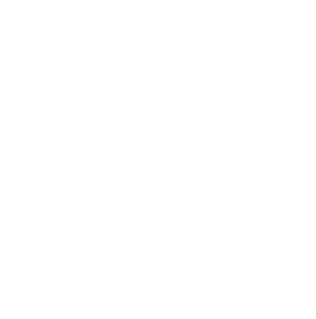
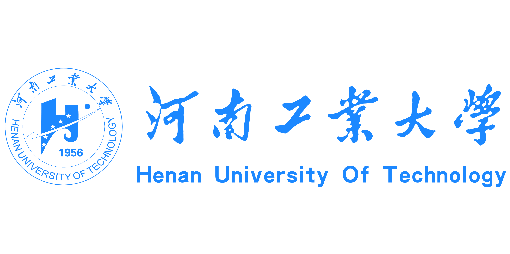
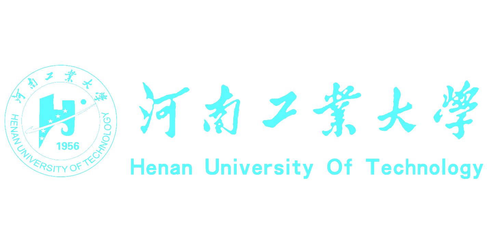
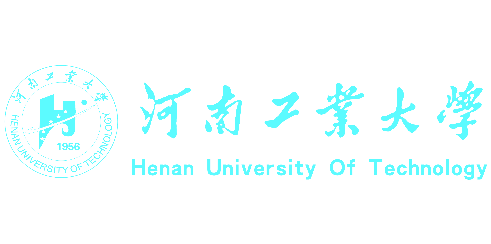

# 8-河南工业大学PPT模板

- Source: `8-河南工业大学PPT模板.pptx`
- Total slides: 22

## Slide 1

Graduation defense

明德 求是 拓新 笃行

- 答辩人：河工星球
- 指导老师：河工星球

## Slide 2

CONTENT

- Part 01
- 研究背景

- Part 02
- 研究方案

- Part 03
- 研究成果

- Part 04
- 研究结论

## Slide 3

GRADUATION DEFENSE TEMPLATE

- Part 01
- 研究背景

## Slide 4

Click to add the title

Text

Text

- 点击输入标题
- 单击此处可编辑内容，根据您的需要自由拉伸文本框大小
- ……

- 点击输入标题
- 单击此处可编辑内容，根据您的需要自由拉伸文本框大小
- ……

- 点击输入标题
- 单击此处可编辑内容，根据您的需要自由拉伸文本框大小
- ……

## Slide 5

Click to add the title

OPTION 1

OPTION 1

$5000

$5000

- DESCRIPTION
- COMPANY
- Your Tagline Here

To fully realize the potential of a cloud-based architecture for applications and network functions.

To fully realize the potential of a cloud-based architecture for applications and network functions.

To fully realize the potential of a cloud-based architecture for applications and network functions.

- DESCRIPTION
- COMPANY
- Your Tagline Here

To fully realize the potential of a cloud-based architecture for applications and network functions.

- DESCRIPTION
- COMPANY
- Your Tagline Here

To fully realize the potential of a cloud-based architecture for applications and network functions.

## Slide 6

Click to add the title

Click to add the title

PowerPoint offers word processing, outlining, drawing, graphing, and presentation management tools all designed to be easy to use and learn.

Text here

Text here

Text here

- 单击此处可编辑内容，根据您的需要自由拉伸文本框大小
- ……

- 单击此处可编辑内容，根据您的需要自由拉伸文本框大小
- ……

- 单击此处可编辑内容，根据您的需要自由拉伸文本框大小
- ……

35%

60%

55%

## Slide 7

Click to add the title

Click to add the content, click to add the content

Text here

Text here

Text here

... ￥ | 20 %

... ￥ | 55 %

... ￥ | 96 %

- 点击输入标题
- 单击此处可编辑内容，根据您的需要自由拉伸文本框大小
- ……

- 点击输入标题
- 单击此处可编辑内容，根据您的需要自由拉伸文本框大小
- ……

- 点击输入标题
- 单击此处可编辑内容，根据您的需要自由拉伸文本框大小
- ……

## Slide 8

GRADUATION DEFENSE TEMPLATE

- Part 02
- 研究方案

## Slide 9

Click to add the title

1

3

4

2

Text here

Text here

Text here

Text here

Click to add the title

- 点击输入标题
- 单击此处可编辑内容，根据您的需要自由拉伸文本框大小
- ……

- 点击输入标题
- 单击此处可编辑内容，根据您的需要自由拉伸文本框大小
- ……

PowerPoint offers word processing, outlining, drawing, graphing, and presentation management tools all designed to be easy to use and learn.

## Slide 10

Click to add the title

Supporting text here.

Supporting text here.

Supporting text here.

Supporting text here.

Supporting text here.

Supporting text here.

Supporting text here.

Supporting text here.

Supporting text here.

## Slide 11

Click to add the title

- 点击输入标题
- 单击此处可编辑内容，根据您的需要自由拉伸文本框大小
- ……

- 点击输入标题
- 单击此处可编辑内容，根据您的需要自由拉伸文本框大小
- ……

- 点击输入标题
- 单击此处可编辑内容，根据您的需要自由拉伸文本框大小
- ……

- 点击输入标题
- 单击此处可编辑内容，根据您的需要自由拉伸文本框大小
- ……

- 点击输入标题
- 单击此处可编辑内容，根据您的需要自由拉伸文本框大小
- ……

- 点击输入标题
- 单击此处可编辑内容，根据您的需要自由拉伸文本框大小
- ……

## Slide 12

GRADUATION DEFENSE TEMPLATE

- Part 03
- 研究成果

## Slide 13

Click to add the title

Text here

Text here

Text here

Text here

123K

288K

309K

555K

- 点击输入标题
- 单击此处可编辑内容，根据您的需要自由拉伸文本框大小
- ……

- 点击输入标题
- 单击此处可编辑内容，根据您的需要自由拉伸文本框大小
- ……

- 点击输入标题
- 单击此处可编辑内容，根据您的需要自由拉伸文本框大小
- ……

- 点击输入标题
- 单击此处可编辑内容，根据您的需要自由拉伸文本框大小
- ……

## Slide 14

Click to add the title

- 点击输入标题
- 单击此处可编辑内容，根据您的需要自由拉伸文本框大小
- ……
- 点击文本框即可进行编辑输入相关内容点击文本框即可进行编辑输入相关内容

Click to add the title

PowerPoint offers word processing, outlining, drawing, graphing, and presentation management tools all designed to be easy to use and learn.

## Slide 15

Click to add the title

- 点击输入标题
- 单击此处可编辑内容，根据您的需要自由拉伸文本框大小
- ……

- 点击输入标题
- 单击此处可编辑内容，根据您的需要自由拉伸文本框大小
- ……

- 点击输入标题
- 单击此处可编辑内容，根据您的需要自由拉伸文本框大小
- ……

- 点击输入标题
- 单击此处可编辑内容，根据您的需要自由拉伸文本框大小
- ……

- 点击输入标题
- 单击此处可编辑内容，根据您的需要自由拉伸文本框大小
- ……

- 点击输入标题
- 单击此处可编辑内容，根据您的需要自由拉伸文本框大小
- ……

## Slide 16

Click to add the title

Lorem ipsum dolor sit amet, consectetur adipisicing elit, sed do eiusmod tempor incididunt ut labore et dolore magna

Lorem ipsum dolor sit amet, consectetur adipisicing elit, sed do eiusmod tempor incididunt ut labore et dolore magna

Lorem ipsum dolor sit amet, consectetur adipisicing elit, sed do eiusmod tempor incididunt ut labore et dolore magna

Lorem ipsum dolor sit amet, consectetur adipisicing elit, sed do eiusmod tempor incididunt ut labore et dolore magna

Lorem ipsum dolor sit amet, consectetur adipisicing elit, sed do eiusmod tempor incididunt ut labore et dolore magna

34%

59%

From 2014

From 2014

Lorem ipsum dolor sit amet, consectetur adipisicing elit, sed do eiusmod tempor incididunt ut labore et dolore magna

## Slide 17

GRADUATION DEFENSE TEMPLATE

- Part 04
- 研究结论

## Slide 18

Click to add the title

50%

45%

60%

90%

80%

70%

点击输入简要文字内容，文字内容需概括精炼，言简意赅的说明分项内容。点击输入简要文字内容，文字内容需概括精炼，言简意赅的说明分项内容。点击输入简要文字内容，文字内容需概括精炼，

## Slide 19

Click to add the title

Add the title here

Add the title here

Add the title here

Add the title here

02

01

03

04

单击编辑标题

单击编辑标题

单击编辑标题

单击编辑标题

Flying impression graphic design thank you for buying this template. Flying impression graphic design thank you for buying this template.

Flying impression graphic design thank you for buying this template. Flying impression graphic design thank you for buying this template.

Flying impression graphic design thank you for buying this template. Flying impression graphic design thank you for buying this template.

Flying impression graphic design thank you for buying this template. Flying impression graphic design thank you for buying this template.

## Slide 20

Click to add the title

Click to add the title

PowerPoint offers word processing, outlining, drawing, graphing, and presentation management tools all designed to be easy to use and learn.

Text here

Text here

Text here

- 单击此处可编辑内容，根据您的需要自由拉伸文本框大小
- ……

- 单击此处可编辑内容，根据您的需要自由拉伸文本框大小
- ……

- 单击此处可编辑内容，根据您的需要自由拉伸文本框大小
- ……

35%

60%

55%

## Slide 21

## Slide 22

THANKS for watching

明德 求是 拓新 笃行

- 答辩人：河工星球
- 指导老师：河工星球

