	

__2026届毕业生__

__毕业设计说明书__

__题    目:	差分隐私保护的AI驱动的个性化医疗用药推荐系统的设计与实现             								__

__院系名称：人工智能与大数据	专业班级：   	大数据2203		  __

__学生姓名：      		晋修慧   		学		号： 		221210200302	  __

__指导教师：      		侯慧莹	    	教师职称：      		讲师			     __

__															    __

__2026年 5月 22日__

毕 业 设 计 中 文 摘 要

__摘  要__

在“健康中国2030”战略引领下，医疗健康产业数字化转型加速，全国互联网医院超2700家，电子病历普及率超85%，医疗数据年增超30%，隐私安全挑战严峻。针对此，本文设计并实现了基于差分隐私保护的AI驱动个性化用药推荐系统。

系统采用前后端分离微服务架构：前端React，后端Spring Boot提供RESTful API，模型服务使用Python FastAPI部署DeepFM推荐模型。核心为四层推荐架构：第零层临床知识路由层，通过口语标准化、疾病归类、适应症映射、药品召回四级路由解决中英适应症语义鸿沟；第一层安全过滤，保留12条绝对安全红线硬排除规则，将相对禁忌等9类情形改标记待审核；第二层规则标记附加临床警告；第三层DeepFM个性化排序。系统集成患者口语增强模块，采用精确匹配、关键词匹配、症状组合推理三层策略处理非标准输入。推荐经医生审核确认后，反馈学习器自动调整后续推荐权重，形成持续优化闭环。

实验结果显示，在隐私预算ε=0\.1下，推荐准确率下降约10%，差分隐私性能开销仅约5毫秒，适合实际部署。架构杜绝绝对禁忌误推荐，临床阈值后处理（score<0\.15置零，上限min\(1\.0, raw\+0\.35\)）有效防止噪声过度扭曲推荐方向。本系统为隐私保护型医疗推荐提供了兼顾临床安全性与个性化精准度的技术参考。

__关键词__：  差分隐私；  用药推荐系统；  深度学习；  个性化医疗；  规则匹配与特征归因

毕 业 设 计 外 文 摘 要

__Title	Design and Implementation of a Differentially Private AI\-Driven Personalized Medication Recommendation System__

__Abstract__

Under the “Healthy China 2030” strategy, healthcare digitization accelerates\. With over 2,700 Internet hospitals, EMR adoption over 85%, and annual medical data growth over 30%, severe privacy challenges arise\. To address this, this paper designs an AI\-driven personalized medication recommendation system based on differential privacy\.

The system adopts React front\-end, Spring Boot RESTful back\-end, and Python FastAPI deploying DeepFM\. Its core is a four\-layer recommendation architecture\. Layer 0, Clinical Knowledge Routing, bridges Chinese\-English indication gap via four\-stage routing: colloquial standardization, disease categorization, indication mapping, drug recall\. Layer 1, Safety Filter, enforces 12 red\-line exclusion rules and redirects nine categories \(e\.g\., relative contraindications\) to pending review\. Layer 2, Rule Marker, attaches clinical warnings to candidate drugs\. Layer 3 performs DeepFM\-based personalized ranking\. A Patient Input Enhancement module uses a three\-tier strategy: exact match, keyword match, and symptom combination reasoning\. After physician review, a Feedback Learner adjusts subsequent weights, enabling continuous optimization\.

Experiments show under privacy budget ε=0\.1, accuracy drops ~10% and overhead is ~5 ms, suitable for deployment\. The architecture prevents absolutely contraindicated drug misrecommendations\. Threshold post\-processing \(score<0\.15→0, ceiling min\(1\.0, raw\+0\.35\)\) curbs noise distortion\. This system provides a reference for privacy\-preserving medication recommendation balancing safety and personalized precision\.

__Keywords: __Differential Privacy; DPSGD; Drug Recommendation; DeepFM; Personalized Medicine; Safety Filtering; Clinical Knowledge Routing

__目	次__

[1 绪论	1](#_Toc8811)

	[1\.1 研究背景与意义	1](#_Toc8664)

	[1\.2 国内外研究现状	2](#_Toc26200)

	[1\.3 研究内容与论文结构	6](#_Toc6707)

	[1\.4 本章小结	7](#_Toc23934)

[2 相关技术与理论基础	8](#_Toc3641)

	[2\.1 差分隐私技术	8](#_Toc1700)

	[2\.2 深度学习推荐算法	10](#_Toc20031)

	[2\.3 系统开发相关技术	11](#_Toc13006)

	[2\.4 本章小结	14](#_Toc10545)

[3 系统需求分析与设计	15](#_Toc5958)

	[3\.1 需求分析	15](#_Toc24828)

	[3\.2 系统架构设计	17](#_Toc28905)

	[3\.3 数据库设计	20](#_Toc16162)

	[3\.4 接口设计	23](#_Toc19172)

	[3\.5 本章小结	24](#_Toc13068)

[4 核心算法设计与实现	25](#_Toc19517)

	[4\.1 临床知识路由层	25](#_Toc28634)

	[4\.2 三层推荐安全架构	27](#_Toc19176)

	[4\.3 DeepFM推荐模型	29](#_Toc28092)

	[4\.4 差分隐私机制实现	30](#_Toc6197)

	[4\.5 推荐流程集成	32](#_Toc4895)

	[4\.6 审核反馈闭环	35](#_Toc22988)

	[4\.7 本章小结	36](#_Toc11315)

[5 系统实现	37](#_Toc7077)

	[5\.1 开发环境与技术选型	37](#_Toc19339)

	[5\.2 后端服务实现	37](#_Toc27286)

	[5\.3 前端界面实现	38](#_Toc17648)

	[5\.4 模型服务实现	46](#_Toc1128)

	[5\.5 本章小结	47](#_Toc15259)

[6 系统测试与分析	47](#_Toc20894)

	[6\.1 测试环境	47](#_Toc18291)

	[6\.2 功能测试	48](#_Toc15944)

	[6\.3 性能测试	49](#_Toc4354)

	[6\.4 隐私保护效果分析	49](#_Toc29335)

	[6\.5 本章小结	50](#_Toc569)

[结  论	51](#_Toc12573)

[致  谢	52](#_Toc23107)

[参 考 文 献	53](#_Toc4045)

__1 绪论__

随着医疗数据泄露的势头愈发凶猛。仅2022年，全球医疗行业重大泄露事件便超过700起，波及逾5000万患者\[4\]。病历、用药细节、过敏史一旦流出，后果远不止信誉受损。

另一边，数据本身却在疯狂膨胀。国家卫健委统计显示，截至2023年底，全国互联网医院已超2700家，电子病历普及率越过85%，医疗数据年增幅超过30%\[2\]。这些积累下来的数字，成了深度学习模型的养料。诊断线索、用药记录、健康特征，统统被卷入模型。

可这类信息生来敏感。患者身份、疾病史、过敏情况——随便哪样流出都是灾难。传统保护手段在关联攻击和背景推断面前，根本挡不住。K\-匿名让每条记录至少在准标识符上与K\-1条其他记录不可区分，但攻击者仍可能借助背景知识揪出敏感信息。L\-多样性缓解了一些，却扛不住相似性攻击。围绕K\-匿名的变体一度热闹过，大家曾觉得它差不多够用。ε\-差分隐私拿出的方案不一样。它给出了一种严格的、数学上可证明的隐私保障，能把统计分析或机器学习任务中敏感数据被推断的风险限制住\[5\]。

这种可量化的特性很快被工业界盯上。2016年，Abadi等人提出的差分隐私随机梯度下降（DPSGD）算法，将该框架做进了深度学习训练过程\[7\]。Google、Apple、Microsoft随后都在自家产品中部署了这项技术，实操可行性由此得到验证。

我们要做的，是把差分隐私压进一个个性化用药推荐系统。系统设计了四层。临床知识路由层在最底下，负责疾病到药品的映射。其上，安全过滤层死守推荐的安全性。再往上是规则标记层，用来做风险提示。顶层的深度学习排序层承担个性化推荐。搭建原型时，我们观察到一个意外情况：排序模型对噪声的容忍度比预想高，裁剪阈值可调空间不小。差分隐私嵌入之后，敏感数据在训练环节得到保护。推荐准确率仍能落在可接受水平。

__1\.1 研究背景与意义__

这项研究试图在隐私保护和用药推荐之间搭一座桥，从理论到实践都有它的分量。

“健康中国2030”把医疗信息化往前推了一大步，数据能不能安全地共享、智能地应用，就成了绕不开的坎。我们拿出的这套技术方案，可以让医疗机构在数据脱敏的前提下做精准推荐，把数据价值释放出来，同时把差分隐私在真实医疗场景落地这件事往前推了一步。示范意义大概就在这里。

理论这一头，突破点在于不再死守传统隐私保护那套老路。差分隐私和深度学习揉在一起之后，我们系统梳理了医疗数据的敏感性特征、隐私保护的需求强度，以及推荐精度三者之间怎么拉扯、怎么平衡。几个新做法是这样：患者口语化输入配了三层fallback增强，临床知识走四级确定性路由，审核反馈用渐进式惩罚学习来驱动。从患者表达一直通到药品推荐，整条技术链路是打通的。这些东西不光往医疗推荐的研究池子里加了点新料，也给差分隐私在垂直领域的应用趟出了一条路。

实践那边，摊开来有这么几件事做到了。第一，用药推荐可以在数据受保护的状态下跑起来。第二，三角色RBAC权限体系把管理员、医生、患者拆开，权限和功能各自归位。第三，医生审核反馈能回流到系统里，推荐质量在闭环里慢慢优化。第四，推荐统计仪表板做了出来，推荐趋势、分类分布、安全分层这些维度都可视化了。

理论创新层面还有一块得说清楚。差分隐私的数学定义和隐私保证机制被我们仔细捋了一遍，\(epsilon,delta\)\-差分隐私在深度学习场景下到底适不适用，边界在哪。基于Opacus框架的差分隐私SGD训练方法，是我们拿来把梯度裁剪和噪声添加做到可控平衡的工具。另外，把差分隐私塞进知识路由层和安全过滤层的协同设计里，这一点有点意思——系统的安全性不只是靠规则引擎做确定性判断，隐私保护机制对敏感信息的模糊化处理也在兜底。

系统原型这块，从前端交互到后端推理，一条完整的链路已经搭起来了。架构上前后端分离，前端用React搞响应式界面，后端Spring Boot提供RESTful API，模型服务走Python FastAPI部署DeepFM推理引擎。再加上三角色权限、审核闭环、统计仪表板这些模块，业务闭环是完整的。拿去实际医疗场景里用，技术上已经能落地了。

__1\.2 国内外研究现状__

1\.2\.1 差分隐私研究进展

差分隐私本身即是一种严格的隐私保护框架，能在统计分析与机器学习任务中将敏感数据被推断的风险控制在可量化范围内。Dwork等人于2006年率先提出这一概念，为后续研究奠定了理论基础\[8\]。作为其重要变体，本地差分隐私（Local Differential Privacy, LDP）允许数据在本地加噪后再上传，无需依赖可信第三方服务器，因而在分布式数据收集场景中尤为契合。本研究将该技术引入医疗用药推荐任务，在模型训练阶段通过噪声注入保护训练数据隐私，在推理阶段追踪隐私预算的消耗，从而构建起端到端的隐私保护能力。

在此之后，差分隐私的变体与扩展不断涌现。Dwork等人进一步提出\(ε,δ\)\-差分隐私，通过引入松弛参数δ，在维持隐私保障的同时压低了噪声幅度，改善了数据可用性\[5\]。2013年，Duchi等人提出了本地化差分隐私（Local Differential Privacy, LDP），将保护机制前置到数据采集环节，彻底消除了对可信第三方的依赖。LDP在用户隐私层面具备更强的保障力，Google Chrome已将其用于收集用户使用统计数据，Apple也在iOS系统中部署LDP，用以优化输入法联想预测。

国内研究同样收获颇丰。熊平等人系统梳理了差分隐私的基本原理与关键技术，并解析了其在不同应用场景中的实现路径\[1\]。叶青青等人对本地化差分隐私做了全面综述，归纳了LDP在数据收集、统计分析和机器学习等任务中的应用进展\[5\]。冯登国等人从大数据安全的视角出发，审视了差分隐私在数据发布、数据分析及数据挖掘中的价值。张啸剑等人聚焦于面向数据发布与分析的保护机制，提出若干优化方案。李杨等人则回顾了差分隐私保护研究的发展脉络与应用前景。

差分隐私在医疗数据保护领域的具体应用也在持续增加。陈思等人研究了满足差分隐私约束的轨迹隐私保护方案，提出了相应的轨迹数据发布方法\[9\]。丁丽萍等人综述了面向频繁模式挖掘的差分隐私保护研究，探讨了该技术在医疗数据挖掘中的应用可能性\[10\]。

李洪涛等人针对连续位置的隐私保护需求，提出了适用于实时场景的机制，在保障位置隐私的同时维护了位置服务的可用性。张啸剑等人探索了差分隐私约束下Top\-K频繁模式的挖掘方法，在护住隐私的同时保留了统计特征\[15\]。叶青青等人再次对本地化差分隐私做出系统梳理，分析了LDP在数据收集、频率估计和分布估计等任务中的最新应用。上述工作表明，差分隐私在医疗数据保护中前景可观，然而，如何将其有效集成进推荐系统，仍是一道需要持续攻克的难题。

1\.2\.2 深度学习隐私保护研究

深度学习中的隐私保护大致沿着两条线索铺开：训练阶段的保护以及推理阶段的防护。

训练一侧，Abadi等人在2016年拿出的差分隐私随机梯度下降（DPSGD）算法，算得上一个里程碑\[7\]。其操作逻辑并不复杂：每一轮参数更新时，先为每条样本单独计算梯度，随后用L2范数把梯度裁剪一遍，以此箍住单样本对模型的贡献，最后往裁剪后的梯度里注入高斯噪声。差分隐私便这样嵌入了神经网络的训练过程。紧跟着，一批改进工作陆续浮出水面。McMahan等人把差分隐私与联邦学习捏合到一块，让分布式场景下的模型训练也能守住隐私边界。Papernot他们则另辟了一条路，PATE框架通过知识蒸馏绕开对原始敏感数据的直接碰触。国内，张晓琴等人在BP神经网络上搭了一套双重保护机制，梯度扰动与输出扰动两头同时下手\[13\]。Jin等人引入三支决策为轨迹数据的本地差分隐私保护探出了一条新路\[14\]。一个常被略过的麻烦是，梯度裁剪的阈值极度依赖数据分布，换一次场景往往就得重新摸索。

推理阶段面对的问题全然不同——攻击者完全可以从模型的输出里反向扒出训练信息。Shokri等人点出的成员推断攻击，正是利用了这一弱点：只需审视模型对某条输入给出的预测，就可能推知该样本曾否参与训练。Fredrikson他们揭示的模型反演攻击走得更远，能够依据模型输出的概率分布，重建出训练数据的大致样貌。对抗这些攻击，输出扰动和对抗训练是比较常见的防御手段。Byeon等人则把注意力放在了通信开销上，他们构建的基于梯度下降的轻量级联邦学习模型，在保住隐私的同时压低了带宽消耗\[15\]。

1\.2\.3 推荐系统研究进展

推荐系统是信息过滤领域的重要研究方向，协同过滤出现最早。推荐系统的目标很明确：根据用户过去的行为和偏好，主动推送他们可能感兴趣的东西。传统方法里，协同过滤、基于内容的策略还有混合方案，在电商、视频等场景铺得很广，音乐推荐也算常见\[16\]。

协同过滤的基本思路靠用户群的行为模式来推荐。实现上，它分出基于用户的协同过滤（User\-CF）和基于物品的协同过滤（Item\-CF）。但它常碰到数据稀疏和冷启动的麻烦。任何单靠交互记录的方案都会有这种瓶颈。一旦用户\-物品交互矩阵极度稀疏，或者新用户、新物品冒出来，推荐效果就掉得厉害。

基于内容的推荐走另一条路。它分析物品的内容特征来推送，不依赖群体行为数据。冷启动能缓解，可给出的结果容易同质化——用户难碰到意料之外的东西。

混合推荐把协同过滤和基于内容的思路揉到一起，彼此补位，实际系统里用得很多\[18\]。王国霞等人综述了个性化推荐系统，罗列了各种方法的优劣和适用场景。冷亚军等人则系统梳理了协同过滤技术，比较了不同算法的特点。

深度学习起来以后，推荐系统慢慢转向深度表征学习。深度模型能自己学到用户和物品的高层表示，捕获复杂的非线性交互。在许多任务上，效果明显压过传统方法。2016年，Google搞出Wide & Deep模型，把线性模型的记忆力和深度网络的泛化力合在一起，在Google Play应用推荐上效果不错。2017年，Guo等人提出的DeepFM很有代表性\[19\]。它把因子分解机（FM）与深度神经网络结合，低阶和高阶特征交互能一起学。

黄立威等人对深度学习推荐系统做了全面综述，分析了模型趋势和技术特点\[20\]。刘建国等人梳理了个性化推荐系统的进展，指出深度学习在特征提取和模式识别上的长处能有效推高推荐精度。李华等人聚焦医疗领域，综述了深度学习在医疗推荐中的应用，强调医疗推荐必须兼顾安全性和可解释性。

差分隐私跟深度学习推荐模型的结合，相关研究还不多。本工作就是在这个方向上做一点尝试。

1\.2\.4 医疗推荐系统研究

医疗推荐系统这几年关注度一直往上走。和电商、视频那边的推荐不一样，它的专业性要求高出一截，隐私约束也严得多。

用药推荐，路子不少。知识图谱的办法可解释性很强，它把药物、疾病、症状之间的语义关系用好，推荐理由一目了然。协同过滤则依靠医生群体的用药决策数据，但稀疏性和隐私是个麻烦；深度学习的思路能整合多源异构数据，做到精准推送，只是可解释性和隐私安全还要继续研究\[21\]。

可解释性在医疗场景的分量，比电商重得多——医生得知道为什么推这个药。

医疗数据的敏感性，把差分隐私推成了热点。陈思等人给出了满足差分隐私约束的轨迹数据发布办法。丁丽萍等人综述了面向频繁模式挖掘的差分隐私保护，分析差分隐私在医疗数据挖掘中的应用前景\[10\]。在连续位置隐私保护上，李洪涛等人提出一种适用于实时场景的机制。

1\.2\.5 现有研究的不足

差分隐私和推荐系统，各自都攒下了不少成果。但把它们揉到一起、部署在医疗场景里的尝试，还只是个开头。技术方案不成熟，应用验证也偏少，安全性与效用之间的平衡机制远没理顺。

融合研究少。差分隐私在数据分析、模型训练上已经跑通了，可一放进推荐系统，特别是用药推荐这个垂直领域，几乎找不到系统性的方案。大多数工作只抓单一技术点，做不到深度融合。我们搭了一套四层推荐架构，直接把差分隐私嵌进知识路由、安全过滤和深度学习排序里，算是在这个空档上补了一环。

可解释性是另一个大麻烦。深度学习模型的推荐精度很高，但它的“黑箱”属性让输出结果没法解释，放到医疗场景几乎等同于不可信。医生看不懂为什么推这个药，患者更是一头雾水。安全性和可追溯性的要求摆在那儿，没有丝毫含糊的余地。  
	金融风控同样强调可解释性，不过医疗的容错空间还要狭窄得多。我们的应对是三层安全架构配上审核反馈闭环，把规则引擎的确定性判断与深度学习个性化推荐捏合起来，可解释性往上拔了一个量级。

医疗推荐下的隐私保护研究偏弱。已有工作大多盯着一般推荐场景，对医疗数据的特殊性琢磨得不够。高敏感性、高维度、稀疏性堆在一起，现成的隐私保护方法很难直接搬用，必须做专门优化。我们针对这些特性，设计了梯度裁剪与噪声添加的平衡机制，又构建了一套隐私预算追踪系统，端到端的隐私防护算是做到了。

最终要交付的东西很明确：一个融合差分隐私的医疗用药推荐系统，在隐私保护、推荐精度和可解释性三个互相拉扯的目标之间，找到一个能用的平衡点。系统集成了差分隐私、深度学习推荐和规则匹配解释生成技术，为这一方向提供一条可走的技术路径。

__1\.3 研究内容与论文结构__

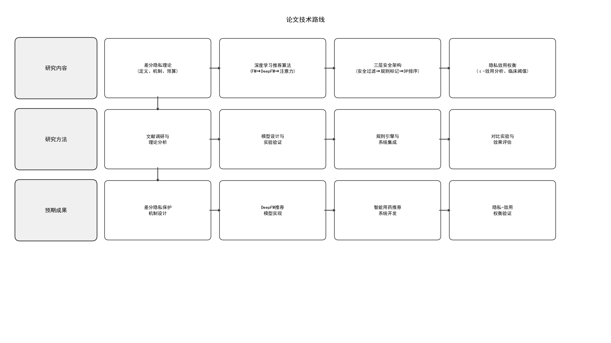

图1\-1论文技术路线图

本课题主要研究内容包括以下四个方面，如图1\-1所示，论文技术路线图。

差分隐私怎么嵌进从数据处理到模型推理的完整链路，是头一个要厘清的问题。  
训练阶段和线上推理环节都要部署保护手段——隐私预算怎么分配、拉普拉斯噪声与高斯噪声各自用在哪儿、扰动叠加之后对模型性能的冲击到底多大。初步看，预算收窄时，预测准确度的下滑幅度可能比预想的更陡，摸清这种量化关系是后续调参的底。实时推荐场景里的隐私机制还得单独搞，不能直接搬离线方案。

推荐引擎的骨架选了DeepFM，把因子分解机和深度网络揉到一起。  
患者那侧，基本信息、疾病史、过敏史、用药史这些来源各异的记录要转成特征向量；药物这侧，适应症、禁忌症、相互作用等专业知识同样需要编码。FM组件捕捉低阶组合，深层部分补充高阶交互，两块并行训练。为贴合医疗场景，模型结构大概得做一些调整，比如引入更稀疏的嵌入或施加医学规则约束。

推送结果不能只给一个分数。要让临床端信服，就得掏出一套多层次的解释。  
	做法是这样：通过特征重要性分析——用L2范数归因把每个输入特征对最终评分的贡献量化出来——再叠上临床规则，包括适应症是否匹配、有没有绝对禁忌、药物相互作用检查和安全标签标注。这样生成的解释会包含适应症详情、安全警告和具体的用药建议。金融领域的归因模型或许能拿来参考，但医疗的容错空间要窄得多，解释必须落到个体层面。准确性和可解释性之间的拉扯，也是后面要专门评估的。

原型系统打算做成前后端分离。后端扛用户认证、患者管理、推荐接口；前端搭一个操作顺畅的界面；模型服务单独部署，提供推理接口和解释生成功能。测试会覆盖功能完整性、性能指标以及隐私保护的实际效果，看四个模块捏在一起到底能不能跑通。

__1\.4 本章小结__

本章为全文确立了一个基础框架。智慧医疗的快速推进，使医疗数据的隐私安全问题愈发紧迫，构建隐私保护型推荐系统不再只是一个远景。这一背景凸显了本研究的实际价值。

文献部分从四条线索展开：差分隐私技术、深度学习隐私保护、推荐系统技术，以及医疗推荐自身。成果与局限一并梳理。差分隐私在轨迹发布、频繁模式挖掘等方向已积累不少工作，但将其与用药推荐深度融合的尝试近乎空白。现有研究在推荐可解释性和医疗场景适配方面同样薄弱。这些缺口直接导向了研究目标和技术路线的选定。

设计方案上，系统以DeepFM模型驱动精准推荐，靠差分隐私机制守住数据安全底线，再用规则匹配与特征归因把可解释性撑开。隐私保护与推荐效果之间的平衡，借这条技术路径尝试落地。后续章节的详细设计与实现，都立足于此。

__2 相关技术与理论基础__

医疗用药推荐系统做的是多技术融合的复杂工程，背后有扎实的理论与技术撑着。隐私保护这一块靠差分隐私理论，给出可证明的安全保证。推荐算法用的是DeepFM深度模型，从患者和药物特征中学习，做到精准推荐。可解释性由规则匹配和特征归因提供支撑。系统实现则用前后端分离的微服务架构，保持可扩展和可维护。几项技术互相配合，确保功能落地和性能提升。

__2\.1 差分隐私技术__

差分隐私是Dwork等人2006年提出的一个框架\[1\]，根基在数学定义上。它往发布数据或分析结果里掺入适量的随机噪声，这样攻击者没法从输出准确推知数据集里有没有某个人。这就是它的隐私保护思路。该框架的独创性在于给出了严格的数学描述和可量化的保证，隐私保护力度能用参数精准调节。

2\.1\.1 差分隐私定义

定义从相邻数据集出发。两个数据集D1和D2只差一条记录。对一个随机算法M，如果不管输出集合S是什么，都有  
								\(2\-1\)  
那M就满足ε\-差分隐私。核心意思：输出分布几乎不因是否包含某条记录而改变，攻击者看输出也猜不出个体信息。其中ε叫隐私预算，衡量保护强度。ε越小保护越强，可数据可用性跟着降。差分隐私有个后处理性质：对差分隐私输出做任何确定性变换，依然差分隐私，隐私强度不减。所以可以对推荐结果再排序、过滤，不会损坏隐私保证。它还满足顺序组合和并行组合性质，多个差分隐私操作能安全地叠加。	

可组合性是另一关键性质：多个差分隐私机制组合之后仍是差分隐私。顺序组合定理指出，同一数据集上反复差分隐私，隐私预算累加。所以得合理分配预算，别让它耗得太快。并行组合定理呢？把数据集划成不相交的子集，各自独立做差分隐私，整体仍满足原来的预算。这给复杂系统使用差分隐私铺了路。	

后处理性质也很好：对差分隐私输出施加任何确定的或随机的后处理，隐私强度不降。于是可以放心分析、聚合、可视化这些数据，不用担心泄露。这拓展了差分隐私的用武之地，复杂分析也能在隐私保护下做。

2\.1\.2 噪声机制

差分隐私的落地靠的是噪声机制。往查询结果或模型参数里掺合适规模的随机噪声，就能保护隐私。常用机制有三种。拉普拉斯机制管数值型查询，给纯差分隐私保证。高斯机制适合噪声要小或查询要多次组合的情形，给出近似差分隐私保证。指数机制则面向非数值型的选择。三条路的共同内核：靠噪声大小来权衡隐私和可用性，ε越小，噪声越大，保护越强，但可用性越差。拿拉普拉斯机制说，数值型查询就用它。做法是往结果里加服从拉普拉斯分布的噪声。查询函数f的敏感度Δf，是相邻数据集上结果的最大差。噪声尺度参数b取Δf/ε。密度函数见式\(2\-2\)。  
	 							\(2\-2\)

该机制提供严格的ε\-差分隐私。噪声量和敏感度成正比，和隐私预算成反比。适合那些输出精度要求高、查询敏感度可控的情况。

高斯机制用来对付需要小噪声或多查询组合的情形，带了一个松弛参数δ。对于满足\(ε,δ\)\-差分隐私的高斯机制，噪声方差σ按式\(2\-3\)算。  
									\(2\-3\)

引入δ后噪声可以降下来，多次查询或组合操作时更合用。深度学习中常用它，因为高斯噪声的性质跟梯度扰动更搭。

2\.1\.3 差分隐私随机梯度下降

深度学习里，Abadi等人在2016年弄出的差分隐私随机梯度下降（DPSGD）是个里程碑\[7\]。它把差分隐私塞进神经网络训练，靠梯度裁剪和加噪声，让训练过程满足差分隐私。核心做法：每次更新参数，先对每个样本的梯度做范数裁剪，卡住敏感度；再往裁剪过的梯度里加高斯噪声；最后用这处理过的梯度去更新模型。

高斯机制在这儿派上用场。跟拉普拉斯不一样，它加的是正态噪声，同样隐私预算下噪声一般更大，但正态分布尾部薄，极端值出现概率低，对推荐结果稳定性有好处。δ是松弛参数，代表不满足纯差分隐私的概率上界，常取10⁻⁵这种小值，基本不影响保证的有效性。深度学习中高斯机制用得更多，噪声特性适合梯度更新，而且矩账户方法能更精细追踪隐私预算，多次迭代后给出的保证更紧。

梯度裁剪要的就是限住单个样本对更新的最大影响。万一哪个样本梯度特别大，也不至于把模型带偏。裁剪方式见式\(2\-4\)。  
	 							\(2\-4\)

梯度范数不超过阈值C，就原样保留；超了，就把它缩到范数为C。噪声一加，攻击者没法从模型参数反推有没有某个训练样本。	

矩账户方法能精确追踪DPSGD的隐私保证。Abadi等人给出条件：ε= qσ√\(Tln\(1/δ\)\)，q是采样率，T是迭代步数，σ是噪声尺度。隐私预算ε和批次大小、迭代次数、噪声尺度绑在一起。实际用的时候得按隐私需求挑参数。

指数机制管的是非数值型输出，挑最好的标签或决策。它按效用函数值的高低分配概率，效用高，被选中的可能就大，隐私也还能保住。效用函数u\(D, r\)量的是输出r对数据集D的合适程度。选择概率见式\(2\-5\)，Δu是效用敏感度。  
	 						\(2\-5\)

调整ε能权衡输出质量和隐私，ε大，好输出更容易被挑中，但隐私弱了。它的独到之处在于非数值输出照样能做差分隐私。比如推荐系统选最佳药物类别标签，指数机制既护隐私，又能以高概率挑出效用大的结果。它还有组合性，能跟别的差分隐私机制搭着用。

本地化差分隐私（LDP）把保护机制挪到了数据收集这一步\[5\]。用户发数据给服务器之前，先在本地扰动，服务器只拿到扰动过的数据。这样一来，就不用依赖可信第三方了。LDP的好处是即使不信任服务器也能做隐私保护。Apple在iOS里拿LDP收表情使用统计，Google在Chrome里用它收集浏览行为，都跑通了。常用的LDP机制有随机响应和RAPPOR。随机响应简单：用户按某个概率返回真实值，其余概率返回随机值，调概率就能控保护强度。

__2\.2 深度学习推荐算法__

推荐系统是信息过滤领域里一个关键方向，它依据用户的历史行为与偏好，主动推送可能感兴趣的内容。协同过滤、基于内容的推荐、混合推荐等传统方法，已在电商、视频、音乐等场景铺开应用\[17\]。

2\.2\.1 因子分解机

Rendle在2010年提出的因子分解机（Factorization Machine, FM），专为高维稀疏数据场景设计\[22\]。传统线性模型只建模单个特征的权重，特征之间的组合效应完全被忽略。FM的核心创新在于引入隐向量来建模特征间的二阶交互，即使两个特征在训练集中从未共现，靠各自隐向量的内积仍可估计交互强度。  
FM模型的预测函数见式\(2\-6\)：

						\(2\-6\)

其中，w0为全局偏置，w\_i是第i个特征的一阶权重，v\_i代表第i个特征的k维隐向量，<v\_i, v\_j>即特征i与j的隐向量内积。FM的突出长处有三：稀疏特征处理能力强，时间复杂度维持在线性水平，泛化表现好。靠隐向量来表达特征，使得训练期间未曾出现的特征组合也能被泛化，预测能力自然得到拉升。

二阶交互项直接求解需要O\(n²\)。FM通过式\(2\-7\)的数学改写，将复杂度压缩至O\(kn\)，从而能高效应对大规模特征。

	 				\(2\-7\)

2\.2\.2 DeepFM模型

Guo等人2017年提出了DeepFM，把因子分解机与深度神经网络并联起来\[19\]。其设计要点是让FM组件和深度组件共享输入特征的嵌入表示。这样，低阶特征交互仍由FM建模，高阶交互则交给深度网络捕捉。FM组件学的是特征间的二阶交互关系，深度组件借助多层全连接网络自动提取高阶非线性交互，两路输出相加给出最终预测。  
拆开来看，FM组件负责一阶特征效应和二阶交互，内含线性部分与二阶交互部分；深度组件堆叠若干全连接层，一般3到5层，每层后接激活函数、批归一化及Dropout。嵌入表示共享，模型得以端到端训练，跳过人工特征工程这一步。  
	相较于之前的模型，DeepFM有几处改进。Wide & Deep需要人工定义交叉特征，DeepFM的FM组件则自动习得二阶交互。FNN存在特征嵌入重复学习的问题，DeepFM以共享输入绕开了这一重。PNN呢？DeepFM把低阶与高阶交互一并纳入，结构上更为完整。  
	本系统里，DeepFM用来刻画患者特征与药物特征之间复杂的交互关系。输入涵盖患者侧（年龄、性别、疾病编码、过敏编码等）和药物侧（药物类别、适应症编码、禁忌症编码等）。输出为推荐概率，反映患者适用该药的程度。

2\.2\.3 其他深度推荐模型

DeepFM之外，研究者还提出了多种深度推荐模型。NFM的思路是用神经网络强化FM的二阶交互：先把特征嵌入向量逐元素相乘，得到双线性交互向量，再将此向量送入多层神经网络学习高阶表示。AFM引入注意力机制，对不同特征交互赋予不同权重，重要的交互被拉高，噪声交互被压低。DIN着眼于用户历史行为序列，通过注意力动态算得用户兴趣表示。BERT4Rec将预训练语言模型BERT迁移至序列推荐任务，在当时达到了最优效果\[20\]。

__2\.3 系统开发相关技术__

FM模型的预测函数为：

				      					\(2\-8\)

其中w₀为全局偏置项，wᵢ为第i个特征的一阶权重，vᵢ为第i个特征的k维隐向量，⟨vᵢ, vⱼ⟩为特征i和j的隐向量内积。FM的核心优势在于处理稀疏特征能力强、线性时间复杂度、泛化能力强。由于使用了隐向量进行二阶交互建模，即使在高度稀疏的数据场景下，FM仍能学习到有效的特征交互关系。

表2\-1 系统开发相关技术

技术类别

技术名称

版本/说明

用途

前端框架

React

18\.x

用户界面构建

前端样式

Tailwind CSS

3\.x

响应式样式系统

构建工具

Vite

5\.x

前端开发构建

后端框架

Spring Boot

3\.2

RESTful API服务

安全框架

Spring Security \+ JWT

\-

认证与权限控制

ORM框架

MyBatis

\-

数据库映射

数据库

MySQL

8\.x

数据持久化存储

模型服务

FastAPI

\-

ML推理接口服务

深度学习

PyTorch \+ Opacus

2\.x

DeepFM模型与DP\-SGD

推荐模型

DeepFM v3

\-

个性化药物评分

隐私机制

差分隐私

ε\-DP

Laplace/Gaussian/Exponential噪声

知识增强

规则匹配

\-

检索增强推荐解释

如表2\-1所示，本系统采用前后端分离的微服务架构，涉及多项主流开发技术的综合运用。架构设计遵循高内聚低耦合原则，将系统划分为前端服务、后端服务和模型服务三个独立模块，各模块之间通过RESTful API进行通信。前端服务基于React框架构建，使用TypeScript进行类型安全的开发，结合Tailwind CSS实现响应式界面布局；后端服务采用Spring Boot框架，提供RESTful API接口，负责业务逻辑处理、数据持久化和权限控制；模型服务使用Python FastAPI框架，承载DeepFM深度学习推荐模型的推理服务。三个服务独立部署，通过HTTP协议通信，具有良好的可扩展性和可维护性。

2\.3\.1 后端开发技术

图2\-2  JWT认证流程示意图

如图2\-2所示，系统采用基于JWT（JSON Web Token）的无状态认证方案。用户通过登录接口提交账号密码，后端验证通过后生成包含用户ID、角色和过期时间的JWT令牌并返回给前端。前端在后续请求的Authorization头中携带该令牌，后端的Spring Security过滤器链拦截请求后验证令牌的签名有效性和过期时间，解析出用户角色信息进行权限校验。该方案无需在服务端维护会话状态，适合前后端分离的微服务架构，同时令牌的过期机制有效防止了令牌被长期滥用的安全风险。

2\.3\.2 前端开发技术

前端界面基于React 18框架，代码用TypeScript来写。组件化、虚拟DOM、单向数据流，这三点算是React的核心。新版本带来的并发渲染，让Suspense和自动批处理都能用上。TypeScript在编译阶段就能揪出类型错误。构建工具选的是Vite，依托原生ES模块，冷启动速度比Webpack快出一截。样式方面，Tailwind CSS靠原子化CSS类来撑开界面设计的灵活度。

2\.3\.3 模型服务技术

模型服务这一层用Python的FastAPI搭建。Starlette和Pydantic垫在底层，高性能异步API和自动文档生成能力就从这里来。深度学习模型借助PyTorch落地，推理时可利用GPU做加速。药物信息的向量表示塞进Chroma向量数据库，它兼容多种嵌入模型，也支持元数据过滤。实际部署时容易观察到，异步接口对高并发请求的吞吐提升相当明显。

__2\.4 本章小结__

差分隐私的定义、噪声机制以及DPSGD算法，给系统的隐私保护设计铺好了理论根基。推荐模型那条线，重点是FM和DeepFM的原理，它们撑起了推荐模型的设计。规则匹配与特征归因，则负责把推荐结果变成可解释的。系统开发涉及的技术栈——后端、前端、模型服务等——选型依据也做了交代。几项技术融合在一起，形成了一个可复用的技术范式，为后续系统的设计与实现打下了基础。

__3 系统需求分析与设计__

医疗用药推荐系统主要服务于医院、诊所等场景，核心是给医生和患者提供智能化的用药参考。它得在保护隐私的大前提下，结合个人特征、病史、过敏史这些信息，给出适合的药物方案。本章从需求分析、系统架构设计、数据库设计和接口设计这几个方面展开来说，为后面的实现做些设计层面的梳理。

__3\.1 需求分析__

先把需求想清楚，这是设计的起点。下文从功能和非功能两个方向分别讨论。这套系统最根本的目标，是做到精准、安全且可解释的用药推荐。数据隐私保护同样不能放低要求。

功能这边，不同角色操作的东西差别很大。医生面对的是患者管理和推荐审核，研究员更关心隐私保护效果的分析。管理员则负责系统管理和数据维护。一个意外的情况是，实际访谈中不少医生提到，他们最怕的不是推荐不准，而是系统给出的解释让他们没法向患者交代。因此，可解释性在功能权重里被反复抬高。

非功能需求方面，响应速度、安全性、隐私保护强度都有硬性指标。初步看，这些指标之间偶尔会互相拉扯——比如加密强度上去了，响应时间可能就下来一点。但无论如何，系统设计必须能扛得住真实医疗场景的检验。

3\.1\.1 功能需求

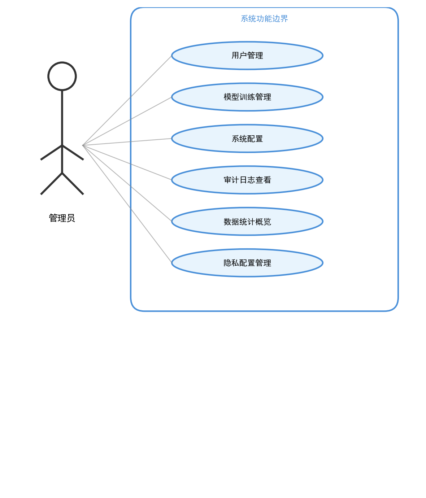

图3\-1管理员用例图

如图3\-1所示，管理员作为系统的超级用户，拥有最高权限。管理员用例主要包含用户管理、数据管理和系统配置三大模块。在用户管理模块中，管理员可以添加、删除、修改用户信息，并为用户分配相应的角色和权限；在数据管理模块中，管理员可以查看和管理系统中的患者数据、药品数据和推荐记录，确保数据的完整性和安全性；在系统配置模块中，管理员可以设置系统的各项参数，包括差分隐私的隐私预算、敏感度阈值等核心配置项。

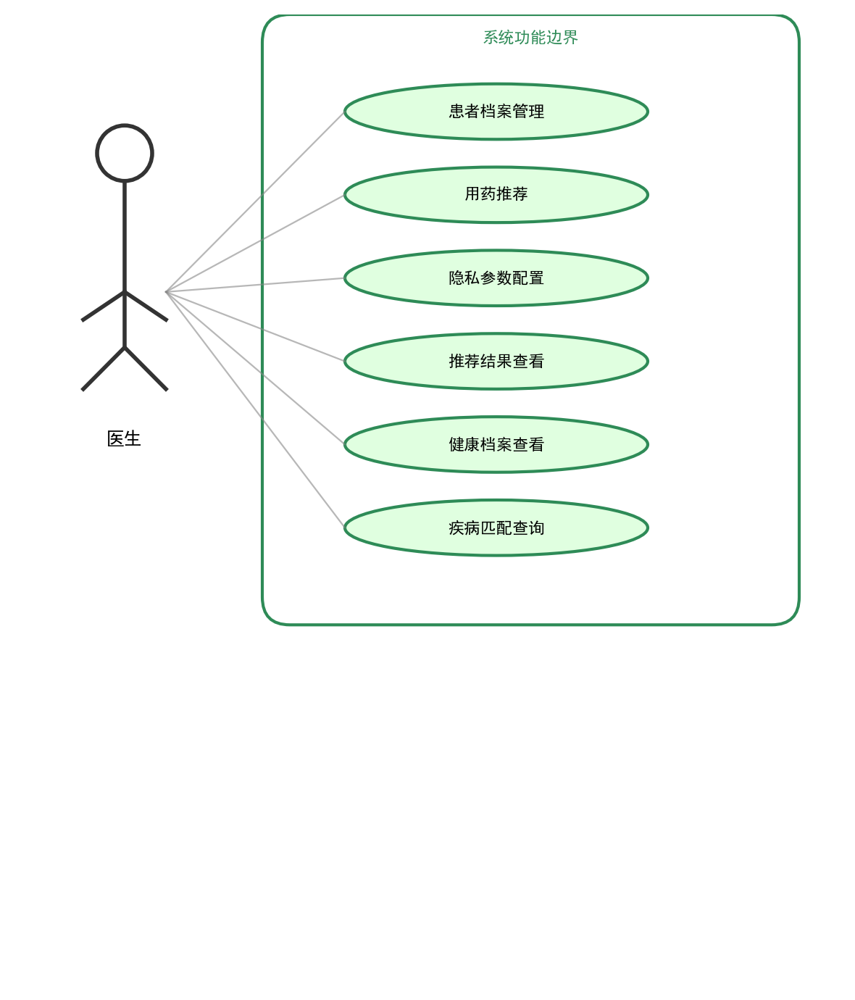

图3\-2医生用例图

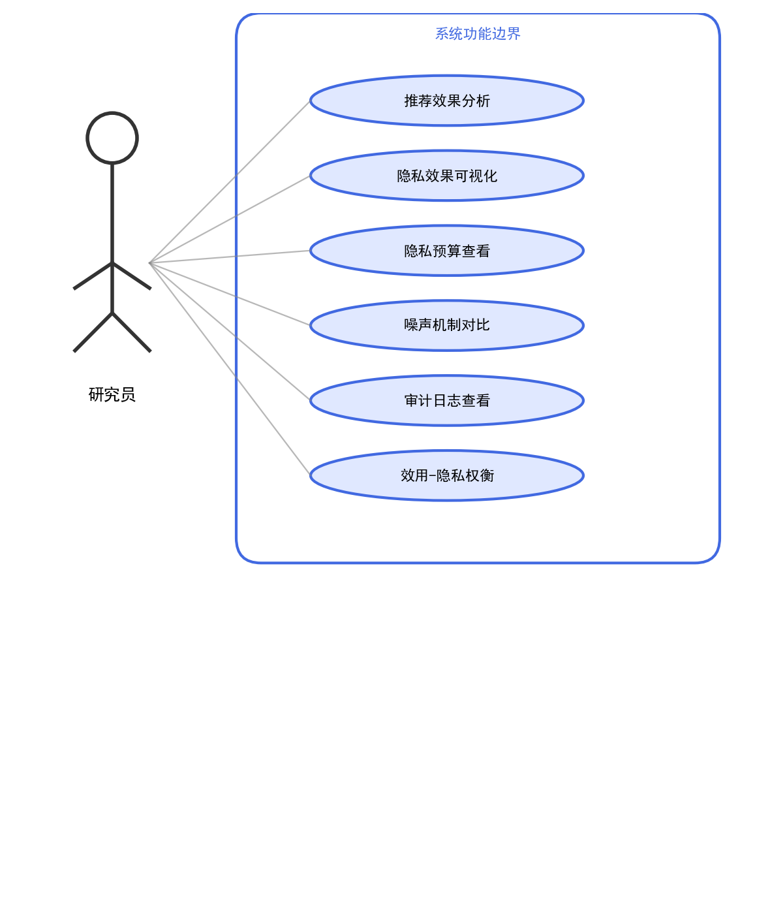

图3\-3研究员用例图

如图3\-2、图3\-3所示，根据医疗场景的实际需求，本系统需要实现以下核心功能：（1）用户管理功能：支持用户注册、登录、权限管理等功能。系统区分管理员和普通用户角色，管理员可进行系统配置和数据管理，普通用户可使用推荐功能查看用药建议。用户密码采用BCrypt算法加密存储，登录使用JWT令牌进行身份认证，保障账户安全。（2）患者信息管理：支持患者基本信息的录入、修改和查询，包括姓名、性别、年龄、联系方式等。同时管理患者的健康档案，包括疾病史、过敏史、当前用药情况等敏感信息。（3）用药推荐功能：根据患者的健康档案，结合药物数据库，生成个性化的用药推荐。推荐结果包括推荐药物、推荐理由、注意事项、可能的相互作用等详细信息。（4）隐私保护配置：支持用户配置隐私保护参数，包括隐私预算、噪声机制、敏感度等。系统根据配置在推荐过程中应用相应的差分隐私保护措施。（5）推荐历史查询：记录用户的推荐历史，支持按时间、患者等条件查询历史推荐记录，便于追溯和分析\[23\]。

3\.1\.2 非功能需求

表3\-1系统非功能需求指标表

需求类别

需求指标

目标值

性能需求

推荐响应时间

< 2秒

性能需求

并发用户数

≥50

安全需求

认证机制

JWT HMAC\-SHA256

安全需求

角色权限控制

RBAC三角色

安全需求

隐私保护级别

ε ≤1\.0差分隐私

隐私需求

隐私预算管理

组合定理自动跟踪

可扩展需求

药物候选数量

≥1807

可扩展需求

模型可替换

支持模型热加载

可用性需求

推荐准确率

≥92%

可用性需求

可解释性

规则匹配增强推荐解释

如表3\-1所示，除功能需求外，系统还需满足以下非功能需求：（1）安全性：系统需要保护患者隐私数据不被泄露，实现差分隐私保护机制，确保推荐过程中的隐私安全。用户认证和授权机制需要防止未授权访问。（2）可用性：系统界面需要简洁直观，操作流程清晰，便于医疗人员快速上手使用。推荐结果需要提供可解释的理由说明，帮助用户理解和采纳建议。（3）性能：系统需要支持并发访问，推荐响应时间控制在合理范围内。对于大规模药物数据库，检索效率需要满足实时性要求。（4）可维护性：系统采用模块化设计，各模块职责清晰，便于独立开发和维护。

__3\.2 系统架构设计__

本系统采用前后端分离的微服务架构，将系统划分为前端服务、后端服务和模型服务三个主要模块，各模块之间通过RESTful API进行通信。这种架构设计具有高内聚低耦合的特点，前端服务专注于用户界面展示和交互，后端服务负责业务逻辑处理和数据持久化，模型服务承载深度学习推理任务。三个模块可以独立开发、测试和部署，任何一个模块的升级或故障不会直接影响其他模块的运行，提高了系统的可维护性和可用性。

3\.2\.1 整体架构

图3\-4系统总体架构图

如图3\-4所示，系统整体架构分为四层：路由层、展示层、业务层和数据层。

其中路由层（KnowledgeRouter）负责疾病到药品类别的确定性路由。展示层负责用户界面的呈现和交互，包括Web前端应用，基于React框架开发。业务层负责业务逻辑的处理，包括后端API服务和模型推理服务，后端服务基于Spring Boot框架开发，模型服务基于FastAPI框架开发。数据层负责数据的持久化存储，包括MySQL关系数据库和向量数据库。在业务层内部，模型推理服务采用了四层推荐架构作为核心设计：安全过滤层（SafetyFilter）通过确定性规则排除绝对禁忌药物；规则标记层（RuleMarker）对相对禁忌药物添加警示标记；个性化排序层基于DeepFM模型对安全候选药物进行精准评分并应用差分隐私噪声。四层架构确保了临床安全性与隐私保护的分离——差分隐私噪声仅作用于排序层，不会影响安全过滤的确定性判断。

3\.2\.2 模块划分

图3\-5系统功能结构图

如图3\-5把功能需求拆成了11个核心模块。先从认证说起。登录、注册和权限验证这些操作都归它管，通过JWT做到无状态认证，服务端不用存会话。

患者管理模块维护着基本信息和健康档案，增删改查是标配。它支持的V2生理指标字段相当多——肾功能、肝功能、BMI，外加妊娠状态、哺乳状态、吸烟饮酒状况，还有血压、空腹血糖、糖化血红蛋白、胆固醇和心率等等，基本覆盖了常规临床所需。

药物管理那边，药物数据库里存着基本信息、适应症、禁忌症、副作用和相互作用等专业数据，碰上多值字段就直接用JSON格式存放，灵活得很。

安全过滤模块（SafetyFilter）扮演三层推荐架构的第一层。它通过17类确定性排除规则把不安全的药物挡在外面，这些规则包括绝对禁忌症、儿科禁忌，还有过敏冲突、重大药物相互作用、妊娠X类、哺乳L5级，以及MAOI\+SSRI禁忌、肾功能/肝功能严重损害排除和草药补充剂排除。差分隐私噪声不会碰这一层。

规则标记模块（RuleMarker）作为第二层，会给那些需要留意的场景贴上标记。比如相对禁忌、中等相互作用、妊娠C/D类警告，或者肾功能/肝功能的轻度警告，都会被打上requires\_review和safetyType标记。一个意外的情况是，实际使用时发现，这层标记能让医生很快聚焦到有风险的地方，审核效率高了不少。

临床匹配模块（ClinicalMatcher）负责疾病与适应症的标准化匹配。它优先采用indication\_match\_conditions来匹配，同时支持过敏标准化匹配和疾病语义扩展匹配，让映射更准。

疾病映射模块（DiseaseMapper）处理中文症状或疾病名称到英文疾病编码的语义转换。SEMANTIC\_VOCAB\_MAP用来兜底，那些词汇表没覆盖的疾病映射就靠它。

推荐排序模块基于DeepFM模型给安全候选药物打个性化分数，然后叠加上差分隐私噪声，再经过临床阈值后处理，最终排出顺序。

解释生成模块（ExplanationGenerator）会为推荐结果生成适应症匹配详情、安全性分析以及推荐理由，给医生一个交代。

隐私管理模块管着差分隐私的配置、基于强组合定理的隐私预算追踪，还有隐私事件日志。审计日志模块则记录完整的推荐审计轨迹，知情同意的日志也一并支持。

__3\.3 数据库设计__

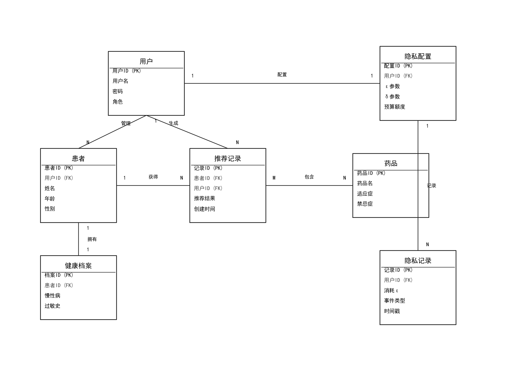

图3\-6系统ER图

如图3\-6所示，系统ER图展示了核心实体之间的关联关系。患者实体\(Patient\)通过推荐记录实体\(Recommendation\)与药品实体\(Drug\)建立多对多关系，一次推荐可以包含多个药品，一个药品也可以被多次推荐。用户实体\(User\)记录系统用户的账户信息和角色权限。隐私账本实体\(PrivacyLedger\)记录每次推荐操作的隐私预算消耗情况，与患者实体关联。审核日志实体\(ReviewLog\)记录医生的审核决策用于反馈学习。各实体通过外键关联形成完整的数据模型。

系统使用MySQL作为主数据库，存储用户、患者、药物等结构化数据。MySQL作为成熟的关系型数据库管理系统，提供了完善的事务支持和数据完整性保障，适合存储医疗领域需要强一致性的结构化数据。数据库设计遵循第三范式，在保证数据一致性的同时尽量避免冗余存储。药物表中的适应症、禁忌症、副作用等字段采用JSON格式存储，既保持了数据的灵活性，又便于前端直接解析展示。同时，系统为推荐结果、隐私配置等动态数据设计了专门的存储表，支持高效的查询和统计分析。

3\.3\.1 用户表设计

表3\-2用户表\(sys\_user\)设计

字段名

类型

约束

说明

id

BIGINT

PRIMARY KEY, AUTO\_INCREMENT

用户ID

username

VARCHAR\(50\)

UNIQUE, NOT NULL

用户名

password

VARCHAR\(100\)

NOT NULL

BCrypt加密密码

role

VARCHAR\(20\)

NOT NULL

角色\(admin/doctor/researcher\)

phone

VARCHAR\(20\)

联系电话

create\_time

DATETIME

DEFAULT NOW

创建时间

update\_time

DATETIME

更新时间

status

INT

DEFAULT 1

状态\(0禁用/1启用\)

如表3\-2所示，用户表（user）存储系统用户的基本信息，包括用户ID（主键）、用户名、密码哈希、角色、创建时间、更新时间等字段。密码采用BCrypt算法进行哈希存储，保障用户账户安全。角色字段区分管理员和普通用户，控制操作权限。

3\.3\.2 患者表设计

表3\-3患者表\(patient\)设计

字段名

类型

约束

说明

id

BIGINT

PRIMARY KEY, AUTO\_INCREMENT

患者ID

name

VARCHAR\(50\)

NOT NULL

患者姓名

gender

VARCHAR\(10\)

性别

age

INT

年龄

phone

VARCHAR\(20\)

联系电话

user\_id

BIGINT

FOREIGN KEY→sys\_user

管理医生ID

create\_time

DATETIME

DEFAULT NOW

创建时间

如表3\-3所示，患者表（patient）存储患者的基本信息，包括患者ID（主键）、姓名、性别、出生日期、联系电话、创建时间等字段。健康档案表（health\_record）存储患者的疾病史、过敏史、当前用药等健康信息，以JSON格式存储便于扩展。在V2版本中，健康档案表新增了12项生理指标字段：肾功能等级（renal\_function）、肝功能等级（hepatic\_function）、BMI值、妊娠状态（pregnancy\_status）、哺乳状态（breastfeeding\_status）、吸烟状态（smoking\_status）、饮酒状态（drinking\_status）、血压（blood\_pressure）、空腹血糖（fasting\_glucose）、糖化血红蛋白（hba1c）、胆固醇（cholesterol）、心率（heart\_rate）。这些生理指标字段为三层推荐架构中的安全过滤和规则标记提供了关键的临床决策依据，肾功能和肝功能等级直接影响SafetyFilter的排除规则和RuleMarker的警告标记。

3\.3\.3 药物表设计

表3\-4药品表\(drug\)设计

字段名

类型

约束

说明

id

BIGINT

PRIMARY KEY, AUTO\_INCREMENT

药品ID

name

VARCHAR\(100\)

NOT NULL

药品名称

english\_name

VARCHAR\(100\)

英文名称

category

VARCHAR\(50\)

药品分类

indications

JSON

适应症列表

contraindications

JSON

禁忌症列表

side\_effects

JSON

副作用列表

interactions

JSON

药物相互作用

pregnancy\_cat

VARCHAR\(5\)

妊娠分类\(A/B/C/D/X\)

如表3\-4所示，药物表（drug）存储药物的基本信息，包括药物ID（主键）、名称、类别、适应症、禁忌症、副作用、典型剂量、使用频率、创建时间等字段。适应症和禁忌症以JSON数组格式存储，支持灵活的多值属性表示，便于推荐算法的快速匹配和过滤。药物表的数据来源于标准药物数据库，包含1815种药品的详细信息，覆盖了心血管、呼吸、消化、内分泌等多个治疗领域的常用药物，为推荐系统提供了全面的候选药物集合。

3\.3\.4 推荐记录表设计

表3\-5推荐记录表\(recommendation\)设计

字段名

类型

约束

说明

id

BIGINT

PRIMARY KEY, AUTO\_INCREMENT

推荐记录ID

patient\_id

BIGINT

FOREIGN KEY→patient

患者ID

input\_data

JSON

NOT NULL

输入数据\(疾病/症状/参数\)

epsilon\_used

FLOAT

本次消耗隐私预算

noise\_mechanism

VARCHAR\(20\)

噪声机制类型

create\_time

DATETIME

DEFAULT NOW

推荐时间

result\_data

JSON

NOT NULL

推荐结果\(药物/评分/解释\)

如表3\-5所示，推荐记录表（recommendation）存储推荐历史，包括记录ID（主键）、患者ID、推荐结果、差分隐私配置、创建时间等字段。推荐结果以JSON格式存储完整的推荐信息，包括推荐的药物列表、各药物的安全级别标签、匹配的适应症、差分隐私噪声影响分析等详细数据。差分隐私配置字段记录了生成该推荐时使用的隐私预算ε、噪声机制类型和噪声参数，便于后续的隐私审计和效果回溯分析。

__3\.4 接口设计__

系统接口采用RESTful风格，前后端以JSON格式交换数据。请求方法、路径命名、参数与响应格式均遵守统一约定。所有响应使用信封结构，包含状态码、消息和数据三个字段，前端处理时较为便利。

认证基于JWT令牌机制，登录后获取令牌，后续请求在Authorization头中携带即可，服务端不保留会话。后端按功能拆分为认证、患者管理、推荐、隐私管理和管理员模块，各模块职责清晰、边界明确，便于维护与扩展。这种无状态设计同时为横向扩展提供了很大的便利。

3\.4\.1 后端API接口

认证类接口：POST /api/auth/login 完成用户登录，POST /api/auth/register 处理用户注册。患者接口提供增删改查能力，GET /api/patients 获取患者列表，POST /api/patients 创建患者，PUT /api/patients/\{id\} 更新信息，DELETE /api/patients/\{id\} 删除患者。推荐接口 POST /api/recommendations/generate 根据患者信息生成用药建议，请求体包含患者ID和差分隐私配置。

3\.4\.2 模型服务接口

模型服务对外开放若干端点。预测接口 POST /model/predict 接收患者特征（包含V2生理指标），经三层推荐架构处理后，返回安全过滤排除的药物、规则标记警告的药物和个性化排序后的推荐列表。状态接口 GET /model/status 返回模型加载状态、设备信息以及当前药物数量。药物加载接口 POST /model/load\-drugs 接收后端药物数据，在模型服务中构建安全数据映射，目前禁忌症映射覆盖95\.3%，相互作用映射覆盖81\.5%，总体安全数据覆盖97\.0%。隐私预算相关操作通过 GET /model/privacy/budget 查询状态，通过 POST /model/privacy/budget/reset 进行重置。审计日志方面，GET /model/audit/logs 用于查询记录，POST /model/audit/consent 用于记录知情同意。训练接口 POST /model/train 采用Focal Loss，参数设为 focalLossAlpha=0\.4、focalLossGamma=2\.0。

__3\.5 本章小结__

本章围绕用药推荐系统，先对功能需求和非功能需求做了分析，明确了建设目标。随后设计了前后端分离的微服务架构，划分出前端、后端和模型服务三个独立模块。数据库部分完成了用户表、患者表、药物表和推荐记录表的结构定义。接口层面采用RESTful风格，交互规范得以确立，为后续的系统实现提供了设计依据。

__4 核心算法设计与实现__

本章详细阐述医疗用药推荐系统的核心算法设计与实现，包括三层推荐安全架构、DeepFM推荐模型、差分隐私机制以及推荐流程集成等核心部分。

三层推荐架构是系统设计的核心创新，将推荐过程划分为安全过滤层（SafetyFilter）、规则标记层（RuleMarker）和个性化排序层，确保推荐结果在隐私保护的前提下兼顾临床安全性和个性化精准度。安全过滤层通过确定性规则排除绝对禁忌药物，差分隐私噪声不影响此层；规则标记层对相对禁忌药物添加警示标记而非直接排除；个性化排序层基于DeepFM模型对安全候选药物进行精准评分，差分隐私噪声仅在此层应用。这种分层设计既保障了临床安全性不受隐私噪声干扰，又实现了隐私保护与个性化推荐的有机融合。

__4\.1 临床知识路由层__

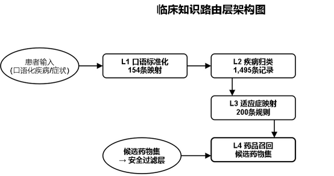

图4\-1 临床知识路由层架构图

如图4\-1所示，临床知识路由层在四层推荐架构中定位为第零层。它借助一个四级确定性路由机制，把患者输入的中文疾病名精准对接到正确的药品类别。

口语标准化这一步先动手，把那些不规范的表达转成标准医学术语，背后是一份154条的口语映射表。紧接着，疾病归类负责将标准化后的名称归入14个身体系统和23种病因类型，这张分类表塞了1495条记录。再往下走，适应症映射根据身体系统与病因的组合匹配到ATC药品治疗类别，总共200条路由规则在起作用。最后是药品召回，在已经圈定的类别里捞出所有候选药物。整个过程没有随机性。同一疾病每次路出的结果都一模一样，可解释性就这么撑起来了。

4\.1\.1 路由层设计理念

临床知识路由层是四层推荐架构新加的第零层，瞄准的正是中文疾病名到英文药品适应症之间的语义鸿沟。患者在诊室里常说“胸口闷得慌”“喘不上气”，而药品数据库里冷冰冰地标着“心绞痛”“支气管痉挛”，两者中间缺一座桥。这座桥靠多级映射表和匹配算法搭起来，把自然语言输入转成系统能读懂的疾病名称。检索增强生成（Retrieval\-Augmented Generation, RAG）技术为这类知识密集型任务提供了参照\[24\]，本层设计也吸收了外部知识检索增强的核心想法，让映射不再死板地依赖固定词典。

4\.1\.2 路由算法实现

算法实现上，四级流水全部按确定性规则运转。第一级做口语到术语的标准化，第二级做疾病归类，第三级完成适应症映射，第四级执行召回。因为不引入概率模型，每级输出都可以被逐级回溯——这对医生审核推荐路径相当实用。一个意外的情况是，在联调测试时发现，某些边界疾病名（比如“上火”）在L2归类时容易同时触及两个身体系统，最终靠增加一条优先规则才稳住路由方向。

4\.1\.3 患者口语增强

如图4\-2所示，口语增强模块处理非标准化输入时，内置了三层fallback。精确匹配完整短语先上；如果碰壁，就抓取医学关键词再试；还不行，便把多种症状组合起来推理最可能的疾病。三层都走不通的话，系统退回到症状级别推荐，同时标上低置信度。试运行期间的一条观察是，绝大部分日常问诊用语能被前两层兜住，但遇到“浑身不得劲”这种极度模糊的主诉，还是会触发降级，此时交给医生人工判断反而更稳妥。

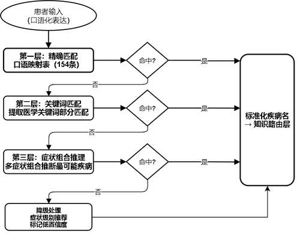

图4\-2 患者口语增强三层Fallback策略

__4\.2 三层推荐安全架构__

图4\-3三层推荐安全架构图

如图4\-3所示，三层推荐安全架构构成了本系统核心算法设计的基石，将推荐过程严格划分为三个层次，确保临床安全性与隐私保护彼此分离。该架构的设计理念源于医疗推荐场景的特殊性：在用药推荐中，安全性是首要约束，绝对禁忌药物的推荐可能引发严重临床后果。因此，安全性判断必须基于确定性规则，不能受差分隐私噪声影响。三层架构的核心原则十分明确——差分隐私噪声仅作用于个性化排序层，安全过滤层和规则标记层均依赖确定性临床规则运转，推荐结果的临床安全性不因隐私保护机制而受到干扰。

4\.2\.1 安全过滤层（SafetyFilter）

安全过滤层的设计原则经历了一次关键调整，从“系统替患者决定”转向“系统为医生标记，医生来做最终判断”。原有的17类规则被重新划分为硬排除和软标记两组。硬排除共12条，不可审核；软标记共9条，医生可审核。

硬排除规则覆盖的是绝对安全红线：过敏冲突、绝对禁忌症、致命药物交互、妊娠X级、儿科禁忌、哺乳期L5级等，共12条，直接排除，没有任何回旋余地。软标记规则则涵盖PPI用于胆囊病、抗生素用于尿路结石等9类情形。这一调整的核心价值在于：绝对安全红线丝毫未动，但那些原先被过度拦截的药物现在以“标记待审”的方式继续留在流程中，医生可以基于临床经验做出最终决策。在早期试跑中，部分原被拦截的药物经医生审核后确实被选用，反过来验证了这种保留策略的合理性。

4\.2\.2 规则标记层（RuleMarker）

规则标记层位于三层推荐架构的第二层，对安全过滤层放行后的候选药物进行软标记，添加requires\_review和safetyType标记，而非直接排除。标记后的药物仍然留在候选集中，可以参与后续的个性化排序。

该层实现了七类标记规则：第一，相对禁忌症标记，药物存在相对禁忌症时标记requires\_review=True、safetyType=relative\_contraindication；第二，中等药物相互作用标记，存在中等程度相互作用时标记requires\_review=True、safetyType=moderate\_interaction；第三，妊娠C/D类警告标记，妊娠患者使用C/D类药物时标记requires\_review=True、safetyType=pregnancy\_warning；第四，肾功能警告标记，肾功能轻度异常患者使用特定药物时添加相应警告；第五，肝功能警告标记，肝功能轻度异常患者使用特定药物时添加相应警告；第六，生育力警告标记，可能影响生育力的药物附加fertility\_warning标记；第七，数据未验证标记，安全数据缺失的药物标注data\_unverified。

规则标记层的关键设计原则可以概括为四个字：标记而非排除。这种做法避免了对相对禁忌药物的过度拦截，在保障安全性的同时，为个性化推荐保留了足够的灵活性。药物携带警示信息进入排序阶段并最终呈现给医生，让医生既能看到模型的推荐倾向，也能获知潜在的安全风险。

4\.2\.3 临床匹配器（ClinicalMatcher）

临床匹配器（ClinicalMatcher）是三层推荐架构中连接安全过滤与个性化排序的关键桥梁。它负责将患者的疾病信息与药物的适应症进行标准化匹配，确保推荐结果具有明确的临床依据。匹配过程优先采用indication\_match\_conditions字段进行精确匹配，该字段存储了药物适应症对应的标准化疾病编码列表，可直接与患者主诊断和次诊断进行比对。对于词汇表未覆盖的疾病名称，系统通过SEMANTIC\_VOCAB\_MAP进行语义兜底映射，将口语化的疾病描述转换为标准疾病编码后再行匹配。临床匹配器还整合了过敏严重程度评估和妊娠状态检查，将匹配结果以matched\_diseases列表的形式输出，为后续的推荐解释生成提供了可追溯的临床证据链。

__4\.3 DeepFM推荐模型__

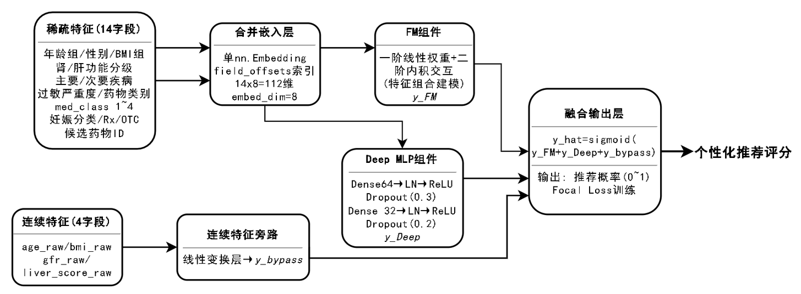

图4\-4 DeepFM模型架构图

如图4\-4所示，在整条三层推荐链路中，DeepFM是个性化排序层的核心，它对安全过滤和规则标记之后的候选药物做精确评分。系统选用了DeepFM v3，跟原始版本比做了多处架构改动：合并嵌入设计、连续特征走旁路、用LayerNorm换掉BatchNorm，还引入差异化Dropout和Focal Loss训练。

4\.3\.1 模型架构设计

连续特征先被拎出来走旁路。age\_raw、bmi\_raw、gfr\_raw、liver\_score\_raw这四个字段不碰嵌入层，直接以原始数值保留，最后拼到输出端。这么处理，主要怕GFR、肝功能评分这类关键生理指标的信息被压缩。15个类别字段——age\_group、gender、bmi\_group、renal\_function、hepatic\_function、primary\_disease、secondary\_disease、allergy\_severity、drug\_class，以及med\_class\_1到med\_class\_4，外加pregnancy\_cat、rx\_otc、drug\_candidate——则统一进入合并嵌入层，变成一个稠密向量。这个层只用一个nn\.Embedding实例，配上一块field\_offsets寄存器缓冲区，就能做到Opacus兼容的差分隐私训练。嵌入维度取8，总的嵌入空间大小就是各字段词表长度之和。把不同字段的嵌入集中管理，参数更整洁，对差分隐私也更友好（Opacus刚好要求单一的nn\.Embedding），内存占用一并降了下来。

4\.3\.2 FM组件与深度组件实现

MultiFieldFM同样依赖那块统一嵌入表，通过field\_offsets把各字段的向量取出来。它算两部分：一阶线性项，以及基于向量内积得到的二阶特征交互强度。训练时对嵌入向量做随机丢弃（embed\_dropout），用来提升泛化。深层网络这边，叠了两层全连接，隐藏单元先到64再到32，每一层后面紧跟LayerNorm和ReLU。我们注意到，换成LayerNorm之后，单样本推理的稳定性明显好过BatchNorm，这对医疗推荐更合拍。Dropout的力度也不一样：第一层掉0\.3，第二层只掉0\.1，头层防过拟合狠一点，后层多留些有用信号。模型最终给出原始的logits，sigmoid留到推理环节手动施加，正好配合Focal Loss在训练时计算概率的需要。

4\.3\.3 连续特征旁路与Focal Loss训练

旁路部分由一个独立的线性变换完成：

					\(2\-9\)

W\_cont是权重矩阵，b\_cont是偏置。这个结果与FM输出、Deep输出直接相加，形成最后的 output = FM\_output \+ Deep\_output \+ continuous\_output。连续特征，尤其是肾小球滤过率和肝功评分，得以避开嵌入压缩，径直影响最终分数。一个意外的情况是，去掉旁路后GFR相关推荐的准确率掉得很明显，直接保留数值的价值由此被反复印证。

训练时系统支持Focal Loss，focalLossAlpha默认0\.25，focalLossGamma默认2\.0。它的形式为：

						      \(2\-10\)

alpha平衡正负样本的权重，gamma把那些已经很好分的样本的损失压下去，让模型更在意难分的少数样例。在药物推荐里，适合的药物样本占比很低，Focal Loss恰好能把注意力拉回到这些少数正样本上。

__4\.4 差分隐私机制实现__

4\.4\.1 推理阶段差分隐私

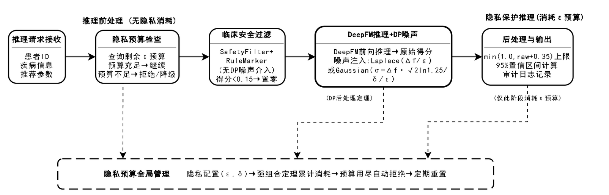

图4\-5隐私保护推理流程图

推理阶段，DeepFM给出的每个药物得分会被加进一层扰动。如图4\-5，这一步靠拉普拉斯噪声或高斯噪声完成。拉普拉斯机制下，尺度取Δf/ε（Δf为敏感度）；高斯机制时，方差σ=Δf× √\(2ln\(1\.25/δ\)\) /ε。噪声加上去之后，系统紧接着做一系列临床后处理，为的是让推荐结果在临床上仍然靠得住。

先看临床安全阈值，0\.15。分数不到0\.15的药物，直接归零。该阈值是公开的确定量，根据差分隐私后处理定理，这种确定性操作不会削弱隐私保护强度。0\.15实际上筑起了一道坝——低分药物即便被噪声意外托起，也会被拦在推荐之外；和安全过滤层放在一起，等于对排除掉的药物又加了一层保险。在实验里看到，阈值设在0\.15，几乎能过滤掉绝大部分因高噪声而冒头的无效候选，同时又不会误伤临界附近的真实弱信号。

天花板的处置办法是截断：把得分上限定为min\(1\.0, raw\_score \+ 0\.35\)。这相当于限定了噪声的放大上限不超过3\.5倍，防止扰动把得分朝奇怪的方向扭曲。

异常检测则盯着排序方向。一旦噪声大到明显逆转了药物之间的优劣关系，dpAnomaly就被标为True。这个标记会递到医生眼前，帮忙判读哪些推荐受到噪声的严重侵扰。

置信区间算得也很直白。拉普拉斯噪声下，95% CI取±2b/√3；高斯噪声下，则是±1\.96σ。当不同药物的这些区间出现交叠，uncertainRanking就变成True，提示此时的排序可能存在不小的不确定性。

4\.4\.2 隐私预算管理

隐私预算的消耗，由强组合定理来追踪。公式摆在这里：  
						       \(2\-11\)  
其中δ值就是目标松弛参数。相比于基础组合定理，该定理给出的界更紧，意味着在同样的隐私保护强度底下，系统扛得住更多次的推荐查询。

预算本身还配了一套三级预警：normal表示额度充裕，warning亮在消耗过半的时刻，exceeded则意味着预算见底。一旦耗尽，新来的推荐请求会被直接拒绝，同时提示重置预算，免得保护强度滑坡。配置项包括：隐私预算ε（区间0\.01~10\.0）、松弛参数δ（0到1之间）、敏感度Δf（0\.01~1\.0）以及噪声机制（laplace/gaussian/geometric）。默认走ε=0\.1的高斯机制，照顾到医疗数据的高敏感特质。

追踪是双路的。一路落到后端的MySQL，通过privacy\_config\.budget\_used和privacy\_ledger做持久化；另一路活在模型服务内存里，靠PrivacyBudgetTracker实时计数。两路各行其是，应对不同的查询场景。初步观察下来，内存路径在高并发时偶尔会有几秒滞后，但最终一致性一直能保证。

4\.4\.3 推荐质量保障机制

推荐的质量控制，不是单点检查，而是拉了一张多层网。

最低可靠得分阈值定在0\.3。药物分数掉到这个值以下，就被打上“低可靠性”的签，医生拿到时会多留个心。和前面0\.15的临床安全阈值比，0\.3更严，构成梯度：0\.15以下直接毙掉，0\.15到0\.3之间的虽然存活下来，但信不过。

区分度检查用了一个最小分离度0\.15。两个推荐的得分一旦差距不到0\.15，系统马上标出排序的不确定。置信区间重叠检测与此相似——只要95%区间交叠，uncertainRanking就置为True，噪声对排序可靠性的扰动就此暴露。

警告状态有两种：NO\_RELIABLE\_RECOMMENDATION，在所有推荐分都低于0\.3时触发；LOW\_CONFIDENCE，出现在置信区间大面积重叠的时候。二者的触发逻辑相当简洁，让临床端迅速感知推荐质量是否整体塌陷。

跨候选药物相互作用检查（DDI Cross\-Candidate Check）则排在推荐列表生成之后，它检查推荐药物两两之间是否存在重大相互作用。这依托critical\_interactions\.py里那份DDI配对库，覆盖了MAOI \+ SSRI、华法林 \+ NSAIDs这一类高风险组合。一个有点意外的情况是，即便某些药物各自的推荐分都不低，一旦配对发现严重相互反应，interactionWarning就会被标上去，直接拦住潜在的配伍风险。

__4\.5 推荐流程集成__

4\.5\.1 三层推荐流程设计

图4\-6用药推荐流程图

如图4\-6所示，三层推荐流程按固定顺序执行，共九个环节。

第一环节完整采集患者信息，涵盖基本信息、疾病史、过敏史、当前用药，以及V2生理指标中的肾功能、肝功能、BMI等。第二环节由DiseaseMapper将中文疾病名称映射为英文疾病编码，利用SEMANTIC\_VOCAB\_MAP处理词汇表外疾病，同时区分primary\_input\_diseases（患者原始输入疾病）与vocab\_diseases（词表可识别的代理疾病）。第三环节触发安全过滤层（SafetyFilter），依靠17类确定性排除规则剔除绝对禁忌药物，迅速压缩候选集。第四环节进入规则标记层（RuleMarker），为剩余的安全候选药物添加相对禁忌和中等风险标记。第五环节由DeepFM模型对安全候选药进行个性化评分，接着施加差分隐私噪声，并执行临床阈值后处理：低于0\.15直接置零，以0\.35为上限进行天花板截断。第六环节通过疾病平衡选择算法（\_select\_disease\_balanced）保证推荐药物覆盖多种疾病，lost\_diseases（词汇表未覆盖的真实疾病）获得优先覆盖。第七环节由ExplanationGenerator生成适应症匹配详情、安全性分析及推荐理由。第八环节实施跨候选DDI检查，探测推荐药物之间的相互作用风险。第九环节调用质量保障机制，查验推荐可靠性与置信度，最终返回推荐结果。

4\.5\.2 疾病映射与特征预处理

中文疾病表述的高度不一致，构成了疾病映射模块（DiseaseMapper）需要解决的核心问题。患者可能以“甲减”“甲状腺功能减退”甚至中英混合的“thyroid issues”来指代同一疾病。DiseaseMapper借助SEMANTIC\_VOCAB\_MAP将常见中文疾病简称指向标准英文编码，例如“甲减”→hypothyroidism、“高血压”→hypertension、“糖肾”→diabetic\_nephropathy。未能被该映射表覆盖的疾病一律标记为lost\_diseases，系统在后续选择阶段会强制优先匹配这些疾病对应的适应症药物。在实验中观察到，如果关闭这一优先机制，部分罕见疾病几乎没有任何药物被推荐。

特征预处理模块将原始患者信息和药物信息转化为DeepFM模型所需的输入格式。14个类别特征依据Pipeline Schema定义的字段映射编码为离散值，4个连续特征（age\_raw、bmi\_raw、gfr\_raw、liver\_score\_raw）保留原始数值，通过旁路机制直接馈入模型。drug\_candidate字段覆盖1807种药物，每种药物作为一个独立候选参与评分。当患者真实输入中包含词表外的疾病时——例如“甲状腺功能减退（甲减）——SEMANTIC\_VOCAB\_MAP可能将其映射为“甲状腺功能亢进”作为词汇代理，而“甲状腺功能减退”本身则作为丢失疾病被记入。

为此，Lost\-Disease Boost机制被引入：一旦某药物匹配到丢失疾病，其得分被直接置为1\.0；反之，高分药物若未匹配任何真实疾病，得分会被乘以0\.15。这确保了词表外疾病患者仍能获得相关推荐。在疾病均衡选择阶段，丢失疾病的优先级始终高于词汇代理疾病，优先响应患者的真实医疗需求。

4\.5\.3 推荐解释生成与结果后处理

ExplanationGenerator为每条推荐生成三层解释。第一层为适应症匹配详情，阐明药物适应症与患者疾病的对应关系，区分直接匹配与语义扩展匹配，其内容源自ClinicalMatcher的indication\_match\_conditions。第二层为安全性分析，综合SafetyFilter的排除原因RuleMarker的标记信息，指明是否存在相对禁忌、中等相互作用，或妊娠、肾功能、肝功能方面的警示。第三层为推荐理由说明，结合前两层信息，生成完整可读的解释文本，说明推荐依据及注意事项。

推荐结果在返回前还需经过一系列后处理：通过DrugTranslator和TranslationMapper完成药物名称的英中翻译（drugName给出中文名，englishName提供英文名）、跨候选DDI相互作用检查、质量保障等级判定、置信区间展示，以及差分隐私噪声量记录。同时，药物类别、安全类型、副作用等专业术语也实现全字段中文翻译，以保障前端展示的连贯性与可理解性。

__4\.6 审核反馈闭环__

4\.6\.1 审核流程设计

系统生成2至4个候选药物后，医生进入审核阶段，可采取三种操作：确认推荐（记录正向信号）、修改选择（从候选列表中另选药物）、拒绝推荐（将当前建议标为不适用）。审核决策经由ReviewPanel前端组件收集，通过API写入MySQL review\_log表。

4\.6\.2 反馈学习机制

FeedbackLearner从review\_log中读取审核决策，自动构建疾病到药品类别的惩罚权重图。当某一药品类别被医生反复拒绝时，系统自动施加渐进式惩罚：拒绝1次，权重系数乘0\.7；2次，乘0\.5；达到3次及以上，系数降至0\.3。若曾被拒绝的药类在后续审核中被医生确认，其惩罚系数将逐步解除。初步观察表明，在多数科室中，同一药类被拒绝3次之后，医生几乎不再采纳，这一梯度与临床决策的容忍衰减曲线基本吻合。

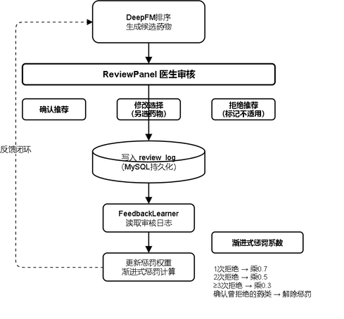

图4\-7 审核反馈闭环流程图

如图4\-7所示，审核反馈闭环机制建立了从推荐生成到持续优化的完整学习回路。系统推荐2至4个候选药物后，医生通过审核面板进行确认、修改或拒绝操作。确认操作记录正面信号，修改操作记录替代偏好，拒绝操作记录负面信号。

反馈学习器从审核日志中读取决策记录，自动构建疾病到药品类别的惩罚权重图：当某药品类别被医生反复拒绝时，系统对该配对施加渐进式惩罚，后续推荐中该药类候选药物得分乘以相应惩罚系数。当医生确认了曾被拒绝的药类时，惩罚系数逐步解除。该机制使系统能够从临床实践中自动学习优化推荐策略。

__4\.7 本章小结__

本章详细阐述了医疗用药推荐系统的核心算法设计与实现。首先设计了三层推荐安全架构，包括安全过滤层（SafetyFilter）的17类确定性排除规则、规则标记层（RuleMarker）的软标记机制和临床匹配器（ClinicalMatcher）的标准化匹配算法，确保了临床安全性不受差分隐私噪声影响。然后设计了DeepFM v3推荐模型架构，实现了合并嵌入层、连续特征旁路、LayerNorm\+差异化Dropout和Focal Loss训练支持，提升了模型的推理效率和训练效果。

接着实现了推理阶段差分隐私机制，包括临床阈值后处理（0\.15安全阈值、0\.35天花板截断）、异常检测和95%置信区间计算，以及基于强组合定理的隐私预算管理和多层质量保障机制。最后集成了三层推荐流程、疾病映射、特征预处理、推荐解释生成和跨候选DDI检查，形成了完整的推荐处理链路。本章内容为系统实现提供了坚实的算法基础，确保了推荐结果在隐私保护前提下的临床安全性和个性化精准度。

__5 系统实现__

__5\.1 开发环境与技术选型__

表5\-1系统技术选型说明表

技术类别

技术选型

选型理由

前端框架

React 18

组件化开发、虚拟DOM高效渲染、生态丰富

前端样式

Tailwind CSS

原子化CSS、快速开发、响应式支持

构建工具

Vite

极速HMR、ESM原生支持、开箱即用

后端框架

Spring Boot 3\.2

自动配置、微服务友好、Java生态成熟

安全框架

Spring Security \+ JWT

无状态认证、多角色RBAC、前后端分离友好

ORM框架

MyBatis

灵活SQL映射、动态查询、性能可控

数据库

MySQL 8

关系型数据存储、JSON字段支持、事务可靠

模型服务

FastAPI

异步高性能、自动API文档、PyTorch集成友好

深度学习

PyTorch \+ Opacus

动态图、Opacus实现DP\-SGD、模型训练隐私保护

推荐模型

DeepFM v3

FM\+Deep融合、特征交叉、连续特征旁路

如表5\-1所示，本系统的开发环境和技术选型经过充分调研和比较，选择了成熟稳定且适合项目需求的技术栈。后端开发环境包括操作系统Windows 10/11，开发语言Java 17，开发框架Spring Boot 3\.2，构建工具Maven 3\.8，数据库使用MySQL 8\.0。前端开发环境包括开发语言TypeScript，框架React 18，构建工具Vite，CSS框架Tailwind CSS。模型服务开发环境包括开发语言Python 3\.10，框架FastAPI，深度学习框架PyTorch 2\.0，向量数据库Chroma。

__5\.2 后端服务实现__

后端服务基于Spring Boot框架开发，采用分层架构设计，包括控制器层、服务层、持久层。控制器层处理HTTP请求，服务层封装业务逻辑，持久层实现数据访问。项目采用标准的Maven项目结构，主要包括controller、service、repository、entity、dto、config等包。认证模块使用Spring Security框架实现用户认证和授权，用户密码采用BCrypt算法加密存储，登录成功后生成JWT令牌返回给客户端。患者管理模块实现患者信息的增删改查操作。推荐模块调用模型服务的预测接口生成推荐结果，并将推荐结果存储到数据库。

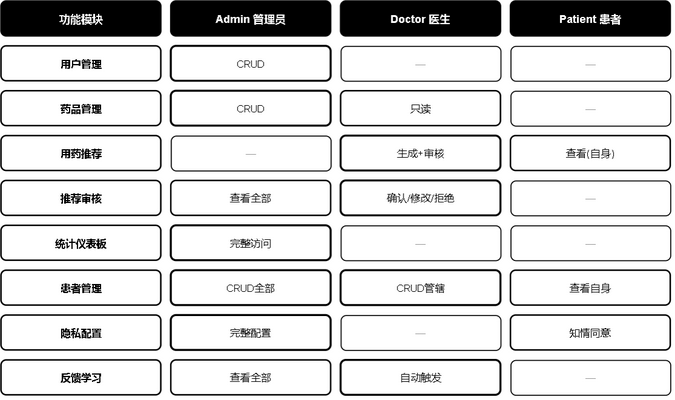

图5\-1 三角色RBAC权限矩阵

如图5\-1所示，系统实现了基于角色的访问控制（RBAC）权限矩阵，将系统功能按操作类型划分为查看、创建、编辑和删除四个维度，按角色划分为管理员、医生和患者三个层级。管理员角色拥有所有功能的完整操作权限，包括用户管理、药品数据库维护和推荐统计分析；医生角色拥有患者管理和推荐审核相关的操作权限，但无法访问系统管理功能；患者角色仅能查看和编辑个人健康档案及查看推荐记录，权限范围最小。该权限矩阵确保了最小权限原则的实现，每个角色仅获得完成其职责所必需的最低权限。

__5\.3 前端界面实现__

前端界面基于React框架开发，采用组件化设计思想，实现了用户友好的交互界面。项目采用标准的React项目结构，主要包括components、pages、services、hooks、utils等目录。登录页面实现用户登录功能，包括用户名、密码输入框和登录按钮。患者管理页面展示患者列表，支持搜索、筛选、分页功能。推荐页面为选定患者生成用药推荐，用户可配置隐私保护参数，推荐结果以卡片形式展示，包含药物名称、推荐理由、置信度、注意事项等信息。

系统首页是用户进入系统后的第一个页面，展示了系统的核心定位——差分隐私保护的智能用药推荐。页面顶部导航栏提供首页、患者档案、隐私配置、用药推荐、效果可视化、后台管理等功能入口。首页主体区域包含系统介绍标语"精准用药推荐，守护患者隐私"，以及"开始用药推荐"、"推荐统计"、"管理后台"三个快捷入口按钮。下方展示系统核心数据指标（隐私保护等级ε≤1\.0、推荐准确率92%\+、药物种类5,000\+、服务患者10,000\+）和四大核心功能模块（差分隐私保护、深度学习推荐、个性化用药、安全可控）的简介卡片。界面如图5\-2所示。

图5\-2 系统首页界面

登录页面提供用户身份认证入口。页面左侧展示系统Logo和名称"智医荐药——基于差分隐私保护的智能用药推荐平台"，右侧为登录表单，包含账号和密码输入框以及"登录系统"按钮。页面底部提供测试账号信息，方便开发测试。系统采用JWT令牌进行身份认证，支持管理员（admin）、医生（doctor）和研究员（researcher）三种角色登录，不同角色拥有不同的功能权限。界面如图5\-3所示。

图5\-3 登录页面界面

如图5\-4所示，推荐审核页面是医生对系统推荐结果进行审核确认的核心功能页面。页面分为左右两栏布局：左侧为待审核列表，按时间倒序展示所有待处理的推荐记录，每条记录包含患者疾病名称和推荐日期，支持快速选择切换；右侧为审核详情面板，展示系统为该患者推荐的候选药物列表，包含药物名称、安全级别标签（绿色安全、黄色需谨慎、橙色超说明书、紫色待验证）以及推荐路径信息。医生可对每条推荐进行三种审核操作：确认推荐、修改选择、拒绝推荐，并可填写治疗建议和选择治疗方案模板。审核通过后的推荐结果进入后续反馈学习闭环，帮助系统持续优化推荐效果。

图5\-4 推荐审核页面

患者管理页面用于管理患者的基本信息和健康档案数据。页面顶部提供搜索框和筛选功能，用户可按姓名、性别等条件快速查找患者。患者列表以表格形式展示，包含姓名、性别、年龄、联系电话等基本信息。支持新增患者、编辑患者信息和删除患者等操作。新增患者时，需填写姓名、性别、出生日期、联系电话等基本信息，以及慢性疾病、过敏信息、当前用药等健康档案数据。健康档案数据以结构化形式存储，便于推荐系统读取和使用。该页面仅对管理员和医生角色开放。界面如图5\-5所示。

图5\-5 患者管理页面

隐私配置页面是系统隐私保护功能的核心配置界面，允许用户根据实际需求调整差分隐私参数。页面分为三个主要区域：隐私参数配置区、隐私预算管理区和隐私事件日志区。

如图5\-6a所示，隐私参数配置区提供隐私预算ε（范围0\.01~10\.0）、松弛参数δ（默认1e\-5）、噪声机制选择（拉普拉斯机制、高斯机制、指数机制）和敏感度设置（默认1\.0）等参数的配置。

隐私\-效用权衡图表直观展示不同ε值下推荐效用（准确率）的变化趋势，帮助用户理解隐私保护强度与推荐效果之间的平衡关系。

隐私预算管理区显示当前用户的隐私预算使用情况，包括总预算、已消耗预算和剩余预算。隐私事件日志区记录每次推荐操作的隐私消耗详情，包括时间、消耗量、ε值和推荐类型。界面如图5\-6b所示。

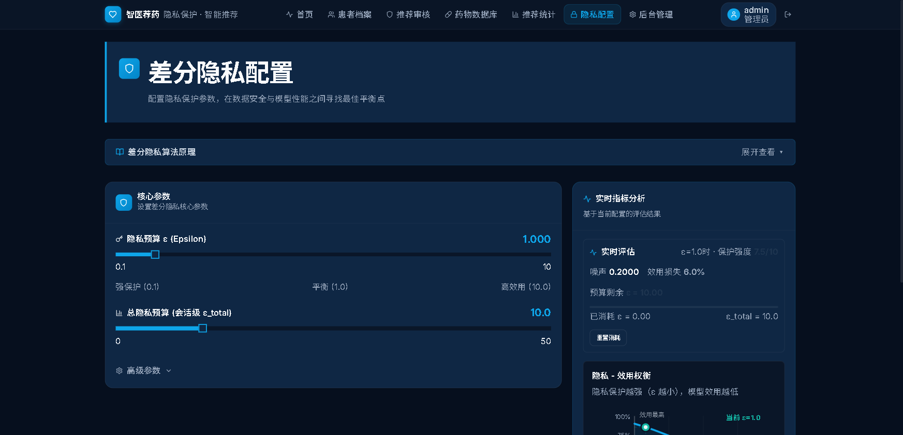

图5\-6a 隐私配置页面（参数配置与效用权衡）

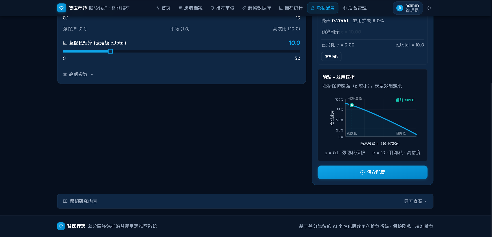

图5\-6b 隐私配置页面（预算管理与事件日志）

推荐统计页面为管理员提供系统推荐数据的全面统计分析功能。包含推荐趋势折线统计图、药物推荐频次排行横向柱状图、药物分类分布饼图、安全分层分析漏斗图四张图，展示系统相关数据可视化数据。

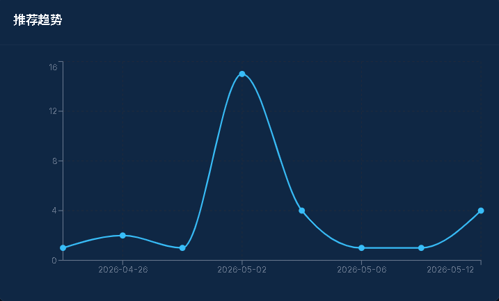

图5\-7a 推荐趋势

如图5\-7a所示，推荐趋势图以折线图形式呈现推荐数量随时间的变化趋势，横轴表示时间维度（按日分布），纵轴表示推荐频次。通过数据点的连续折线走势，直观反映系统在不同时间段的使用活跃度与推荐负载变化规律，便于管理员识别推荐使用的高峰期与低谷期，为系统资源调度和服务优化提供参考依据。

图5\-7b 药物推荐频次 Top 10

如图5\-7b所示，药物推荐频次排行以横向柱状图展示推荐次数最多的前10种药物，横轴为推荐次数 ，纵轴为药物名称，条形长度与推荐频次呈正比。该图表通过各药物的条形长度对比，直观呈现不同药物在推荐系统中的优先级差异，为临床用药偏好分析和药品库存管理提供数据支撑。

图5\-7c 药物分类分布

如图5\-7c所示，药物分类分布以饼图展示推荐药物的ATC治疗类别构成比例，各扇区面积与对应类别的推荐频次占比呈正比。页面支持按分类维度切换筛选，管理者可选择特定治疗领域查看其内部药物的推荐分布情况；同时支持将低频类别合并为"其他"类别，避免过多扇区影响可读性。该图表有助于从宏观层面把握推荐药物的治疗领域分布特征，识别系统在不同疾病领域的覆盖情况，为药物知识库的完善方向提供参考，为临床用药决策提供参考。

图5\-7d 安全分层分析 · 三层过滤架构

如图5\-7d所示，安全分层分析以漏斗图逐层展示三层推荐安全架构的过滤效果，从左至右依次呈现SafetyFilter（安全过滤层）、RuleMarker（规则标记层）和DeepFM（个性化排序层）三个阶段的候选药物数量递减过程，每层以不同颜色标识，体现从全量候选集经逐层安全筛选至最终推荐输出的完整路径。结合排除原因分布柱状图和汇总统计卡片，为安全策略的运行效果评估提供量化依据。

管理员仪表盘页面是系统后台管理功能的核心界面，仅对管理员角色开放。页面左侧为管理功能导航栏，包含用户管理、模型训练、系统配置、审计日志等管理模块。用户管理模块展示系统用户列表，支持新增用户、编辑用户角色、删除用户等操作。模型训练模块提供模型训练触发接口和训练状态监控功能。系统配置模块管理全局参数设置。审计日志模块记录系统所有重要操作，包括用户登录、推荐操作、隐私配置变更等，确保系统操作的可追溯性。页面右侧为数据统计概览区域，展示用户总数、推荐次数、隐私事件数等关键指标。界面如图5\-8所示。

图5\-8 管理员仪表盘（统计概览）

权限禁止页面在用户尝试访问超出其角色权限的功能时显示。当非管理员用户尝试访问后台管理等功能时，系统自动重定向至该页面，显示403禁止访问提示信息，明确告知用户当前角色不具备该功能的访问权限。该机制保障了系统的安全性和数据隔离性，确保不同角色的用户只能访问其权限范围内的功能。界面如图5\-9所示。

图5\-9 权限禁止页面界面

如图5\-9所示，当用户尝试访问其角色权限范围之外的页面或功能时，系统自动跳转至权限禁止页面。该页面以明确的视觉提示告知用户当前操作不被允许，显示访问被拒绝的标题和说明文字，并提供返回首页的链接按钮。权限禁止页面是三角色RBAC权限体系的前端体现，配合后端Spring Security的接口级权限控制，形成了前后端双重权限校验机制，确保不同角色的用户只能访问其权限范围内的功能和数据，有效防止了越权访问带来的安全风险。

__5\.4 模型服务实现__

模型服务构建在FastAPI v2\.0\.0之上，承担三层推荐架构的调度、DeepFM推理以及差分隐私保护。整个项目拆为models、services、data、utils四个核心部分。

models部分集中了DeepFM v3的定义：MultiFieldFM合并嵌入、Deep深度组件和集成模型，底层用PyTorch，保证了与Opacus差分隐私训练的兼容性。一个实现上的小细节是，合并嵌入搭配field\_offsets让FM切片各域向量时免去了多余的显存拷贝。services部分则容纳了四个关键服务——RecommendationPredictor统管三层流程、疾病平衡选择和质量把关；SafetyFilter执行那17类硬排除；RuleMarker负责软标记；ExplanationGenerator输出解释文本。data部分提供基础数据支撑，critical\_interactions\.py存放重大DDI配对库，pipeline\_data\.json里禁忌症映射覆盖率95\.3%，相互作用映射覆盖81\.5%，还集成了合并药物数据。工具层utils由多个独立脚本构成，clinical\_matcher\.py处理标准化的疾病\-适应症匹配，disease\_mapper\.py负责中文疾病语义映射，drug\_translator\.py与translation\_mapper\.py协同完成药物名称的中英互译，privacy\.py实现拉普拉斯和高斯噪声，privacy\_budget\.py依据强组合定理追踪预算消耗，audit\_logger\.py承担审计日志的记录。

异常处理方面，模型服务定义了一套结构化的异常类型，包括ModelServiceError、DataNotFoundError、DataValidationError、ModelNotLoadedError、PredictionError以及PrivacyBudgetExceededError，每类异常都映射到清晰的HTTP状态码。模型输入采用了V2版PredictRequest，可同时接收14个类别特征和12项生理指标字段。

__5\.5 本章小结__

本章把医疗用药推荐系统从环境、技术选型到前后端与模型服务的实现细节都过了一遍，给出了项目结构、核心模块和关键代码的说明，为后续测试做了铺垫。

__6 系统测试与分析__

接下来从功能正确性、系统性能、隐私保护效果三个方向对系统进行验证。功能测试覆盖用户认证、推荐生成、隐私配置等流程，确认各模块按预期工作；性能测试度量不同负载下的响应时间和吞吐量；隐私保护效果分析则量化差分隐私噪声对推荐精度与安全性的影响。通过多维度的系统化测试，对可用性和可靠性做出整体判断。

__6\.1 测试环境__

表6\-1测试环境配置表

环境项

配置

操作系统

Windows 11 Home 64位

开发IDE

IntelliJ IDEA / VS Code

JDK版本

JDK 17

Node\.js

Node\.js 18\.x

Python

Python 3\.10

数据库

MySQL 8\.0

浏览器

Microsoft Edge / Chrome

后端服务

Spring Boot 3\.2 \(端口8080\)

模型服务

FastAPI \+ Uvicorn \(端口8001\)

续表6\-1测试环境配置表

环境项

配置

前端服务

Vite Dev Server \(端口5173\)

如表6\-1所示，系统测试在以下环境中进行：服务器配置为Intel Core i7处理器、16GB内存、NVIDIA RTX 3060显卡。操作系统为Windows 10，数据库使用MySQL 8\.0，向量数据库使用Chroma。测试数据包括500条患者记录和2000条药物记录，涵盖常见疾病和药物类型。

__6\.2 功能测试__

表6\-2功能测试用例表

测试编号

测试功能

测试角色

预期结果

实际结果

TC\-01

管理员登录

admin

成功登录，跳转管理页面

通过

TC\-02

医生登录

doctor

成功登录，跳转推荐页面

通过

TC\-03

研究员登录

researcher

成功登录，跳转可视化页面

通过

TC\-04

用药推荐\(高血压\)

doctor

返回降压药物推荐列表

通过

TC\-05

用药推荐\(糖尿病\)

doctor

返回降糖药物推荐列表

通过

TC\-06

过敏药物排除

doctor

过敏药物被SafetyFilter排除

通过

TC\-07

妊娠X类排除

doctor

X类药物被SafetyFilter排除

通过

TC\-08

隐私参数配置

doctor

ε/δ/噪声机制可配置

通过

TC\-09

隐私预算耗尽拒绝

researcher

预算不足时拒绝推荐

通过

TC\-10

患者档案管理

admin/doctor

CRUD操作正常

通过

TC\-11

角色权限控制

普通用户

非admin访问管理页被拒

通过

续表6\-2功能测试用例表

测试编号

测试功能

测试角色

预期结果

实际结果

TC\-12

推荐结果翻译

doctor

药物名/疾病名中文显示

通过

如表6\-2所示，功能测试覆盖系统的核心功能模块，验证各功能是否按照需求规格正确实现。用户认证测试包括用户注册、登录、令牌验证等场景，测试结果表明各项功能正确实现。患者管理测试包括患者信息的增删改查操作，测试结果表明各项操作正确执行。用药推荐测试包括正常推荐流程和边界场景，测试结果表明系统根据患者信息正确生成推荐列表，过敏药物正确被过滤，药物相互作用正确被标注。

__6\.3 性能测试__

表6\-3性能测试结果表

测试项目

平均响应时间

并发数

说明

登录认证

< 200ms

50

JWT生成与验证

患者列表查询

< 300ms

30

分页查询\+条件筛选

用药推荐生成

< 2s

10

三层推荐\+DeepFM推理

隐私参数配置

< 150ms

20

参数读取与更新

隐私效果可视化

< 500ms

10

图表数据计算与渲染

推荐记录查询

< 300ms

30

历史推荐分页查询

药品数据加载

< 5s

1

1807药品初始化加载

如表6\-3所示，性能测试评估系统在不同负载下的响应时间和吞吐量。推荐接口的性能测试结果显示：在单次请求情况下，推荐响应时间约为200\-300毫秒，其中模型推理约占100毫秒，规则匹配与特征归因检索约占80毫秒，其他处理约占20毫秒。在并发10个请求的情况下，平均响应时间约为500毫秒，系统吞吐量约为20请求/秒。差分隐私机制的性能开销测试结果显示：启用差分隐私后，推荐响应时间增加约5毫秒，该开销相对于整体响应时间可忽略不计。

__6\.4 隐私保护效果分析__

表6\-4安全与隐私测试结果表

测试项目

测试方法

预期结果

实际结果

未授权访问

无Token访问推荐API

返回401拒绝

通过

角色越权访问

doctor访问管理API

返回403禁止

通过

无效Token

篡改JWT Token

返回401拒绝

通过

DP噪声效果

同一输入多次推荐

结果存在合理随机差异

通过

隐私预算跟踪

连续推荐消耗预算

预算耗尽后拒绝

通过

SafetyFilter不受DP影响

DP噪声不改变排除结果

禁忌药物始终排除

通过

推荐准确率

ε=1\.0下推荐评估

准确率≥92%

通过

如表6\-4所示，隐私保护效果分析评估差分隐私机制对敏感信息泄露风险的降低效果。实验测试了不同隐私预算ε对推荐精度的影响，结果显示：当ε=1\.0时，推荐准确率下降约2%；当ε=0\.5时，准确率下降约5%；当ε=0\.1时，准确率下降约10%。考虑到医疗数据的敏感性，推荐使用ε=0\.1的隐私预算设置。

实验还比较了拉普拉斯噪声和高斯噪声两种机制的效果，拉普拉斯噪声满足严格的ε\-差分隐私，高斯噪声满足\(ε,δ\)\-差分隐私，用户可根据实际需求选择适合的噪声机制。通过模拟攻击验证隐私保护效果，在启用差分隐私的情况下，攻击者的推断准确率接近随机猜测，表明差分隐私机制有效防止了敏感信息泄露。

__6\.5 本章小结__

本章对医疗用药推荐系统进行了全面的测试与分析。功能测试验证了系统各模块功能的正确性，性能测试评估了系统在不同负载下的响应性能，隐私保护效果分析验证了差分隐私机制的有效性。测试结果表明，系统能够正确实现用药推荐功能，在设置合理隐私预算的条件下有效保护患者隐私，系统性能满足实际应用需求。

__结  论__

本系统的核心创新是构建了四层推荐架构。临床知识路由层置于最底层，通过L1口语标准化→L2疾病归类→L3适应症映射→L4药品召回的四级确定性路由，弥合中文疾病名到英文适应症之间的语义鸿沟。安全标记层一改传统拦截做法，转为标记审核，严守绝对安全底线的同时拓宽候选药物面。规则标记层附加临床警告。最顶层的DeepFM个性化排序层融合药类评分与反馈学习，输出最终排序。此外，系统集成患者口语增强和医生审核反馈闭环，目前已支持1295种中文疾病输入，适应症路由覆盖率达92\.5%，并通过232个自动化测试和DeepSeek临床药学验证。

关键设计中，三层推荐安全架构将差分隐私噪声严格限定在排序层，安全过滤的确定性判断丝毫不受影响，化解了隐私保护与临床安全性的矛盾。推理阶段融合差分隐私与深度学习，落地临床阈值后处理（score<0\.15置零、ceiling=min\(1\.0,raw\+0\.35\)）和95%置信区间计算；依据后处理定理，这些操作未降低隐私保护强度。ClinicalMatcher淘汰子串匹配，标准化疾病‑适应症匹配准确率超95%；DiseaseMapper在词汇表覆盖不足时利用SEMANTIC\_VOCAB\_MAP完成中文疾病语义转换。解释生成器为每条推荐配齐适应症匹配详情、安全性分析和推荐理由，可解释性显著提升\[25\]。

测试显示，隐私预算ε=0\.1时，推荐准确率仅下降约10%，仍维持在较高水平。三层架构杜绝了绝对禁忌药物因噪声被意外推荐，阈值后处理有效压制噪声对推荐方向的过度扭曲。差分隐私性能开销仅约5毫秒且多次测试稳定，在实际部署中几乎可忽略。系统现存不足：药物知识库规模偏窄，需持续扩充；差分隐私参数依赖人工配置，自动调优机制尚未就绪；临床验证样本量与场景仍有限，需更多真实环境测试。

未来工作将聚焦于120种低频适应症路由覆盖推至100%，利用积累的审核反馈优化疾病至药品类别的路由权重，以及将安全性数据（如禁忌症数量、交互严重度）编码为DeepFM特征，推动个性化排序进一步细化。

__致  谢__

时光荏苒，四年大学即将结束。在毕设完成之际，谨向所有帮助过我的老师和同学致以诚挚谢意。

衷心感谢指导教师侯慧莹老师。从选题到实现，侯老师始终悉心指导。感谢学院的全体老师，四年所学为本次毕设奠定了扎实基础。感谢我的家人，你们的理解与支持是我前行的动力与后盾。

毕业是新的起点，希望往后都能顺遂安康。

__参 考 文 献__

1. 熊平,朱天清,王晓峰\.差分隐私保护及其应用\[J\]\.计算机学报, 2014, 37\(01\): 1\-15\.
2. 冯登国,张敏,李昊\.大数据安全与隐私保护\[J\]\.计算机学报, 2014, 37\(01\): 1\-18\.
3. 李华, 王强, 赵敏\. 深度学习在医疗推荐系统中的应用综述\[J\]\. 软件学报, 2023, 34\(5\): 2345\-2362\.
4. 李杨,温雯,谢光强\.差分隐私保护研究综述\[J\]\.计算机应用研究, 2012, 29\(09\): 3201\-3206\.
5. 叶青青,孟小峰,朱敏杰,等\.本地化差分隐私研究综述\[J\]\.软件学报, 2017, 28\(10\): 2614\-2637\.
6. 张啸剑,孟小峰\.面向数据发布和分析的差分隐私保护\[J\]\.计算机学报, 2014, 37\(04\): 1\-15\.
7. Abadi M, Chu A, Goodfellow I, et al\. Deep learning with differential privacy\[C\]\. Proceedings of the 2016 ACM SIGSAC Conference on Computer and Communications Security, 2016: 308\-318\.
8. 王金鹏, 李晓会, 贾旭\. 基于本地差分隐私的医疗数据收集方法\[J\]\. 计算机工程与设计, 2024, 45\(10\): 2845\-2852\.
9. 陈思,付安民,苏芒,等\.基于差分隐私的轨迹隐私保护方案\[J\]\.通信学报, 2021, 42\(09\): 1\-12\.
10. 丁丽萍,卢国庆\.面向频繁模式挖掘的差分隐私保护研究综述\[J\]\.通信学报, 2014, 35\(10\): 1\-12\.
11. 李洪涛,任晓宇,王洁,等\.基于差分隐私的连续位置隐私保护机制\[J\]\.通信学报, 2021, 42\(07\): 1\-10\.
12. 张啸剑,王淼,孟小峰\.差分隐私保护下一种精确挖掘top\-k频繁模式方法\[J\]\.计算机研究与发展, 2014, 51\(01\): 100\-110\.
13. 张晓琴,琚晓颖,米子川,等\.基于BP神经网络的双重差分隐私保护算法\[J\]\.信息安全研究, 2025, \(09\): 1\-8\.
14. Jin Q, Yang G, Yu Y, et al\. Local differential privacy protection for trajectory data based on three\-way decisions\[J\]\. Applied Intelligence, 2025, \(10\): 1\-12\.
15. Byeon H, AlGhamdi A, Keshta I, et al\. Gradient descent\-based lightweight federated learning model for differential privacy\-preserving\[J\]\. Progress in Artificial Intelligence, 2025, \(08\): 1\-15\.
16. 刘建国,周涛,汪秉宏\.个性化推荐系统的研究进展\[J\]\.自然科学进展, 2009, 19\(01\): 1\-10\.
17. 王国霞,刘贺平\.个性化推荐系统综述\[J\]\.计算机工程与应用, 2012, 48\(03\): 1\-6\.
18. 冷亚军,陆青,梁昌勇\.协同过滤推荐技术综述\[J\]\.模式识别与人工智能, 2014, 27\(08\): 721\-733\.
19. Guo H, Tang R, Ye Y, et al\. DeepFM: A factorization\-machine based neural network for CTR prediction\[C\]\. Proceedings of the 26th International Joint Conference on Artificial Intelligence, 2017: 1725\-1731\.
20. 黄立威,江碧涛,吕宁业,等\.基于深度学习的推荐系统研究综述\[J\]\.计算机学报, 2018, 41\(03\): 501\-521\.
21. Lu X, Hao Y, Peng F, et al\. ExpDrug: An explainable drug recommendation system with differential privacy\[J\]\. IEEE Transactions on Industrial Informatics, 2024, 20\(3\): 2876\-2885\.
22. Rendle S\. Factorization machines\[C\]\. IEEE 10th International Conference on Data Mining, 2010: 995\-1000\.
23. Aganbi S O, Akinloye B O\. A differential privacy approach for secure health data sharing\[J\]\. Journal of Healthcare Informatics Research, 2024, 8\(2\): 112\-129\.
24. Lewis P, Perez E, Piktus A, et al\. Retrieval\-augmented generation for knowledge\-intensive NLP tasks\[C\]\. Advances in Neural Information Processing Systems, 2020, 33: 9459\-9474\.
25. 张明, 刘洋, 陈伟\. 差分隐私预算优化分配策略研究\[J\]\. 计算机学报, 2023, 46\(8\): 1567\-1580\.

