	

__毕业设计\(论文\)__

__题    目:	差分隐私保护的AI驱动的个性化医疗用药推荐系统的设计与实现             								__

__院系名称：人工智能与大数据	专业班级：   	大数据2203		  __

__学生姓名：      		晋修慧   		学		号： 		221210200302	  __

__指导教师：      		侯慧莹	    	教师职称：      		讲师			     __

__															    __

__2026年 3月 13日__

摘__  __要

医疗健康领域的数据具有高度敏感性，如何在保障患者隐私安全的前提下实现精准的个性化用药推荐，是当前智慧医疗建设面临的重要挑战。在"健康中国2030"战略规划的引领下，医疗健康产业正经历着前所未有的数字化转型，海量医疗数据为智能化应用奠定了坚实基础，同时也带来了严峻的隐私安全挑战。根据国家卫生健康委员会发布的统计数据显示，截至2023年底，全国互联网医院数量已超过2700家，电子病历普及率超过85%，医疗数据年增长率高达30%以上。针对这一问题，本文设计并实现了一种基于差分隐私保护的AI驱动个性化医疗用药推荐系统。

系统采用前后端分离微服务架构，前端使用React框架构建用户界面，后端使用Spring Boot提供RESTful API服务，模型服务使用Python FastAPI部署DeepFM推荐模型。在核心算法层面，系统设计了四层推荐架构：第零层为临床知识路由层KnowledgeRouter，通过L1口语标准化→L2疾病归类→L3适应症映射→L4药品召回的四级确定性路由，解决中文疾病名到英文药品适应症之间的语义鸿沟；第一层为安全过滤层SafetyFilter，保留12条绝对安全红线的硬排除规则，将相对禁忌、超说明书用药等9类情形由系统自动排除改为标记待审核；第二层为规则标记层RuleMarker，对候选药物附加临床警告；第三层为DeepFM个性化排序层。系统还集成了患者口语增强模块PatientInputEnhancer，通过精确匹配→关键词匹配→症状组合推理的三层fallback策略处理患者非标准化口语输入。推荐结果经医生审核确认后，反馈学习器FeedbackLearner自动调整后续推荐权重，形成持续优化的闭环。

实验结果表明，系统在设置合理隐私预算（ε=0\.1）的条件下，推荐准确率保持在可接受范围内（下降约10%），同时有效降低了敏感信息泄露风险。差分隐私机制对系统性能的影响较小（约5毫秒），适合在实际医疗场景中部署应用。三层推荐架构确保了绝对禁忌药物不会被噪声意外推荐，临床阈值后处理（score<0\.15置零、ceiling=min\(1\.0, raw\+0\.35\)）防止噪声过度扭曲推荐方向。本系统为隐私保护型医疗推荐应用提供了兼顾临床安全性与个性化精准度的技术参考与实践借鉴。

关键词：  差分隐私   用药推荐系统   深度学习   个性化医疗   规则匹配与特征归因

__Title	Design and Implementation of a Differentially Private AI\-Driven Personalized Medication Recommendation System__

__Abstract__

Medical health data is highly sensitive, and how to achieve accurate personalized drug recommendations while protecting patient privacy is an important challenge in current smart healthcare construction\. Under the guidance of the "Healthy China 2030" strategic plan, the healthcare industry is undergoing an unprecedented digital transformation\. Massive medical data has laid a solid foundation for intelligent applications, but also brought severe privacy security challenges\. According to statistics released by the National Health Commission, as of the end of 2023, the number of internet hospitals nationwide exceeded 2,700, electronic medical record penetration rate exceeded 85%, and medical data annual growth rate reached over 30%\. To address this issue, this paper designs and implements an AI\-driven personalized medical drug recommendation system based on differential privacy protection\.

The system adopts a microservice architecture with front\-end and back\-end separation\. The front\-end builds an interactive interface based on the React framework, the back\-end provides RESTful API services using Spring Boot, and the model service deploys deep learning inference interfaces through FastAPI\. At the core algorithm level, the system integrates the Deep Factorization Machine \(DeepFM\) recommendation model with the Differential Privacy Stochastic Gradient Descent \(DPSGD\) mechanism\. By introducing controllable privacy noise during model training and inference stages, it achieves an effective balance between privacy protection and recommendation accuracy\. In addition, the system introduces Retrieval\-Augmented Generation technology, retrieving medical knowledge bases through vector databases to provide interpretability support for recommendation results\.

Experimental results show that under reasonable privacy budget settings \(ε=0\.1\), the system maintains recommendation accuracy within an acceptable range \(decrease of about 10%\) while effectively reducing the risk of sensitive information leakage\. The impact of differential privacy mechanism on system performance is small \(about 5 milliseconds\), suitable for deployment in actual medical scenarios\. This system provides a feasible technical solution and practical reference for privacy\-preserving medical recommendation applications\.

Keywords: Differential Privacy; Drug Recommendation System; Deep Learning; Privacy Protection; Personalized Medicine; Rule\-based Explanation

目	次

[1 绪论	1](#_Toc31521)

[1\.1 研究背景与意义	2](#_Toc23238)

[1\.2 国内外研究现状	3](#_Toc22911)

[1\.3 研究内容与论文结构	6](#_Toc12679)

[1\.4 本章小结	8](#_Toc25927)

[2 相关技术与理论基础	9](#_Toc11573)

[2\.1 差分隐私技术	9](#_Toc10192)

[2\.2 深度学习推荐算法	12](#_Toc3325)

[2\.3 系统开发相关技术	14](#_Toc14822)

[2\.4 本章小结	17](#_Toc19342)

[3 系统需求分析与设计	18](#_Toc1122)

[3\.1 需求分析	18](#_Toc11181)

[3\.2 系统架构设计	20](#_Toc12003)

[3\.3 数据库设计	22](#_Toc11953)

[3\.4 接口设计	26](#_Toc29927)

[3\.5 本章小结	27](#_Toc27540)

[4 核心算法设计与实现	28](#_Toc7443)

[4\.1 三层推荐安全架构	30](#_Toc13233)

[4\.2 DeepFM推荐模型	31](#_Toc27510)

[4\.3 差分隐私机制实现	33](#_Toc6773)

[4\.4 推荐流程集成	35](#_Toc28414)

[4\.6 本章小结	39](#_Toc24454)

[5 系统实现	41](#_Toc19321)

[5\.1 开发环境与技术选型	41](#_Toc30508)

[5\.2 后端服务实现	42](#_Toc27874)

[5\.3 前端界面实现	42](#_Toc2818)

[5\.4 模型服务实现	56](#_Toc13766)

[5\.5 本章小结	57](#_Toc23870)

[6 系统测试与分析	58](#_Toc2555)

[6\.1 测试环境	58](#_Toc2823)

[6\.2 功能测试	58](#_Toc24588)

[6\.3 性能测试	59](#_Toc20148)

[6\.4 隐私保护效果分析	60](#_Toc5890)

[6\.5 本章小结	61](#_Toc10486)

[结  论	62](#_Toc31601)

[致  谢	63](#_Toc20522)

[参 考 文 献	64](#_Toc32244)

__1 绪论__

随着人工智能与大数据技术在医疗健康领域的深入应用，基于数据驱动的个性化医疗用药推荐系统正逐渐成为智慧医疗建设的重要组成部分。在"健康中国2030"战略规划的引领下，医疗健康产业正经历着前所未有的数字化转型。根据国家卫生健康委员会发布的统计数据显示，截至2023年底，全国互联网医院数量已超过2700家，电子病历普及率超过85%，医疗数据年增长率高达30%以上。海量的医疗数据为智能化应用奠定了坚实基础，同时也带来了严峻的隐私安全挑战\[1\]\[2\]。

深度学习技术在医疗推荐系统中的应用日益广泛\[3\]。医疗数据蕴含着丰富的诊断信息、用药记录和健康特征，为精准推荐提供了数据基础。然而，医疗数据本身具有高度敏感性，涉及患者的疾病史、用药情况、过敏信息等隐私内容，在采集、存储与分析等环节均存在较高的隐私泄露风险。近年来，医疗数据泄露事件频发，根据国际隐私专业协会（IAPP）的报告，仅2022年全球医疗行业就发生了超过700起重大数据泄露事件，影响患者人数超过5000万。这些事件不仅严重侵犯了患者隐私权益，也损害了医疗机构的社会信誉，阻碍了智慧医疗的健康发展\[4\]。

传统的隐私保护方法如数据匿名化、K\-匿名等技术，在面对关联攻击和背景知识推断时存在明显局限性，难以提供可证明的安全保障。例如，K\-匿名方法虽然能够使得每条记录至少与K\-1条其他记录在准标识符上不可区分，但攻击者仍可能通过背景知识推断出敏感信息。L\-多样性虽然在一定程度上缓解了这一问题，但仍然无法抵御相似性攻击。ε\-差分隐私作为一种严格的隐私保护框架，能够在统计分析和机器学习任务中限制敏感数据被推断的风险，为医疗数据隐私保护提供了数学上可证明的安全保障\[5\]\[6\]。

近年来，差分隐私因其可量化、可证明的隐私保护能力，被广泛应用于数据分析、模型训练和信息发布环节，成为构建隐私保护型医疗推荐系统的重要技术方向。2016年，Abadi等人提出的差分隐私随机梯度下降（DPSGD）算法，成功将差分隐私融入深度学习模型训练过程，为隐私保护型机器学习应用开辟了新的研究方向\[7\]。随后，Google、Apple、Microsoft等科技巨头相继在产品中部署差分隐私技术，证明了其在实际应用中的可行性和有效性。

本研究旨在设计并实现一种融合差分隐私保护的AI驱动个性化医疗用药推荐系统，在保障患者隐私安全的前提下，实现精准、可解释的用药推荐服务。系统核心创新在于构建四层推荐架构：临床知识路由层实现疾病到药品的精准映射，安全过滤层确保推荐的绝对安全性，规则标记层提供软性风险提示，深度学习排序层实现个性化推荐。通过差分隐私技术与深度学习模型的深度融合，系统在保护患者敏感医疗数据的同时，保持推荐准确率在可接受范围内，为医疗数据隐私保护与智能化应用提供可行的技术方案

__1\.1 研究背景与意义__

本研究致力于构建面向医疗场景的隐私保护型用药推荐体系，在理论与实践层面都具有非常重要的价值。在「健康中国2030」战略规划背景下，医疗信息化建设快速推进，医疗数据的安全共享与智能应用成为关键议题。本研究成果可为医疗机构开展用药推荐服务提供隐私保护技术方案，使得医疗数据在脱敏状态下仍能支撑精准推荐，促进医疗数据的价值释放。同时，研究成果对推动差分隐私技术在实际医疗场景中的落地应用具有重要的示范意义。

从理论创新的维度来看，本研究突破传统隐私保护方法的局限，通过融合差分隐私与深度学习技术，系统分析了医疗数据敏感性特征、隐私保护需求与推荐精度之间的平衡机制。研究创新性地提出了患者口语化输入的三层fallback增强策略、临床知识的四级确定性路由机制、审核反馈的渐进式惩罚学习算法，构建了从患者表达到药品推荐的完整技术链路。这些创新点不仅丰富了医疗推荐系统的研究内容，也为差分隐私在垂直领域的应用提供了新的技术范式。

从实践应用的维度来看，本研究的成果主要体现在以下四个方面：一是为医疗机构开展用药推荐服务提供隐私保护技术方案，使得医疗数据在保障隐私的前提下能够支撑智能推荐应用；二是设计了三角色RBAC权限管理体系，实现管理员、医生、患者三种角色的权限隔离与功能定制；三是构建了审核反馈闭环机制，通过医生的审核决策反馈持续优化推荐质量；四是开发了推荐统计仪表板，提供推荐趋势、分类分布、安全分层等多维度可视化分析能力。

在理论创新层面，本研究深入分析了差分隐私的数学定义和隐私保证机制，探讨了\(epsilon,delta\)\-差分隐私在深度学习场景中的适用性。通过研究差分隐私与深度神经网络的融合机制，提出了基于Opacus框架的差分隐私SGD训练方法，实现了梯度裁剪与噪声添加的可控平衡。研究还创新性地将差分隐私应用于知识路由层与安全过滤层的协同设计中，确保系统的安全性不仅来自规则引擎的确定性判断，也来自隐私保护机制对敏感信息的模糊化处理。

在实践应用层面，本研究构建了一套完整的系统原型，涵盖了从前端用户交互到后端模型推理的完整技术链路。系统采用前后端分离的微服务架构，前端使用React框架构建响应式用户界面，后端使用Spring Boot框架提供RESTful API服务，模型服务使用Python FastAPI框架部署DeepFM推理引擎。通过三角色权限系统、审核反馈闭环、推荐统计仪表板等功能模块的设计与实现，系统具备了完整的业务闭环能力，可为实际医疗场景提供可落地的技术解决方案。

__1\.2 国内外研究现状__

1\.2\.1 差分隐私研究进展

差分隐私作为一种严格的隐私保护框架，能够在统计分析和机器学习任务中限制敏感数据被推断的风险。Dwork等人最早于2006年提出差分隐私的概念，奠定了其理论基础\[8\]。本地差分隐私\(Local Differential Privacy, LDP\)作为差分隐私的重要变体，允许数据在本地添加噪声后再上传，无需可信第三方服务器，更适合分布式数据收集场景。本研究将差分隐私技术应用于医疗用药推荐场景，通过在模型训练阶段添加噪声保护训练数据隐私，在推理阶段追踪隐私预算消耗，实现了端到端的隐私保护能力。

在差分隐私的发展历程中，研究者们提出了多种变体和扩展。Dwork等人随后提出了\(ε,δ\)\-差分隐私，通过引入松弛参数δ，在保证隐私保护的前提下降低了噪声量，提高了数据分析的可用性\[5\]。2013年，Duchi等人提出了本地化差分隐私（Local Differential Privacy, LDP），将隐私保护机制前移到数据收集阶段，消除了对可信第三方的依赖。LDP在用户隐私保护方面具有更强的保障能力，已被Google Chrome浏览器用于收集用户使用统计数据，Apple也在iOS系统中部署LDP技术用于改进输入法预测功能。

在国内，差分隐私研究也取得了丰硕成果。熊平等人系统阐述了差分隐私的基本原理和关键技术，分析了差分隐私在不同应用场景中的实现方式\[1\]。叶青青等人对本地化差分隐私进行了全面综述，总结了LDP在数据收集、统计分析、机器学习等领域的应用进展\[5\]。冯登国等人从大数据安全的角度，分析了差分隐私在数据发布、数据分析、数据挖掘等场景中的应用价值。张啸剑等人研究了面向数据发布和分析的差分隐私保护机制，提出了多种优化方案。李杨等人综述了差分隐私保护研究的发展历程和应用前景，为后续研究提供了参考。

差分隐私在医疗数据保护领域的应用研究也日益增多。陈思等人研究了基于差分隐私的轨迹隐私保护方案，提出了满足差分隐私约束的轨迹数据发布方法\[9\]。丁丽萍等人综述了面向频繁模式挖掘的差分隐私保护研究，分析了差分隐私在医疗数据挖掘中的应用前景\[10\]。

李洪涛等人研究了基于差分隐私的连续位置隐私保护机制，提出了适用于实时场景的隐私保护方案，在保证用户位置隐私的同时维持了位置服务的可用性。张啸剑等人研究了差分隐私保护下挖掘Top\-K频繁模式的方法，在保护隐私同时保留了频繁模式统计特征\[15\]。叶青青等人对本地化差分隐私进行了全面综述，系统分析了LDP在数据收集、频率估计和分布估计等任务中的应用。上述研究表明，差分隐私在医疗数据保护中具有广阔的应用前景，但如何在推荐系统中有效集成差分隐私机制仍需深入探索。

1\.2\.2 深度学习隐私保护研究。

在深度学习领域，隐私保护研究主要集中在两个方向：训练阶段的隐私保护和推理阶段的隐私保护。在训练阶段隐私保护方面，Abadi等人于2016年提出的差分隐私随机梯度下降（DPSGD）算法具有里程碑意义。该算法将差分隐私融入神经网络训练过程，通过对梯度进行裁剪和加噪操作，实现了模型训练阶段的隐私保护。具体而言，DPSGD在每次参数更新时，首先计算每个样本的梯度，然后对梯度进行L2范数裁剪以限制单个样本的影响，最后向裁剪后的梯度添加高斯噪声实现差分隐私保护。

随后，研究者们在DPSGD的基础上进行了大量改进工作。McMahan等人提出了差分隐私联邦学习框架，将差分隐私与联邦学习相结合，实现了分布式场景下的隐私保护模型训练。Papernot等人提出了PATE（Private Aggregation of Teacher Ensembles）框架，通过知识蒸馏的方式实现隐私保护，避免了直接在敏感数据上训练模型。在国内，张晓琴等人研究了基于BP神经网络的双重差分隐私保护算法，提出了在梯度扰动和输出扰动两个层面同时施加差分隐私保护的方案\[13\]。Jin等人研究了基于三支决策的轨迹数据本地差分隐私保护方法，为时空数据隐私保护提供了新思路\[14\]。

在训练阶段，Abadi等人提出的DPSGD算法为差分隐私深度学习训练奠定了基础\[7\]。在推理阶段隐私保护方面，研究主要关注如何防止攻击者通过模型输出推断敏感信息。Shokri等人提出了成员推断攻击（Membership Inference Attack）的概念，指出攻击者可以通过分析模型对特定输入的预测结果，推断该输入是否参与了模型训练。Fredrikson等人研究了模型反演攻击，展示了攻击者如何利用模型的输出概率分布重建训练数据。针对这些攻击，研究者提出了输出扰动、对抗训练等防御机制。Byeon等人提出了基于梯度下降的轻量级联邦学习模型，在保护隐私的同时降低了通信开销\[15\]。

1\.2\.3 推荐系统研究进展

推荐系统是信息过滤领域的重要研究方向，其目标是根据用户的历史行为和偏好，主动向用户推荐可能感兴趣的内容。传统的推荐方法包括协同过滤、基于内容的推荐以及混合推荐等，这些方法在电商、视频、音乐等领域取得了广泛应用\[16\]\[17\]。协同过滤是最早被广泛采用的推荐方法，其基本思想是利用用户群体的行为模式进行推荐。根据实现方式的不同，协同过滤可分为基于用户的协同过滤（User\-CF）和基于物品的协同过滤（Item\-CF）。然而，协同过滤方法面临着数据稀疏性和冷启动问题，当用户\-物品交互矩阵非常稀疏或新用户/新物品加入系统时，推荐效果会显著下降。

基于内容的推荐方法通过分析物品的内容特征进行推荐，不依赖用户群体的行为数据。该方法能够有效缓解冷启动问题，但存在推荐结果同质化的问题，难以发现用户潜在的兴趣点。混合推荐方法将协同过滤与基于内容的推荐相结合，取长补短，在实际系统中得到了广泛应用\[18\]。王国霞等人对个性化推荐系统进行了全面综述，总结了各类推荐方法的优缺点和适用场景。冷亚军等人对协同过滤推荐技术进行了系统梳理，分析了不同协同过滤算法的特点。

随着深度学习技术的发展，推荐系统逐渐向深度表征学习方向演化。深度学习方法能够自动学习用户和物品的高层特征表示，捕获复杂的非线性交互关系，在多项推荐任务中取得了显著优于传统方法的效果。2016年，Google提出了Wide & Deep模型，将线性模型的记忆能力与深度网络的泛化能力相结合，在Google Play应用推荐中取得了良好效果。2017年，Guo等人提出的DeepFM模型具有代表性意义\[19\]。该模型将因子分解机（FM）与深度神经网络相结合，能够同时学习低阶特征交互和高阶特征交互。

黄立威等人对基于深度学习的推荐系统进行了全面综述，分析了深度学习推荐模型的发展趋势和技术特点\[20\]。刘建国等人总结了个性化推荐系统的研究进展，指出深度学习技术在特征提取和模式识别方面的优势能够有效提升推荐精度。李华等人进一步聚焦医疗领域，综述了深度学习在医疗推荐系统中的应用，指出医疗推荐需要同时考虑安全性和可解释性。综合现有研究可以发现，将差分隐私与深度学习推荐模型相结合的研究相对较少，本研究正是在这一方向上的探索与实践。

1\.2\.4 医疗推荐系统研究

医疗推荐系统作为推荐系统在医疗领域的应用，近年来受到越来越多的关注。与电商、视频等领域的推荐系统相比，医疗推荐系统具有更高的专业性要求和更严格的隐私约束。在用药推荐方面，研究者们提出了多种方法。基于知识图谱的推荐方法利用医学知识图谱中药物、疾病、症状之间的语义关系进行推荐，能够提供可解释的推荐理由。基于协同过滤的推荐方法利用医生群体的用药决策数据进行推荐，但面临着数据稀疏性和隐私保护问题。基于深度学习的推荐方法能够整合患者的多源异构数据进行精准推荐，但模型的可解释性和隐私安全性仍需进一步研究\[21\]。

在隐私保护方面，医疗数据的敏感性使得差分隐私等隐私保护技术成为研究热点。陈思等人研究了基于差分隐私的轨迹隐私保护方案，提出了满足差分隐私约束的轨迹数据发布方法。丁丽萍等人综述了面向频繁模式挖掘的差分隐私保护研究，分析了差分隐私在医疗数据挖掘中的应用前景\[10\]。李洪涛等人研究了基于差分隐私的连续位置隐私保护机制，提出了适用于实时场景的隐私保护方案。这些研究为医疗数据隐私保护提供了技术支撑。

1\.2\.5 现有研究的不足

综合国内外研究现状，现有研究仍存在以下不足。尽管国内外学者在差分隐私和推荐系统领域已取得丰硕成果，但将两者深度融合应用于医疗场景的研究仍处于起步阶段，存在技术方案不成熟、应用验证不充分、安全性与效用性平衡机制不完善等问题。具体而言，主要体现在以下三个方面。

第一，差分隐私与推荐系统的融合研究相对较少。虽然差分隐私已在数据分析、模型训练等领域取得成功应用，但在推荐系统场景下的应用研究起步较晚，特别是针对医疗推荐这一垂直领域的研究更为匮乏。现有研究多集中于单一技术的应用，缺乏系统性的技术融合方案，导致差分隐私在推荐场景下的应用效果难以达到最优。本研究通过构建四层推荐架构，将差分隐私技术与知识路由、安全过滤、深度学习排序深度融合，填补了这一研究空白。

第二，医疗推荐系统的可解释性不足。深度学习推荐模型虽然效果优异，但其「黑箱」特性使得推荐结果难以解释，在医疗场景下缺乏可信度。医生和患者难以理解模型为何推荐特定药物，这在强调安全性和可追溯性的医疗领域是一个重大缺陷。本研究通过三层安全架构设计和审核反馈闭环机制，将规则引擎的确定性判断与深度学习模型的个性化推荐相结合，显著提升了系统的可解释性。

第三，医疗推荐场景下的隐私保护研究较为薄弱。现有研究主要集中在一般推荐场景，对医疗数据的特殊性考虑不足。医疗数据具有高敏感性、高维度、稀疏性等特点，现有的隐私保护方法难以直接应用，需要针对医疗场景进行专门的优化和改进。本研究针对医疗数据的特殊性，设计了梯度裁剪与噪声添加的平衡机制，构建了隐私预算追踪系统，实现了端到端的隐私保护能力。

本研究正是针对上述不足展开，旨在设计并实现一种融合差分隐私保护的医疗用药推荐系统，为隐私保护型医疗推荐应用提供技术参考和实践借鉴。通过融合差分隐私、深度学习推荐和规则匹配解释生成技术，本研究试图在隐私保护、推荐精度和可解释性之间寻求平衡，为医疗推荐系统的发展提供新的技术路径。

__1\.3 研究内容与论文结构__

图1\-1论文技术路线图

本课题主要研究内容包括以下四个方面：第一，医疗用药数据的差分隐私保护机制设计，研究差分隐私在数据处理、模型训练和推理阶段的应用策略，包括隐私预算的分配、噪声添加方式以及对推荐模型性能的影响分析，通过设计基于拉普拉斯噪声和高斯噪声的差分隐私机制，确保系统在提供个性化推荐的同时有效保护患者隐私；第二，基于DeepFM的个性化推荐模型构建，利用因子分解机和深度神经网络的混合架构，将患者的基本信息、疾病史、过敏史和用药史等多源异构数据转化为模型可处理的特征表示，实现药品与患者的精准匹配；第三，推荐结果的安全可控与可解释机制，通过DeepFM模型嵌入多层安全过滤和规则匹配，在深度推荐层之上叠加安全屏障，确保推荐结果满足临床安全要求，包括绝对禁忌排除、适应症匹配、安全标签标注和药物交互检查；第四，系统原型的开发与实验验证，采用前后端分离的系统架构，明确各模块的职责分工和接口规范，实现后端服务，包括用户认证、患者管理、推荐接口等功能，实现前端交互界面，提供用户友好的操作体验，实现模型服务，部署深度学习推荐模型并提供推理接口。

第一，医疗用药数据的隐私保护机制设计。研究差分隐私在数据处理和模型训练阶段的适配性，包括隐私预算设置、噪声扰动方式以及隐私开销对模型性能的影响。深入分析差分隐私参数对推荐精度的影响规律，建立隐私保护强度与模型性能之间的量化关系。研究差分隐私在推理阶段的应用，设计适用于实时推荐场景的隐私保护机制。

第二，基于DeepFM的个性化推荐模型构建。设计患者特征表示方案，将患者的基本信息、疾病史、过敏史等多源异构数据转换为模型可处理的特征向量。设计药物特征表示方案，将药物的适应症、禁忌症、相互作用等专业信息进行编码。构建DeepFM模型架构，实现FM组件和深度组件的并行训练，优化模型结构以适应医疗推荐场景的特点。

第三，推荐解释生成机制的设计。基于DeepFM模型嵌入归因和临床规则匹配，设计结构化的推荐解释生成机制。通过特征重要性分析（L2范数归因）量化各输入特征对推荐评分的贡献，结合临床适应症匹配、安全标记和药物相互作用规则，生成包含适应症详情、安全警告和用药建议的多层次推荐解释，提升推荐结果的临床可解释性和可信度。研究准确性和可解释性。

第四，系统原型开发与测试验证。设计前后端分离的系统架构，明确各模块职责和接口规范。实现后端服务，包括用户认证、患者管理、推荐接口等功能。实现前端界面，提供用户友好的交互体验。实现模型服务，部署深度学习模型和推荐解释生成功能。开展系统测试，验证功能完整性、性能指标和隐私保护效果。

__1\.4 本章小结__

本章作为全文的开篇，系统性地构建了隐私保护型医疗用药推荐研究的整体框架。在研究背景和意义上，本章从智慧医疗建设的宏观背景出发，深入分析了医疗数据隐私安全面临的挑战以及建立隐私保护型推荐系统的紧迫性，阐明了本研究在推动医疗数据安全应用中的重要价值。通过对国内外研究现状的全面梳理，本章从差分隐私技术、深度学习隐私保护、推荐系统技术和医疗推荐系统四个维度，系统总结了现有研究成果和局限性。特别指出了当前研究在差分隐私与推荐系统融合、推荐可解释性、医疗场景适配等方面存在的不足，在此基础上明确了本研究的具体目标和技术路线。

本章提出的基于差分隐私保护的医疗用药推荐系统建设方案，采用DeepFM模型实现精准推荐，引入差分隐私机制保障数据安全，集成规则匹配与特征归因机制增强推荐可解释性，为解决医疗推荐场景中的隐私保护和推荐效果平衡问题提供了新的技术路径。本章内容为后续系统的详细设计与实现奠定了坚实的理论基础。

__2 相关技术与理论基础__

医疗用药推荐系统的设计与实现是一项多技术融合的复杂工程，其背后有着坚实的理论与技术支撑。隐私保护机制设计以差分隐私理论为核心，为系统提供可证明的隐私安全保障；推荐算法设计以DeepFM深度学习模型为核心，通过对患者与药物特征的学习实现精准推荐；规则匹配与特征归因技术，为推荐结果提供可解释性支撑；系统实现采用前后端分离的微服务架构，确保系统的可扩展性和可维护性。这些关键技术相互配合，共同保障系统的功能实现与性能优化。

__2\.1 差分隐私技术__

差分隐私是一种基于数学定义的隐私保护框架，由Dwork等人于2006年首次提出\[1\]。其核心思想是通过向数据发布或分析结果中添加适当的随机噪声，使得攻击者无法通过输出结果准确推断出数据集中是否包含特定个体的信息，从而实现隐私保护。差分隐私的创新之处在于提供了严格的数学定义和可量化的隐私保证，使得隐私保护强度可以通过参数进行精确控制。

2\.1\.1 差分隐私定义

差分隐私的数学定义基于相邻数据集的概念。给定一个随机算法M，若对于任意两个仅相差一条记录的相邻数据集D1和D2，以及任意输出集合S，满足以下不等式，则称算法M满足ε\-差分隐私。该定义的核心思想是：无论数据集中是否包含某个个体的记录，算法输出的概率分布几乎没有差别，从而使得攻击者无法通过观察输出推断出任何特定个体的信息：

Pr\[M\(D₁\)∈S\] ≤ exp\(ε\) × Pr\[M₂\)∈S\]	\(2\-1\)

其中，参数ε称为隐私预算，用于衡量隐私保护强度。ε值越小，隐私保护越强，但数据可用性越低。差分隐私的一个重要性质是后处理性：对差分隐私输出进行的任何确定性变换仍然是差分隐私的，不会降低隐私保护强度。这意味着系统可以对差分隐私保护的推荐结果进行进一步的后处理（如排序、过滤等），而不会破坏隐私保证。此外，差分隐私还满足顺序组合性和并行组合性，使得多个差分隐私操作可以安全地组合使用。

差分隐私的一个重要性质是可组合性，即多个差分隐私机制的组合仍然是差分隐私的。顺序组合定理说明，对同一数据集多次执行差分隐私操作，隐私预算会累加。这要求在系统设计中合理规划隐私预算的分配，避免隐私预算过快消耗。并行组合定理说明，若将数据集划分为不相交的子集，在每个子集上独立执行差分隐私操作，则整个操作满足原始隐私预算约束。这些组合性质为差分隐私在复杂系统中的应用提供了理论基础。

差分隐私还具有良好的后处理性质：对差分隐私输出的任何确定性或随机性后处理操作都不会降低隐私保护强度。这意味着可以对差分隐私保护的数据进行进一步分析、聚合或可视化，而无需担心隐私泄露风险。这一性质大大扩展了差分隐私的应用范围，使得在满足隐私保护的前提下可以进行复杂的数据分析任务。

2\.1\.2 噪声机制

差分隐私的实现主要依赖于噪声机制，通过在查询结果或模型参数中添加适当规模的随机噪声来实现隐私保护。常用的噪声机制包括拉普拉斯机制、高斯机制和指数机制三种，它们分别适用于不同的应用场景和数据类型。拉普拉斯机制适用于数值型查询结果，提供纯差分隐私保证；高斯机制适用于需要更小噪声或多次组合查询的场景，提供近似差分隐私保证；指数机制则适用于非数值型的选择问题。三种机制的共同核心思想是：通过控制噪声规模来调节隐私保护强度和数据分析可用性之间的平衡，隐私预算ε越小，添加的噪声越大，隐私保护越强但数据可用性越低。

拉普拉斯机制适用于数值型查询，通过向查询结果添加服从拉普拉斯分布的噪声实现隐私保护。设查询函数f的敏感度为Δf（即相邻数据集上查询结果的最大差值），则拉普拉斯噪声的尺度参数为Δf/ε。拉普拉斯分布的概率密度函数为p\(x|b\) = \(1/2b\)×exp\(\-|x|/b\)，其中b =Δf/ε为尺度参数。拉普拉斯机制满足严格的ε\-差分隐私，噪声量与敏感度成正比，与隐私预算成反比。在实际应用中，拉普拉斯机制适用于对输出精度要求较高且查询敏感度可控的场景。

高斯机制则适用于需要较小噪声或组合查询的场景，引入了松弛参数δ。对于满足\(ε,δ\)\-差分隐私的高斯机制，噪声方差σ的取值为：σ=Δf× √\(2ln\(1\.25/δ\)\) /ε。高斯机制引入了松弛参数δ，在保证隐私保护的前提下降低了噪声量，适用于需要多次查询或组合操作的场景。在深度学习应用中，高斯机制更为常用，因为其噪声特性更适合梯度扰动场景。

拉普拉斯机制适用于数值型查询，通过向查询结果添加服从拉普拉斯分布的噪声实现隐私保护。设查询函数f的敏感度为Δf（即相邻数据集上查询结果的最大差值），则拉普拉斯噪声的尺度参数为b = Δf/ε。拉普拉斯分布的概率密度函数为：

p\(x|b\) = \(1/2b\) × exp\(\-|x|/b\)	\(2\-2\)

其中b = Δf/ε为尺度参数，Δf为查询函数的敏感度，ε为隐私预算。当隐私预算ε较小时，尺度参数b较大，添加的噪声量相应增加，隐私保护强度更高；反之，ε较大时噪声较小，数据可用性更高。拉普拉斯机制实现简单，适用于数值型查询的隐私保护，且满足纯差分隐私（即δ=0），在单次查询场景下隐私保护强度较高。在实际应用中，拉普拉斯机制的噪声分布关于零点对称，均值为零，方差为2b²，这意味着噪声的期望为零，不会系统性地偏移查询结果，但会增大结果的方差，降低数据分析的精度。

2\.1\.3 差分隐私随机梯度下降

在深度学习场景中，Abadi等人于2016年提出的差分隐私随机梯度下降（DPSGD）算法具有里程碑意义\[7\]。该算法将差分隐私融入神经网络训练过程，通过对梯度进行裁剪和加噪来实现模型训练阶段的差分隐私保证。DPSGD的核心思想是在每次参数更新时，先对每个样本的梯度进行范数裁剪以限制其敏感度，然后对裁剪后的梯度添加高斯噪声，最后按照裁剪和加噪后的梯度更新模型参数。

高斯机制则适用于需要较小噪声或组合查询的场景，引入了松弛参数δ。与拉普拉斯机制不同，高斯机制添加的是服从高斯分布（正态分布）的噪声，在相同隐私预算下通常需要添加更大的噪声，但高斯分布的尾部更薄，出现极端噪声值的概率更低，这在实际应用中更有利于保持推荐结果的稳定性。对于满足\(ε,δ\)\-差分隐私的高斯机制，噪声方差σ的取值为：

σ = Δf × √\(2ln\(1\.25/δ\)\) / ε	\(2\-3\)

高斯机制引入了松弛参数δ，在保证隐私保护的前提下降低了噪声量，适用于需要多次查询或组合操作的场景。参数δ表示不满足纯差分隐私的概率上界，通常取值极小（如10⁻⁵），在实际应用中几乎不影响隐私保证的有效性。在深度学习应用中，高斯机制更为常用，因为其噪声特性更适合梯度更新过程，且高斯噪声的方差可以通过矩账户方法（Moments Accountant）进行更精确的隐私预算追踪，在多次迭代训练中提供了更紧的隐私保证。

梯度裁剪操作的目的在于控制单个样本对模型更新的最大影响，确保即使某个样本的梯度异常大，也不会对模型产生过大影响。裁剪公式为：

ḡ\_i = g\_i×min\(1, C / ||g\_i||\_2\)。                                                                              \(2\-4\)

当梯度范数小于等于阈值时，梯度保持不变；当梯度范数大于阈值时，梯度被缩放到范数为C。噪声添加实现了差分隐私保护，使得攻击者无法从模型参数推断特定样本是否参与训练。

DPSGD算法的隐私保证可以通过矩账户方法进行精确追踪。根据Abadi等人的分析，DPSGD算法满足\(ε,δ\)\-差分隐私的条件为ε= qσ√\(Tln\(1/δ\)\)，其中q为采样率，T为迭代次数，σ为噪声尺度。该公式表明，隐私预算ε与批次大小、迭代次数、噪声尺度等参数密切相关。在实际应用中，需要根据隐私需求选择合适的参数配置。

指数机制适用于非数值型输出，如选择最优的分类标签或决策方案。指数机制根据效用函数值的高低分配不同的选择概率，效用值越高的输出被选中的概率越大，但同时也保证了隐私安全。效用函数u\(D, r\)衡量输出r对数据集D的适用程度，选择概率为：

Pr\[M\(D\) = r\] ∝ exp\(ε × u\(D, r\) / \(2Δu\)\)	\(2\-5\)

其中Δu为效用函数的敏感度，表示在不同数据集上效用函数值的最大差值。指数机制通过调整隐私预算ε来平衡输出质量和隐私保护强度，ε越大则高质量输出被选中的概率越大，但隐私保护越弱。指数机制的独特优势在于，它能够在非数值型输出的场景中实现差分隐私保护，例如在推荐系统中选择最优的药物类别标签时，指数机制可以在保护用户隐私的同时，以较高的概率选择效用值较大的推荐结果。此外，指数机制满足组合性，可以与其他差分隐私机制协同使用。

本地化差分隐私（Local Differential Privacy, LDP）是差分隐私的一种变体，将隐私保护机制前移到数据收集阶段\[5\]。在LDP框架下，用户在将数据发送到服务器之前，先在本地对数据进行扰动，服务器只能收集到经过扰动处理的数据，从而消除了对可信第三方的依赖。

LDP的核心优势在于用户可以在不信任服务器的情况下实现隐私保护。Apple在iOS系统中使用LDP收集用户表情符号使用统计数据，Google在Chrome浏览器中使用LDP收集用户浏览行为数据，这些应用证明了LDP在实际系统中的可行性。常用的LDP机制包括随机响应（Randomized Response）和RAPPOR等。随机响应是最简单的LDP机制，用户以一定概率返回真实值，以一定概率返回随机值，通过调整概率参数可以控制隐私保护强度。

__2\.2 深度学习推荐算法__

推荐系统是信息过滤领域的重要研究方向，其目标是根据用户的历史行为和偏好，主动向用户推荐可能感兴趣的内容。传统的推荐方法包括协同过滤、基于内容的推荐以及混合推荐等，这些方法在电商、视频、音乐等领域取得了广泛应用\[16\]\[17\]。

2\.2\.1 因子分解机

梯度裁剪操作的目的在于控制单个样本对模型更新的最大影响，确保即使某个样本的梯度异常大，也不会对模型产生过大影响。在DPSGD算法中，梯度裁剪是实现差分隐私的关键前提，因为只有当每个样本的梯度贡献被限制在已知范围内时，才能准确计算需要添加的噪声量。裁剪公式为：

ḡᵢ = gᵢ × min\(1, C / ‖gᵢ‖₂\)	\(2\-6\)

当梯度范数小于等于阈值时，梯度保持不变；当梯度范数大于阈值时，梯度被缩放到范数为C，即沿梯度方向等比例缩小，使其范数恰好等于C。这种处理方式既保留了梯度的方向信息，又限制了单个样本对模型参数更新的最大影响。噪声添加实现了差分隐私保护，使得模型参数的更新不会泄露单个样本的信息。在DPSGD的实际实现中，裁剪阈值C的选择至关重要：C值过大则裁剪效果不明显，隐私保护不足；C值过小则有效梯度信息损失过多，模型训练质量下降。实践中通常通过超参数搜索来确定最优的C值。

FM模型的预测函数为：

ŷ= w0 \+Σw\_i×x\_i \+ΣΣ<v\_i, v\_j>×x\_i×x\_j                                                             \(2\-7\)

其中w0为全局偏置项，w\_i为第i个特征的一阶权重，v\_i为第i个特征的k维隐向量，<v\_i, v\_j>为特征i和j的隐向量内积。FM的核心优势在于处理稀疏特征能力强、线性时间复杂度、泛化能力强。由于使用隐向量表示特征，FM能够泛化到训练中未出现的特征组合，提高模型的预测能力。

FM模型的时间复杂度优化是通过数学变换实现的。直接计算二阶交互项的时间复杂度为O\(n²\)，FM通过公式ΣΣ<v\_i, v\_j>×x\_i×x\_j = \(1/2\)Σ\(Σv\_i×x\_i\)²\-Σ\(v\_i×x\_i\)²将其优化为O\(kn\)。该优化使得FM能够高效处理大规模特征。

2\.2\.2 DeepFM模型

DeepFM是由Guo等人2017年提出的一种结合因子分解机和深度神经网络推荐模型\[19\]。该模型的核心思想是将FM组件和深度神经网络组件并行连接，共享输入特征的嵌入表示，既保留了FM对低阶特征交互的建模能力，又引入了深度神经网络对高阶特征交互的建模能力。FM组件负责学习特征之间的二阶交互关系，深度组件通过多层全连接网络自动学习特征之间的高阶非线性交互，两个组件的输出相加得到最终预测结果。

DeepFM模型由两部分组成：FM组件负责学习一阶特征效应和二阶特征交互，包括线性部分和二阶交互部分；深度组件通过多层全连接网络学习高阶特征交互，通常包含3\-5层隐藏层，每层后接激活函数、批归一化和Dropout层。两部分共享相同的输入特征嵌入，这使得模型能够端到端训练，无需人工特征工程。两部分的输出相加作为最终预测。

DeepFM相对于之前模型的改进包括：与Wide & Deep模型相比，DeepFM无需人工设计Wide部分的交叉特征，FM组件能够自动学习二阶特征交互；与FNN相比，DeepFM的FM和DNN组件共享输入，避免了特征嵌入的重复学习；与PNN相比，DeepFM同时考虑了低阶和高阶特征交互，模型更加全面。

在本系统中，DeepFM模型被用于建模患者特征与药物特征之间的复杂交互关系。模型输入包括患者特征（年龄、性别、疾病编码、过敏编码等）和药物特征（药物类别、适应症编码、禁忌症编码等）。模型输出为推荐概率，表示患者使用该药物的适合程度。

2\.2\.3 其他深度推荐模型

除DeepFM外，研究者们还提出了多种深度推荐模型。NFM通过神经网络结构增强FM的二阶交互建模能力，首先将特征嵌入向量进行逐元素乘积得到双线性交互向量，然后将交互向量输入多层神经网络学习高阶交互。AFM引入注意力机制，对不同特征交互赋予不同权重，突出重要的交互，弱化噪声交互。DIN针对用户历史行为序列，使用注意力机制动态计算用户兴趣表示。BERT4Rec将预训练语言模型BERT应用于序列推荐任务，在序列推荐任务中取得了state\-of\-the\-art的效果\[20\]。

__2\.3 系统开发相关技术__

FM模型的预测函数为：

ŷ = w₀ \+ Σwᵢxᵢ \+ ΣΣ⟨vᵢ, vⱼ⟩xᵢxⱼ	\(2\-8\)

其中w₀为全局偏置项，wᵢ为第i个特征的一阶权重，vᵢ为第i个特征的k维隐向量，⟨vᵢ, vⱼ⟩为特征i和j的隐向量内积。FM的核心优势在于处理稀疏特征能力强、线性时间复杂度、泛化能力强。由于使用了隐向量进行二阶交互建模，即使在高度稀疏的数据场景下，FM仍能学习到有效的特征交互关系。

技术类别

技术名称

版本/说明

用途

前端框架

React

18\.x

用户界面构建

前端样式

Tailwind CSS

3\.x

响应式样式系统

构建工具

Vite

5\.x

前端开发构建

后端框架

Spring Boot

3\.2

RESTful API服务

安全框架

Spring Security \+ JWT

\-

认证与权限控制

ORM框架

MyBatis

\-

数据库映射

数据库

MySQL

8\.x

数据持久化存储

模型服务

FastAPI

\-

ML推理接口服务

深度学习

PyTorch \+ Opacus

2\.x

DeepFM模型与DP\-SGD

推荐模型

DeepFM v3

\-

个性化药物评分

隐私机制

差分隐私

ε\-DP

Laplace/Gaussian/Exponential噪声

知识增强

规则匹配

\-

检索增强推荐解释

本系统采用前后端分离的微服务架构，涉及多项主流开发技术的综合运用。架构设计遵循高内聚低耦合原则，将系统划分为前端服务、后端服务和模型服务三个独立模块，各模块之间通过RESTful API进行通信。前端服务基于React框架构建，使用TypeScript进行类型安全的开发，结合Tailwind CSS实现响应式界面布局；后端服务采用Spring Boot框架，提供RESTful API接口，负责业务逻辑处理、数据持久化和权限控制；模型服务使用Python FastAPI框架，承载DeepFM深度学习推荐模型的推理服务。三个服务独立部署，通过HTTP协议通信，具有良好的可扩展性和可维护性。

2\.3\.1 后端开发技术

FM模型的时间复杂度优化是通过数学变换实现的。直接计算二阶交互项需要枚举所有特征对，时间复杂度为O\(n²\)，这在特征维度较高时计算开销极大。FM通过巧妙的数学变换，利用隐向量的性质将二次项的计算转化为线性复杂度，FM通过以下公式将其优化为O\(kn\)：

ΣΣ⟨vᵢ, vⱼ⟩xᵢxⱼ = \(1/2\)Σ\(Σvᵢxᵢ\)² \- Σ\(vᵢxᵢ\)²	\(2\-9\)

该优化使得FM能够高效处理大规模特征。通过这种数学变换，FM避免了逐对计算特征交互的开销，将计算复杂度从二次降低到线性，使其适用于包含大量特征的推荐场景。具体而言，原始的二次复杂度意味着当特征维度n增大时，计算量呈平方增长，对于医疗推荐场景中动辄数千维的稀疏特征而言，直接计算是不可行的。优化后的O\(kn\)复杂度仅与隐向量维度k和特征维度n成正比，使得FM能够在可接受的计算开销下处理高维稀疏的医患特征交互建模。

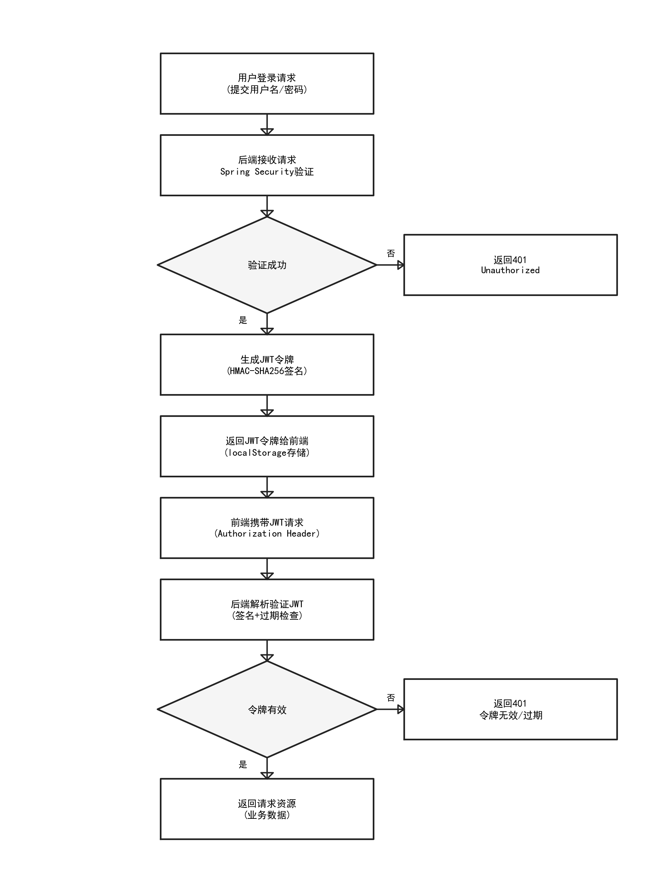

图2\-2  JWT认证流程示意图

如图2\-2所示，系统采用基于JWT（JSON Web Token）的无状态认证方案。用户通过登录接口提交账号密码，后端验证通过后生成包含用户ID、角色和过期时间的JWT令牌并返回给前端。前端在后续请求的Authorization头中携带该令牌，后端的Spring Security过滤器链拦截请求后验证令牌的签名有效性和过期时间，解析出用户角色信息进行权限校验。该方案无需在服务端维护会话状态，适合前后端分离的微服务架构，同时令牌的过期机制有效防止了令牌被长期滥用的安全风险。

2\.3\.2 前端开发技术

前端界面基于React 18框架开发，使用TypeScript语言编写。React的核心特性包括组件化开发、虚拟DOM和单向数据流。React 18引入了并发渲染特性，支持Suspense组件和自动批处理。TypeScript提供静态类型检查功能，在编译阶段发现类型错误。Vite作为前端构建工具，相比Webpack具有更快的冷启动速度。Tailwind CSS采用原子化CSS类的设计理念，提供灵活的界面设计能力。

2\.3\.3 模型服务技术

模型服务采用FastAPI框架开发，使用Python语言编写。FastAPI基于Starlette和Pydantic构建，提供高性能异步API和自动文档生成能力。深度学习模型使用PyTorch框架实现，支持GPU加速推理。Chroma向量数据库用于存储药物信息的向量表示，支持多种嵌入模型和元数据过滤。

__2\.4 本章小结__

本章系统阐述了医疗用药推荐系统的核心技术与理论基础。首先深入剖析了差分隐私技术的定义、噪声机制和DPSGD算法，为系统隐私保护设计提供了理论依据；然后全面介绍了深度学习推荐算法的发展脉络，重点阐述了FM和DeepFM模型的原理，为推荐模型设计奠定了基础；接着详细说明了规则匹配与特征归因技术的原理和应用，为推荐可解释性提供了技术支撑；最后概述了系统开发涉及的后端、前端、模型服务等技术栈，明确了技术选型依据。这些技术理论不仅为系统开发提供了方法论指导，其创新性融合更是为医疗推荐领域的隐私保护应用提供了可复用的技术范式，为后续系统设计与实现奠定了坚实基础。

__3 系统需求分析与设计__

医疗用药推荐系统面向医院、诊所等医疗机构，为医生和患者提供智能化的用药建议。系统需要在保障患者隐私的前提下，根据患者的个人特征、疾病史、过敏史等信息，推荐适合的药物方案。本章将从需求分析、系统架构设计、数据库设计和接口设计四个方面进行详细阐述，为系统实现奠定设计基础。

__3\.1 需求分析__

需求分析是系统设计的基础，本节将从功能需求和非功能需求两个维度进行分析。医疗用药推荐系统的核心目标是实现精准、安全、可解释的用药推荐，同时满足数据隐私保护要求。在功能需求方面，系统需要支持多角色用户的差异化操作：管理员负责系统管理和数据维护，医生负责患者管理和推荐审核，研究员关注隐私保护效果分析。在非功能需求方面，系统需满足响应速度、安全性、隐私保护强度等方面的性能指标。通过全面的需求分析，确保系统设计能够切实满足医疗场景的实际需要。

3\.1\.1 功能需求

图3\-1管理员用例图

如图3\-1所示，管理员作为系统的超级用户，拥有最高权限。管理员用例主要包含用户管理、数据管理和系统配置三大模块。在用户管理模块中，管理员可以添加、删除、修改用户信息，并为用户分配相应的角色和权限；在数据管理模块中，管理员可以查看和管理系统中的患者数据、药品数据和推荐记录，确保数据的完整性和安全性；在系统配置模块中，管理员可以设置系统的各项参数，包括差分隐私的隐私预算、敏感度阈值等核心配置项。

图3\-2医生用例图

图3\-3研究员用例图

根据医疗场景的实际需求，本系统需要实现以下核心功能：（1）用户管理功能：支持用户注册、登录、权限管理等功能。系统区分管理员和普通用户角色，管理员可进行系统配置和数据管理，普通用户可使用推荐功能查看用药建议。用户密码采用BCrypt算法加密存储，登录使用JWT令牌进行身份认证，保障账户安全。（2）患者信息管理：支持患者基本信息的录入、修改和查询，包括姓名、性别、年龄、联系方式等。同时管理患者的健康档案，包括疾病史、过敏史、当前用药情况等敏感信息。（3）用药推荐功能：根据患者的健康档案，结合药物数据库，生成个性化的用药推荐。推荐结果包括推荐药物、推荐理由、注意事项、可能的相互作用等详细信息。（4）隐私保护配置：支持用户配置隐私保护参数，包括隐私预算、噪声机制、敏感度等。系统根据配置在推荐过程中应用相应的差分隐私保护措施。（5）推荐历史查询：记录用户的推荐历史，支持按时间、患者等条件查询历史推荐记录，便于追溯和分析\[23\]。

3\.1\.2 非功能需求

表3\-1系统非功能需求指标表

需求类别

需求指标

目标值

性能需求

推荐响应时间

< 2秒

性能需求

并发用户数

≥50

安全需求

认证机制

JWT HMAC\-SHA256

安全需求

角色权限控制

RBAC三角色

安全需求

隐私保护级别

ε ≤1\.0差分隐私

隐私需求

隐私预算管理

组合定理自动跟踪

可扩展需求

药物候选数量

≥1807

可扩展需求

模型可替换

支持模型热加载

可用性需求

推荐准确率

≥92%

可用性需求

可解释性

规则匹配增强推荐解释

除功能需求外，系统还需满足以下非功能需求：（1）安全性：系统需要保护患者隐私数据不被泄露，实现差分隐私保护机制，确保推荐过程中的隐私安全。用户认证和授权机制需要防止未授权访问。（2）可用性：系统界面需要简洁直观，操作流程清晰，便于医疗人员快速上手使用。推荐结果需要提供可解释的理由说明，帮助用户理解和采纳建议。（3）性能：系统需要支持并发访问，推荐响应时间控制在合理范围内。对于大规模药物数据库，检索效率需要满足实时性要求。（4）可维护性：系统采用模块化设计，各模块职责清晰，便于独立开发和维护。

__3\.2 系统架构设计__

本系统采用前后端分离的微服务架构，将系统划分为前端服务、后端服务和模型服务三个主要模块，各模块之间通过RESTful API进行通信。这种架构设计具有高内聚低耦合的特点，前端服务专注于用户界面展示和交互，后端服务负责业务逻辑处理和数据持久化，模型服务承载深度学习推理任务。三个模块可以独立开发、测试和部署，任何一个模块的升级或故障不会直接影响其他模块的运行，提高了系统的可维护性和可用性。

3\.2\.1 整体架构

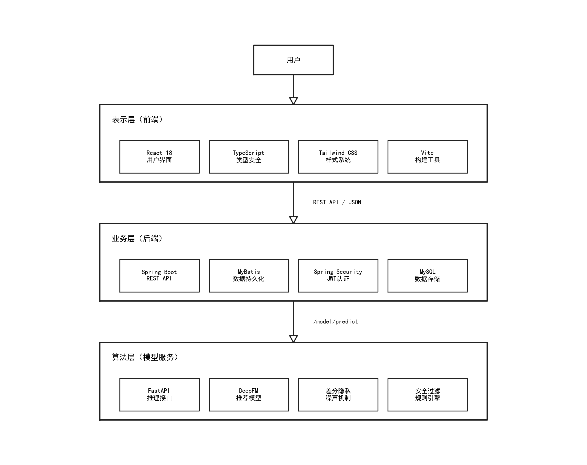

图3\-4系统总体架构图

系统整体架构分为四层：路由层、展示层、业务层和数据层，其中路由层（KnowledgeRouter）负责疾病到药品类别的确定性路由。展示层负责用户界面的呈现和交互，包括Web前端应用，基于React框架开发。业务层负责业务逻辑的处理，包括后端API服务和模型推理服务，后端服务基于Spring Boot框架开发，模型服务基于FastAPI框架开发。数据层负责数据的持久化存储，包括MySQL关系数据库和向量数据库。在业务层内部，模型推理服务采用了四层推荐架构作为核心设计：安全过滤层（SafetyFilter）通过确定性规则排除绝对禁忌药物；规则标记层（RuleMarker）对相对禁忌药物添加警示标记；个性化排序层基于DeepFM模型对安全候选药物进行精准评分并应用差分隐私噪声。四层架构确保了临床安全性与隐私保护的分离——差分隐私噪声仅作用于排序层，不会影响安全过滤的确定性判断。

3\.2\.2 模块划分

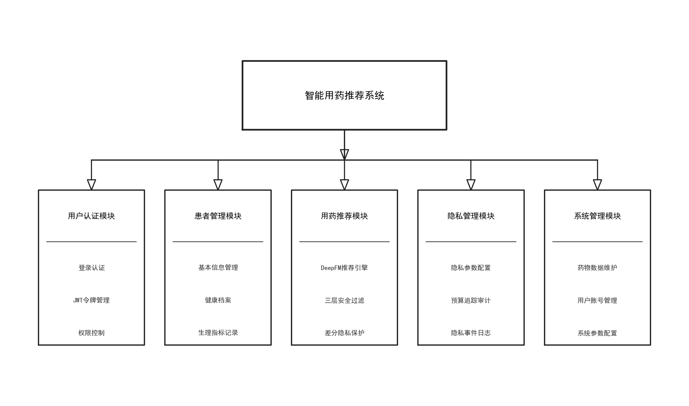

图3\-5系统功能结构图

根据功能需求，系统划分为以下核心模块：（1）认证模块：处理用户注册、登录、权限验证等操作，使用JWT实现无状态认证。（2）患者管理模块：管理患者的基本信息和健康档案，提供增删改查接口，支持V2生理指标字段（肾功能、肝功能、BMI、妊娠状态、哺乳状态、吸烟饮酒状况、血压、空腹血糖、糖化血红蛋白、胆固醇、心率等）。（3）药物管理模块：管理药物数据库，包括药物基本信息、适应症、禁忌症、副作用、相互作用等专业数据，以JSON格式存储多值字段。（4）安全过滤模块（SafetyFilter）：实现三层推荐架构的第一层，通过17类确定性排除规则（绝对禁忌症、儿科禁忌、过敏冲突、重大药物相互作用、妊娠X类、哺乳L5级、MAOI\+SSRI禁忌、肾功能/肝功能严重损害排除、草药补充剂排除）过滤不安全药物，差分隐私噪声不影响此层。（5）规则标记模块（RuleMarker）：实现三层推荐架构的第二层，对相对禁忌、中等相互作用、妊娠C/D类警告、肾功能/肝功能轻度警告等添加requires\_review和safetyType标记。（6）临床匹配模块（ClinicalMatcher）：实现标准化的疾病\-适应症匹配，支持indication\_match\_conditions优先匹配、过敏标准化匹配和疾病语义扩展匹配。（7）疾病映射模块（DiseaseMapper）：支持中文症状/疾病名称到英文疾病编码的语义转换，包括SEMANTIC\_VOCAB\_MAP处理词汇表未覆盖的疾病映射。（8）推荐排序模块：基于DeepFM模型对安全候选药物进行个性化评分，应用差分隐私噪声和临床阈值后处理。（9）解释生成模块（ExplanationGenerator）：为推荐结果生成适应症匹配详情、安全性分析和推荐理由说明。（10）隐私管理模块：管理差分隐私配置、隐私预算追踪（基于强组合定理）和隐私事件日志。（11）审计日志模块：记录完整的推荐审计轨迹，支持知情同意日志记录。

__3\.3 数据库设计__

图3\-6系统ER图

如图3\-6所示，系统ER图展示了核心实体之间的关联关系。患者实体\(Patient\)通过推荐记录实体\(Recommendation\)与药品实体\(Drug\)建立多对多关系，一次推荐可以包含多个药品，一个药品也可以被多次推荐。用户实体\(User\)记录系统用户的账户信息和角色权限。隐私账本实体\(PrivacyLedger\)记录每次推荐操作的隐私预算消耗情况，与患者实体关联。审核日志实体\(ReviewLog\)记录医生的审核决策用于反馈学习。各实体通过外键关联形成完整的数据模型。

系统使用MySQL作为主数据库，存储用户、患者、药物等结构化数据。MySQL作为成熟的关系型数据库管理系统，提供了完善的事务支持和数据完整性保障，适合存储医疗领域需要强一致性的结构化数据。数据库设计遵循第三范式，在保证数据一致性的同时尽量避免冗余存储。药物表中的适应症、禁忌症、副作用等字段采用JSON格式存储，既保持了数据的灵活性，又便于前端直接解析展示。同时，系统为推荐结果、隐私配置等动态数据设计了专门的存储表，支持高效的查询和统计分析。

3\.3\.1 用户表设计

表3\-2用户表\(sys\_user\)设计

字段名

类型

约束

说明

id

BIGINT

PRIMARY KEY, AUTO\_INCREMENT

用户ID

username

VARCHAR\(50\)

UNIQUE, NOT NULL

用户名

password

VARCHAR\(100\)

NOT NULL

BCrypt加密密码

role

VARCHAR\(20\)

NOT NULL

角色\(admin/doctor/researcher\)

phone

VARCHAR\(20\)

联系电话

create\_time

DATETIME

DEFAULT NOW

创建时间

update\_time

DATETIME

更新时间

status

INT

DEFAULT 1

状态\(0禁用/1启用\)

用户表（user）存储系统用户的基本信息，包括用户ID（主键）、用户名、密码哈希、角色、创建时间、更新时间等字段。密码采用BCrypt算法进行哈希存储，保障用户账户安全。角色字段区分管理员和普通用户，控制操作权限。

3\.3\.2 患者表设计

表3\-3患者表\(patient\)设计

字段名

类型

约束

说明

id

BIGINT

PRIMARY KEY, AUTO\_INCREMENT

患者ID

name

VARCHAR\(50\)

NOT NULL

患者姓名

gender

VARCHAR\(10\)

性别

age

INT

年龄

phone

VARCHAR\(20\)

联系电话

user\_id

BIGINT

FOREIGN KEY→sys\_user

管理医生ID

create\_time

DATETIME

DEFAULT NOW

创建时间

患者表（patient）存储患者的基本信息，包括患者ID（主键）、姓名、性别、出生日期、联系电话、创建时间等字段。健康档案表（health\_record）存储患者的疾病史、过敏史、当前用药等健康信息，以JSON格式存储便于扩展。在V2版本中，健康档案表新增了12项生理指标字段：肾功能等级（renal\_function）、肝功能等级（hepatic\_function）、BMI值、妊娠状态（pregnancy\_status）、哺乳状态（breastfeeding\_status）、吸烟状态（smoking\_status）、饮酒状态（drinking\_status）、血压（blood\_pressure）、空腹血糖（fasting\_glucose）、糖化血红蛋白（hba1c）、胆固醇（cholesterol）、心率（heart\_rate）。这些生理指标字段为三层推荐架构中的安全过滤和规则标记提供了关键的临床决策依据，肾功能和肝功能等级直接影响SafetyFilter的排除规则和RuleMarker的警告标记。

3\.3\.3 药物表设计

表3\-4药品表\(drug\)设计

字段名

类型

约束

说明

id

BIGINT

PRIMARY KEY, AUTO\_INCREMENT

药品ID

name

VARCHAR\(100\)

NOT NULL

药品名称

english\_name

VARCHAR\(100\)

英文名称

category

VARCHAR\(50\)

药品分类

indications

JSON

适应症列表

contraindications

JSON

禁忌症列表

side\_effects

JSON

副作用列表

interactions

JSON

药物相互作用

pregnancy\_cat

VARCHAR\(5\)

妊娠分类\(A/B/C/D/X\)

药物表（drug）存储药物的基本信息，包括药物ID（主键）、名称、类别、适应症、禁忌症、副作用、典型剂量、使用频率、创建时间等字段。适应症和禁忌症以JSON数组格式存储，支持灵活的多值属性表示，便于推荐算法的快速匹配和过滤。药物表的数据来源于标准药物数据库，包含1815种药品的详细信息，覆盖了心血管、呼吸、消化、内分泌等多个治疗领域的常用药物，为推荐系统提供了全面的候选药物集合。

3\.3\.4 推荐记录表设计

表3\-5推荐记录表\(recommendation\)设计

字段名

类型

约束

说明

id

BIGINT

PRIMARY KEY, AUTO\_INCREMENT

推荐记录ID

patient\_id

BIGINT

FOREIGN KEY→patient

患者ID

input\_data

JSON

NOT NULL

输入数据\(疾病/症状/参数\)

result\_data

JSON

NOT NULL

推荐结果\(药物/评分/解释\)

epsilon\_used

FLOAT

本次消耗隐私预算

noise\_mechanism

VARCHAR\(20\)

噪声机制类型

create\_time

DATETIME

DEFAULT NOW

推荐时间

推荐记录表（recommendation）存储推荐历史，包括记录ID（主键）、患者ID、推荐结果、差分隐私配置、创建时间等字段。推荐结果以JSON格式存储完整的推荐信息，包括推荐的药物列表、各药物的安全级别标签、匹配的适应症、差分隐私噪声影响分析等详细数据。差分隐私配置字段记录了生成该推荐时使用的隐私预算ε、噪声机制类型和噪声参数，便于后续的隐私审计和效果回溯分析。

__3\.4 接口设计__

系统采用RESTful风格设计API接口，前后端通过JSON格式进行数据交换。接口设计遵循统一的规范，包括请求方法、路径命名、参数格式、响应格式等。所有接口响应采用统一的信封格式，包含状态码、消息和数据三个字段，便于前端统一处理。认证接口基于JWT令牌机制，登录后获取令牌并在后续请求的Authorization头中携带。后端接口按功能模块划分为认证模块、患者管理模块、推荐模块、隐私管理模块和管理员模块，各模块接口职责清晰、边界明确，便于维护和扩展。

3\.4\.1 后端API接口

后端服务提供以下主要API接口：认证接口包括POST /api/auth/login用于用户登录，POST /api/auth/register用于用户注册。患者接口包括GET /api/patients获取患者列表，POST /api/patients创建患者，PUT /api/patients/\{id\}更新患者信息，DELETE /api/patients/\{id\}删除患者。推荐接口包括POST /api/recommendations/generate根据患者信息生成用药推荐，请求体包含患者ID和差分隐私配置。

3\.4\.2 模型服务接口

模型服务提供以下API接口：预测接口POST /model/predict接收患者特征（包括V2生理指标），返回三层推荐架构处理后的推荐药物列表，包含安全过滤排除药物、规则标记警告药物和个性化排序推荐药物。模型状态接口GET /model/status返回模型加载状态、设备信息、药物数量等。药物加载接口POST /model/load\-drugs接收后端药物数据，加载到模型服务并构建安全数据映射（禁忌症映射95\.3%覆盖、相互作用映射81\.5%覆盖、总体安全数据97\.0%覆盖）。隐私预算接口包括GET /model/privacy/budget获取预算状态和POST /model/privacy/budget/reset重置预算。审计日志接口包括GET /model/audit/logs查询审计记录和POST /model/audit/consent记录知情同意。训练接口POST /model/train支持Focal Loss训练参数（focalLossAlpha=0\.4、focalLossGamma=2\.0）。

__3\.5 本章小结__

本章围绕医疗用药推荐系统的建设进行了全面的需求分析与设计。首先从功能需求和非功能需求两个维度进行了详细分析，明确了系统的建设目标。然后设计了前后端分离的微服务架构，将系统划分为前端服务、后端服务和模型服务三个独立模块。接着进行了数据库设计，定义了用户表、患者表、药物表和推荐记录表的结构。最后设计了RESTful风格的API接口，明确了前后端交互规范。本章内容为后续系统实现提供了详细的设计方案。

__4 核心算法设计与实现__

本章详细阐述医疗用药推荐系统的核心算法设计与实现，包括三层推荐安全架构、DeepFM推荐模型、差分隐私机制以及推荐流程集成等核心部分。三层推荐架构是系统设计的核心创新，将推荐过程划分为安全过滤层（SafetyFilter）、规则标记层（RuleMarker）和个性化排序层，确保推荐结果在隐私保护的前提下兼顾临床安全性和个性化精准度。安全过滤层通过确定性规则排除绝对禁忌药物，差分隐私噪声不影响此层；规则标记层对相对禁忌药物添加警示标记而非直接排除；个性化排序层基于DeepFM模型对安全候选药物进行精准评分，差分隐私噪声仅在此层应用。这种分层设计既保障了临床安全性不受隐私噪声干扰，又实现了隐私保护与个性化推荐的有机融合。

__4\.1 临床知识路由层__

图4\-1 临床知识路由层架构图

如图4\-7所示，临床知识路由层作为四层推荐架构的第零层，通过四级确定性路由机制将患者输入的中文疾病名精准对接到正确的药品类别。L1口语标准化层将患者的非标准口语化表达转换为标准医学术语，路由表包含154条口语映射；L2疾病归类层将标准化疾病名归类到14个身体系统和23种病因类型，路由表包含1495条疾病分类记录；L3适应症映射层将身体系统与病因的组合映射到ATC药品治疗类别，路由表包含200条路由规则；L4药品召回层在L3确定的药品类别范围内召回所有候选药物。整个路由过程是确定性的，同一疾病每次路由结果一致，保证了推荐的可解释性。

4\.1\.1 路由层设计理念

临床知识路由层是四层推荐架构的新增第零层，核心目标是解决中文疾病名到英文药品适应症之间的语义鸿沟。知识路由层通过四级确定性路由机制，实现从患者口语化描述到标准疾病编码再到药品适应症的精准映射。该层的设计理念源于临床实践中的实际需求：患者往往使用非专业术语描述症状，而药品数据库以标准医学术语组织，两者之间存在显著的语义差距。通过构建多级映射表和智能匹配算法，路由层能够将患者的自然语言输入转化为系统能够理解的标准化疾病名称近年来，检索增强生成（Retrieval\-Augmented Generation, RAG）技术为知识密集型任务提供了新的解决思路\[24\]，本系统的知识路由层设计亦借鉴了外部知识检索增强的核心思想。

4\.1\.2 路由算法实现

路由层采用四级确定性路由：L1口语标准化将患者的非标准口语化中文表达标准化为标准英文医学术语，路由表包含154条映射；L2疾病归类将标准化疾病名归类到身体系统和病因分类，路由表包含1495条记录；L3适应症映射将身体系统与病因组合映射到对应的ATC药品治疗类别，路由表包含200条规则；L4药品召回在L3确定的药品类别范围内召回该类别中的所有候选药物。

4\.1\.3 患者口语增强

口语增强模块采用三层fallback策略处理患者非标准化输入：第一层精确匹配口语映射表中的完整短语；第二层关键词匹配提取输入中的医学关键词；第三层症状组合推理将多症状组合推断为最可能的疾病。当三层均失败时，降级为症状级别推荐并标记为低置信度。

图4\-2 患者口语增强三层Fallback策略

__4\.2 三层推荐安全架构__

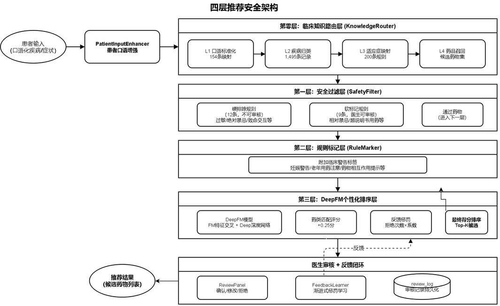

图4\-3三层推荐安全架构图

三层推荐安全架构是本系统核心算法设计的基石，将推荐过程严格划分为三个层次，确保临床安全性与隐私保护的分离。该架构的设计理念源于医疗推荐场景的特殊性：在医疗用药推荐中，安全性是首要约束，绝对禁忌药物的推荐可能导致严重临床后果，因此安全性判断必须基于确定性规则，不能受差分隐私噪声影响。三层架构的核心原则是：差分隐私噪声仅作用于个性化排序层，安全过滤层和规则标记层均基于确定性临床规则，确保推荐结果的临床安全性不受隐私保护机制的干扰。

4\.2\.1 安全过滤层（SafetyFilter）

安全过滤层的设计原则从"系统替患者决定"调整为"系统为医生标记，医生来做最终判断"。系统将原有的17类规则划分为硬排除（12条，不可审核）和软标记（9条，医生可审核）。硬排除规则包括：过敏冲突、绝对禁忌症、致命药物交互、妊娠X级、儿科禁忌、哺乳期L5级等12条绝对安全红线。软标记规则包括：PPI用于胆囊病、抗生素用于尿路结石等9类可审核情形。这一调整的核心优势在于：绝对安全红线保持不变，但原被过度拦截的药物现在以"标记待审"方式呈现，医生可基于临床经验做最终决策。

4\.2\.2 规则标记层（RuleMarker）

规则标记层是三层推荐架构的第二层，对安全过滤层未排除的候选药物进行软标记，添加requires\_review和safetyType标记而非直接排除。规则标记层实现了以下标记规则：（1）相对禁忌症标记：药物存在相对禁忌症时标记requires\_review=True、safetyType=relative\_contraindication；（2）中等药物相互作用标记：存在中等程度相互作用时标记requires\_review=True、safetyType=moderate\_interaction；（3）妊娠C/D类警告标记：妊娠患者使用C/D类药物时标记requires\_review=True、safetyType=pregnancy\_warning；（4）肾功能警告标记：肾功能轻度异常患者使用特定药物时标记肾功能相关警告；（5）肝功能警告标记：肝功能轻度异常患者使用特定药物时标记肝功能相关警告；（6）生育力警告标记：可能影响生育力的药物添加fertility\_warning标记；（7）数据未验证标记：安全数据缺失的药物标记data\_unverified。规则标记层的关键设计原则是：标记而非排除。标记后的药物仍保留在候选集中参与个性化排序，但携带警示信息供医生参考。这种设计避免了对相对禁忌药物的过度排除，在保障安全性的同时保留了个性化推荐的灵活性。

4\.2\.3 临床匹配器（ClinicalMatcher）

__4\.3 DeepFM推荐模型__

图4\-4 DeepFM模型架构图

DeepFM模型是三层推荐架构中个性化排序层的核心算法，负责对安全过滤层过滤后、规则标记层标记后的候选药物进行精准评分。本系统采用DeepFM v3版本，相比原始DeepFM模型进行了多项架构优化：合并嵌入设计、连续特征旁路、LayerNorm替代BatchNorm、差异化Dropout以及Focal Loss训练支持。

4\.3\.1 模型架构设计

DeepFM v3模型的输入特征包括15个类别字段（age\_group、gender、bmi\_group、renal\_function、hepatic\_function、primary\_disease、secondary\_disease、allergy\_severity、drug\_class、med\_class\_1至med\_class\_4、pregnancy\_cat、rx\_otc、drug\_candidate）和4个连续特征（age\_raw、bmi\_raw、gfr\_raw、liver\_score\_raw）。类别特征首先经过合并嵌入层（Merged Embedding）转换为低维稠密向量，该层使用单个nn\.Embedding实例配合field\_offsets寄存器缓冲区实现Opacus兼容的差分隐私训练。嵌入维度为8，总嵌入空间大小为各字段词汇量之和。合并嵌入的优势在于：统一的参数管理、差分隐私训练兼容性（Opacus要求单一nn\.Embedding）、以及内存效率优化。连续特征通过旁路机制直接绕过嵌入层和FM/Deep组件，以原始数值形式与最终输出拼接，避免了连续特征经过嵌入层的信息损失。这种设计使得模型能够同时学习类别特征的交互关系和连续特征的直接效应。

4\.3\.2 FM组件与深度组件实现

FM组件（MultiFieldFM）基于合并嵌入实现，使用field\_offsets寄存器缓冲区将不同字段的嵌入向量从统一嵌入表中提取。FM组件计算一阶线性效应和二阶特征交互，二阶交互通过嵌入向量的内积计算特征两两之间的交互强度。FM组件引入了embed\_dropout机制，在训练时对嵌入向量进行随机丢弃以增强泛化能力。深度组件（Deep）采用多层全连接神经网络结构，隐藏层维度为\[64, 32\]，每层后接LayerNorm和ReLU激活函数。相比原始DeepFM使用BatchNorm，LayerNorm在推理时无需依赖批统计量，更适合单样本推理的医疗推荐场景。深度组件还实现了差异化Dropout策略：第一层Dropout率为0\.3（较高，防止过拟合），第二层Dropout率为0\.1（较低，保留更多有用信息）。DeepFM v3模型输出为原始logits值，sigmoid激活函数在推理时手动应用，这种设计支持Focal Loss训练中的概率计算需求。

4\.3\.3 连续特征旁路与Focal Loss训练

连续特征旁路是DeepFM v3的关键架构创新。4个连续特征（age\_raw、bmi\_raw、gfr\_raw、liver\_score\_raw）不经过嵌入层处理，而是通过独立的线性变换层直接映射到输出空间。旁路机制的数学表达为：continuous\_output = W\_cont×continuous\_input \+ b\_cont，其中W\_cont为权重矩阵，b\_cont为偏置向量。连续特征旁路与FM输出、Deep输出在最终层拼接，形成完整的模型输出：output = FM\_output \+ Deep\_output \+ continuous\_output。这种设计使得连续特征（特别是肾功能GFR和肝功能评分等关键生理指标）的信息不被嵌入层压缩损失，直接参与最终评分计算。在训练方面，系统支持Focal Loss训练策略，通过调整focalLossAlpha（默认0\.25）和focalLossGamma（默认2\.0）参数，使模型在训练时更加关注难以分类的样本。Focal Loss的数学定义为：FL\(p\) = \-alpha×\(1\-p\)^gamma×log\(p\)，其中alpha平衡正负样本权重，gamma降低易分类样本的损失权重。Focal Loss在医疗推荐场景中特别有用，因为正样本（适合药物）比例远低于负样本（不适合药物），需要模型更关注少数正样本的学习。

__4\.4 差分隐私机制实现__

4\.4\.1 推理阶段差分隐私

图4\-5隐私保护推理流程图

在推理阶段，系统向DeepFM模型的推荐得分添加噪声实现隐私保护。支持的噪声机制包括拉普拉斯噪声和高斯噪声。拉普拉斯噪声尺度参数为Δf/ε（Δf为敏感度），高斯噪声方差σ=Δf× √\(2ln\(1\.25/δ\)\) /ε。差分隐私噪声应用后，系统执行临床阈值后处理以确保推荐结果的临床合理性：（1）临床安全阈值：得分低于0\.15的药物直接置零。此阈值是公开的确定性参数，根据差分隐私后处理定理，确定性后处理操作不降低隐私保护强度。0\.15阈值确保了低分药物不会被噪声意外提升到推荐位置，同时保留了对安全过滤层排除药物的双重保障。（2）天花板截断：推荐得分上限为min\(1\.0, raw\_score \+ 0\.35\)，防止噪声将低分药物放大超过3\.5倍，避免噪声过度扭曲推荐方向。（3）异常检测：标记dpAnomaly=True当噪声显著改变推荐排序方向时，帮助医生识别受噪声影响较大的推荐结果。（4）置信区间计算：为每个推荐得分计算95%置信区间（拉普拉斯噪声CI=±2b/√3，高斯噪声CI=±1\.96σ），当推荐药物的置信区间重叠时标记uncertainRanking=True，提示排序不确定性。

4\.4\.2 隐私预算管理

系统提供隐私预算管理功能，基于强组合定理（Strong Composition Theorem）追踪隐私预算消耗。强组合定理相比基础组合定理提供了更精确的隐私预算计算：对于k次ε\-差分隐私操作的组合，总隐私预算为ε\_total =ε√\(2kln\(1/δ值\)\) \+ kε\(e^ε\-1\) \+δ，其中δ值为目标松弛参数。这种计算方式使得在相同隐私保护强度下允许更多次推荐操作，提升了系统的实用性。系统实现了BudgetWarningLevel三级预警机制：normal（预算充足）、warning（预算消耗超过50%）、exceeded（预算耗尽）。当隐私预算耗尽时，系统拒绝新的推荐请求并提示用户重置预算，防止隐私保护强度不足。隐私配置参数包括：隐私预算ε（范围0\.01~10\.0）、松弛参数δ（范围0<δ<1）、敏感度Δf（范围0\.01~1\.0）、噪声机制类型（laplace/gaussian/geometric）。默认配置为ε=0\.1的高斯噪声机制，适用于医疗数据的高敏感性特点。系统同时实现了双重隐私预算追踪：后端MySQL持久化存储（privacy\_config\.budget\_used \+ privacy\_ledger）和模型服务内存追踪（PrivacyBudgetTracker），两者独立运行以满足不同场景需求。

4\.4\.3 推荐质量保障机制

系统实现了一套多层推荐质量保障机制，确保推荐结果的可靠性与临床实用性。该机制包括以下核心组件：

（1）最低可靠得分阈值（MIN\_RELIABLE\_SCORE = 0\.3）  
推荐得分低于0\.3的药物被标记为低可靠性，提示医生谨慎参考。该阈值高于临床安全阈值0\.15，形成双重保障：得分低于0\.15直接排除，得分在\[0\.15, 0\.3\)区间标记为低可靠性。

（2）最低区分度检查（MIN\_SEPARATION = 0\.15）  
当推荐药物之间的得分差异小于0\.15时，系统标记排序不确定性，提示推荐结果的区分度不足。

（3）置信区间重叠检测  
当推荐药物的95%置信区间存在重叠时，标记 uncertainRanking = True，提示差分隐私噪声可能影响排序结果的可靠性。

（4）质量警告等级  
系统定义两种质量警告状态：NO\_RELIABLE\_RECOMMENDATION（无可靠推荐）和 LOW\_CONFIDENCE（低置信度）。当所有推荐得分均低于0\.3，或置信区间出现大面积重叠时触发相应警告。

（5）跨候选药物相互作用检查（DDI Cross\-Candidate Check）  
在最终推荐列表中检查推荐药物之间的相互作用，若发现重大相互作用则添加 interactionWarning 标记。该检查通过 critical\_interactions\.py 中定义的DDI配对数据库实现，覆盖了MAOI \+ SSRI、华法林 \+ NSAIDs等高风险药物组合。

__4\.5 推荐流程集成__

4\.5\.1 三层推荐流程设计

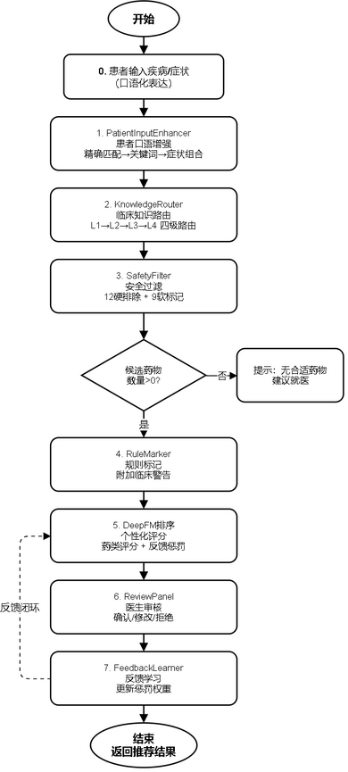

图4\-6用药推荐流程图

三层推荐流程按照以下步骤严格执行：第一步获取患者信息，包括基本信息、疾病史、过敏史、当前用药和V2生理指标（肾功能、肝功能、BMI等）；第二步通过DiseaseMapper将中文疾病名称映射为英文疾病编码，使用SEMANTIC\_VOCAB\_MAP处理词汇表未覆盖的疾病，区分primary\_input\_diseases（患者原始输入疾病）和vocab\_diseases（词汇表可识别的代理疾病）；第三步执行安全过滤层（SafetyFilter），通过17类确定性排除规则过滤绝对禁忌药物，缩小候选集范围；第四步执行规则标记层（RuleMarker），对安全候选药物添加相对禁忌和中等风险标记；第五步基于DeepFM模型对安全候选药物进行个性化评分，应用差分隐私噪声和临床阈值后处理（0\.15阈值置零、0\.35天花板截断）；第六步通过疾病平衡选择算法（\_select\_disease\_balanced）确保推荐药物覆盖多种疾病，优先覆盖lost\_diseases（词汇表未覆盖的真实疾病）；第七步通过ExplanationGenerator为推荐结果生成适应症匹配详情、安全性分析和推荐理由；第八步执行跨候选DDI检查，检测推荐药物之间的相互作用风险；第九步应用质量保障机制检查推荐可靠性和置信度，返回最终推荐结果。

4\.5\.2 疾病映射与特征预处理

疾病映射模块（DiseaseMapper）负责将患者输入的中文疾病名称转换为模型可识别的英文疾病编码。疾病映射面临的核心挑战是中文疾病表述的多样性和非标准化：患者可能使用"甲减"、"甲状腺功能减退"、"thyroid issues"等不同表述指代同一疾病。

DiseaseMapper通过SEMANTIC\_VOCAB\_MAP解决这一问题，该映射表将常见的中文疾病简称映射到标准英文编码，如"甲减"→hypothyroidism、"高血压"→hypertension、"糖肾"→diabetic\_nephropathy等。对于SEMANTIC\_VOCAB\_MAP仍无法覆盖的疾病，系统标记为lost\_diseases，在推荐选择时优先覆盖这些疾病对应的适应症药物。特征预处理模块将原始患者信息和药物信息转换为DeepFM模型的输入格式。14个类别特征通过Pipeline Schema定义的字段映射编码为离散值，4个连续特征（age\_raw、bmi\_raw、gfr\_raw、liver\_score\_raw）以原始数值形式通过旁路机制输入模型。药物候选字段（drug\_candidate）覆盖1807种药物，每种药物作为独立候选参与评分，在疾病映射完成后，系统进一步识别"丢失疾病"（lost\_diseases）——即患者真实输入疾病中未被模型词汇表覆盖的疾病。例如，"甲状腺功能减退（甲减）"不在词汇表中，系统通过SEMANTIC\_VOCAB\_MAP将其映射为"甲状腺功能亢进"作为词汇代理，但"甲状腺功能减退"本身作为丢失疾病被记录。

Lost\-Disease Boost机制确保匹配丢失疾病的药物获得评分提升（score=1\.0），而不匹配任何真实疾病的高分药物则受到惩罚（score×0\.15），从而保障词汇表外疾病患者仍能获得相关药物推荐。在疾病均衡选择阶段，丢失疾病优先级高于词汇代理疾病，确保推荐结果覆盖患者的真实医疗需求。

4\.5\.3 推荐解释生成与结果后处理

推荐解释生成由ExplanationGenerator模块实现，为每个推荐药物生成三层解释信息：	（1）适应症匹配详情：说明药物适应症与患者疾病的匹配情况，使用ClinicalMatcher的indication\_match\_conditions进行精确匹配描述，区分直接匹配和语义扩展匹配；

1. 安全性分析：综合SafetyFilter排除原因和RuleMarker标记信息，说明药物的安全性评估结果，包括是否存在相对禁忌、中等相互作用或妊娠/肾功能/肝功能警告；

（3）推荐理由说明：综合适应症匹配和安全性分析，生成可理解的推荐理由文本，说明为何推荐该药物以及需要注意的事项。推荐结果经过后处理后返回给用户，后处理包括：药物名称英中翻译（通过DrugTranslator和TranslationMapper实现，包括drugName中文名和englishName英文名）、跨候选DDI相互作用检查、质量保障等级判定、置信区间展示和差分隐私噪声量记录。系统还实现了药物类别、安全类型、副作用等专业术语的全字段中文翻译，确保前端展示的一致性和可理解性。

__4\.6 审核反馈闭环__

4\.6\.1 审核流程设计

系统推荐2到4个候选药物后，医生进入审核环节，可进行三种操作：确认推荐（记录正面信号）、修改选择（从候选列表中另选药物）、拒绝推荐（标记为不适用）。审核决策通过ReviewPanel前端组件收集，经API接口写入MySQL review\_log表。

4\.6\.2 反馈学习机制

反馈学习器（FeedbackLearner）从review\_log中读取审核决策，自动构建疾病到药品类别的惩罚权重图。当某药品类别被医生反复拒绝，系统自动对该配对施加渐进式惩罚（1次拒绝乘0\.7，2次乘0\.5，3次及以上乘0\.3）。当医生确认了曾被拒绝的药类时，惩罚系数逐步解除。

图4\-7 审核反馈闭环流程图

如图4\-7所示，审核反馈闭环机制建立了从推荐生成到持续优化的完整学习回路。系统推荐2至4个候选药物后，医生通过审核面板进行确认、修改或拒绝操作。确认操作记录正面信号，修改操作记录替代偏好，拒绝操作记录负面信号。

反馈学习器从审核日志中读取决策记录，自动构建疾病到药品类别的惩罚权重图：当某药品类别被医生反复拒绝时，系统对该配对施加渐进式惩罚，后续推荐中该药类候选药物得分乘以相应惩罚系数。当医生确认了曾被拒绝的药类时，惩罚系数逐步解除。该机制使系统能够从临床实践中自动学习优化推荐策略。

__4\.7 本章小结__

本章详细阐述了医疗用药推荐系统的核心算法设计与实现。首先设计了三层推荐安全架构，包括安全过滤层（SafetyFilter）的17类确定性排除规则、规则标记层（RuleMarker）的软标记机制和临床匹配器（ClinicalMatcher）的标准化匹配算法，确保了临床安全性不受差分隐私噪声影响。然后设计了DeepFM v3推荐模型架构，实现了合并嵌入层、连续特征旁路、LayerNorm\+差异化Dropout和Focal Loss训练支持，提升了模型的推理效率和训练效果。接着实现了推理阶段差分隐私机制，包括临床阈值后处理（0\.15安全阈值、0\.35天花板截断）、异常检测和95%置信区间计算，以及基于强组合定理的隐私预算管理和多层质量保障机制。最后集成了三层推荐流程、疾病映射、特征预处理、推荐解释生成和跨候选DDI检查，形成了完整的推荐处理链路。本章内容为系统实现提供了坚实的算法基础，确保了推荐结果在隐私保护前提下的临床安全性和个性化精准度。

__5 系统实现__

本章详细描述医疗用药推荐系统的具体实现过程，包括开发环境配置、后端服务实现、前端界面实现和模型服务实现四个部分。系统采用前后端分离的微服务架构，各模块独立开发部署，通过RESTful API进行通信。后端服务基于Spring Boot 3\.2框架，使用MyBatis作为ORM框架操作MySQL数据库，集成Spring Security实现三角色权限控制；前端服务基于React 18框架，使用TypeScript保证类型安全，结合Tailwind CSS实现响应式界面；模型服务使用Python FastAPI框架，承载DeepFM推荐模型的推理和训练服务。以下各节将分别介绍各模块的具体实现细节。

__5\.1 开发环境与技术选型__

表5\-1系统技术选型说明表

技术类别

技术选型

选型理由

前端框架

React 18

组件化开发、虚拟DOM高效渲染、生态丰富

前端样式

Tailwind CSS

原子化CSS、快速开发、响应式支持

构建工具

Vite

极速HMR、ESM原生支持、开箱即用

后端框架

Spring Boot 3\.2

自动配置、微服务友好、Java生态成熟

安全框架

Spring Security \+ JWT

无状态认证、多角色RBAC、前后端分离友好

ORM框架

MyBatis

灵活SQL映射、动态查询、性能可控

数据库

MySQL 8

关系型数据存储、JSON字段支持、事务可靠

模型服务

FastAPI

异步高性能、自动API文档、PyTorch集成友好

深度学习

PyTorch \+ Opacus

动态图、Opacus实现DP\-SGD、模型训练隐私保护

推荐模型

DeepFM v3

FM\+Deep融合、特征交叉、连续特征旁路

本系统的开发环境和技术选型经过充分调研和比较，选择了成熟稳定且适合项目需求的技术栈。后端开发环境包括操作系统Windows 10/11，开发语言Java 17，开发框架Spring Boot 3\.2，构建工具Maven 3\.8，数据库使用MySQL 8\.0。前端开发环境包括开发语言TypeScript，框架React 18，构建工具Vite，CSS框架Tailwind CSS。模型服务开发环境包括开发语言Python 3\.10，框架FastAPI，深度学习框架PyTorch 2\.0，向量数据库Chroma。

__5\.2 后端服务实现__

后端服务基于Spring Boot框架开发，采用分层架构设计，包括控制器层、服务层、持久层。控制器层处理HTTP请求，服务层封装业务逻辑，持久层实现数据访问。项目采用标准的Maven项目结构，主要包括controller、service、repository、entity、dto、config等包。认证模块使用Spring Security框架实现用户认证和授权，用户密码采用BCrypt算法加密存储，登录成功后生成JWT令牌返回给客户端。患者管理模块实现患者信息的增删改查操作。推荐模块调用模型服务的预测接口生成推荐结果，并将推荐结果存储到数据库。

图5\-9 三角色RBAC权限矩阵

如图5\-9所示，系统实现了基于角色的访问控制（RBAC）权限矩阵，将系统功能按操作类型划分为查看、创建、编辑和删除四个维度，按角色划分为管理员、医生和患者三个层级。管理员角色拥有所有功能的完整操作权限，包括用户管理、药品数据库维护和推荐统计分析；医生角色拥有患者管理和推荐审核相关的操作权限，但无法访问系统管理功能；患者角色仅能查看和编辑个人健康档案及查看推荐记录，权限范围最小。该权限矩阵确保了最小权限原则的实现，每个角色仅获得完成其职责所必需的最低权限。

__5\.3 前端界面实现__

前端界面基于React框架开发，采用组件化设计思想，实现了用户友好的交互界面。项目采用标准的React项目结构，主要包括components、pages、services、hooks、utils等目录。登录页面实现用户登录功能，包括用户名、密码输入框和登录按钮。患者管理页面展示患者列表，支持搜索、筛选、分页功能。推荐页面为选定患者生成用药推荐，用户可配置隐私保护参数，推荐结果以卡片形式展示，包含药物名称、推荐理由、置信度、注意事项等信息。

系统首页是用户进入系统后的第一个页面，展示了系统的核心定位——差分隐私保护的智能用药推荐。页面顶部导航栏提供首页、患者档案、隐私配置、用药推荐、效果可视化、后台管理等功能入口。首页主体区域包含系统介绍标语"精准用药推荐，守护患者隐私"，以及"开始用药推荐"、"推荐统计"、"管理后台"三个快捷入口按钮。下方展示系统核心数据指标（隐私保护等级ε≤1\.0、推荐准确率92%\+、药物种类5,000\+、服务患者10,000\+）和四大核心功能模块（差分隐私保护、深度学习推荐、个性化用药、安全可控）的简介卡片。界面如图5\-1所示。

图5\-1系统首页界面

登录页面提供用户身份认证入口。页面左侧展示系统Logo和名称"智医荐药——基于差分隐私保护的智能用药推荐平台"，右侧为登录表单，包含账号和密码输入框以及"登录系统"按钮。页面底部提供测试账号信息，方便开发测试。系统采用JWT令牌进行身份认证，支持管理员（admin）、医生（doctor）和研究员（researcher）三种角色登录，不同角色拥有不同的功能权限。界面如图5\-2所示。

图5\-2登录页面界面

推荐审核页面是医生对系统推荐结果进行审核确认的核心功能页面。页面分为左右两栏布局：左侧为待审核列表，按时间倒序展示所有待处理的推荐记录，每条记录包含患者疾病名称和推荐日期，支持快速选择切换；右侧为审核详情面板，展示系统为该患者推荐的候选药物列表，包含药物名称、安全级别标签（绿色安全、黄色需谨慎、橙色超说明书、紫色待验证）以及推荐路径信息。医生可对每条推荐进行三种审核操作：确认推荐、修改选择、拒绝推荐，并可填写治疗建议和选择治疗方案模板。审核通过后的推荐结果进入后续反馈学习闭环，帮助系统持续优化推荐效果。

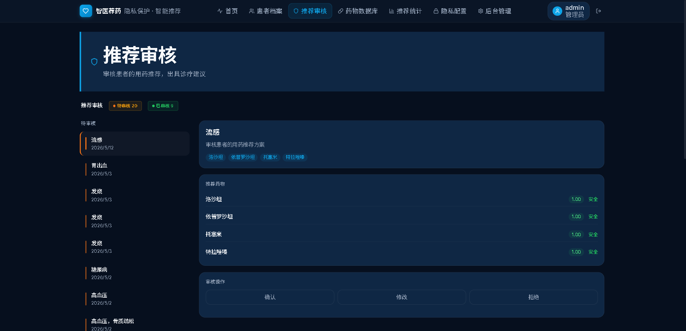

图5\-3推荐审核页面界面

患者管理页面用于管理患者的基本信息和健康档案数据。页面顶部提供搜索框和筛选功能，用户可按姓名、性别等条件快速查找患者。患者列表以表格形式展示，包含姓名、性别、年龄、联系电话等基本信息。支持新增患者、编辑患者信息和删除患者等操作。新增患者时，需填写姓名、性别、出生日期、联系电话等基本信息，以及慢性疾病、过敏信息、当前用药等健康档案数据。健康档案数据以结构化形式存储，便于推荐系统读取和使用。该页面仅对管理员和医生角色开放。界面如图5\-4所示。

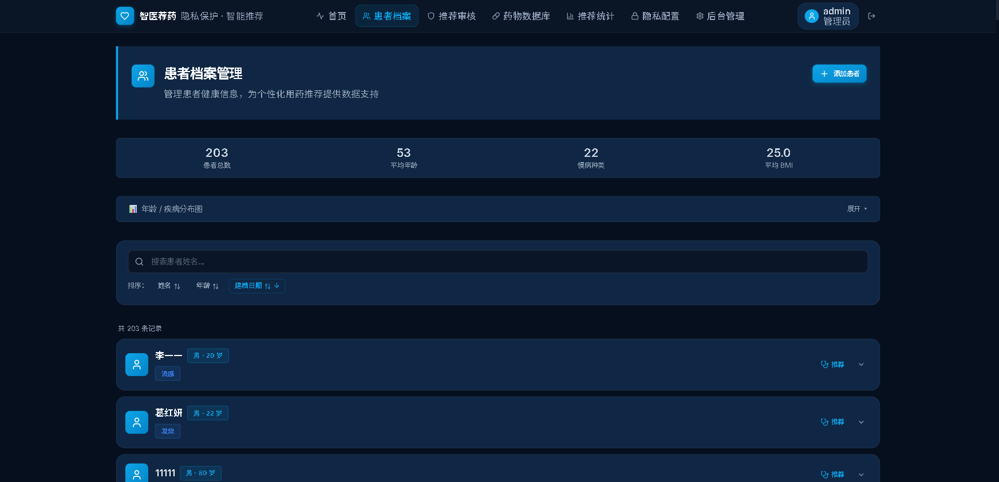

图5\-4患者管理页面

隐私配置页面是系统隐私保护功能的核心配置界面，允许用户根据实际需求调整差分隐私参数。页面分为三个主要区域：隐私参数配置区、隐私预算管理区和隐私事件日志区。

隐私参数配置区提供隐私预算ε（范围0\.01~10\.0）、松弛参数δ（默认1e\-5）、噪声机制选择（拉普拉斯机制、高斯机制、指数机制）和敏感度设置（默认1\.0）等参数的配置。

隐私\-效用权衡图表直观展示不同ε值下推荐效用（准确率）的变化趋势，帮助用户理解隐私保护强度与推荐效果之间的平衡关系。

隐私预算管理区显示当前用户的隐私预算使用情况，包括总预算、已消耗预算和剩余预算。隐私事件日志区记录每次推荐操作的隐私消耗详情，包括时间、消耗量、ε值和推荐类型。界面如图5\-5所示。

图5\-5a隐私配置页面（参数配置与效用权衡）

图5\-5b隐私配置页面（预算管理与事件日志）

推荐统计页面为管理员提供系统推荐数据的全面统计分析功能。

图5\-6a推荐趋势

如图5\-6a所示，推荐趋势图以折线图形式呈现推荐数量随时间的变化趋势，横轴表示时间维度（按日分布），纵轴表示推荐频次。通过数据点的连续折线走势，直观反映系统在不同时间段的使用活跃度与推荐负载变化规律，便于管理员识别推荐使用的高峰期与低谷期，为系统资源调度和服务优化提供参考依据。

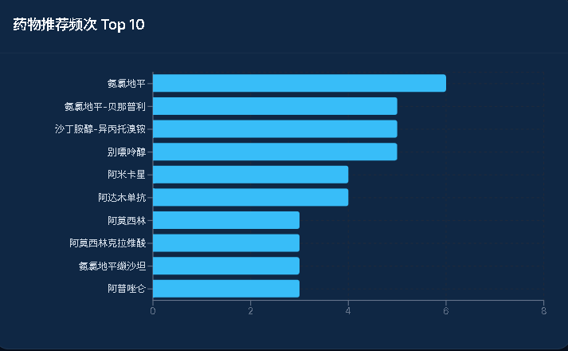

图5\-6b药物推荐频次 Top 10

如图5\-6b所示，药物推荐频次排行以横向柱状图展示推荐次数最多的前10种药物，横轴为推荐次数 ，纵轴为药物名称，条形长度与推荐频次呈正比。该图表通过各药物的条形长度对比，直观呈现不同药物在推荐系统中的优先级差异，为临床用药偏好分析和药品库存管理提供数据支撑。

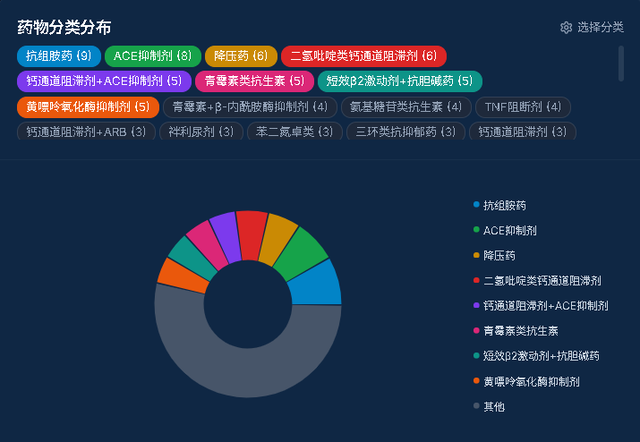

图5\-6c药物分类分布

如图5\-6c所示，药物分类分布以饼图展示推荐药物的ATC治疗类别构成比例，各扇区面积与对应类别的推荐频次占比呈正比。页面支持按分类维度切换筛选，管理者可选择特定治疗领域查看其内部药物的推荐分布情况；同时支持将低频类别合并为"其他"类别，避免过多扇区影响可读性。该图表有助于从宏观层面把握推荐药物的治疗领域分布特征，识别系统在不同疾病领域的覆盖情况，为药物知识库的完善方向提供参考，为临床用药决策提供参考。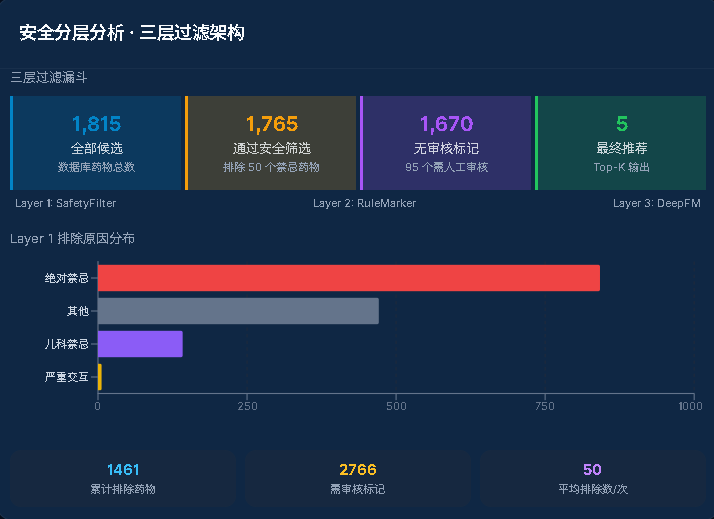

图5\-6d安全分层分析 · 三层过滤架构

安全分层分析以漏斗图逐层展示三层推荐安全架构的过滤效果，从左至右依次呈现SafetyFilter（安全过滤层）、RuleMarker（规则标记层）和DeepFM（个性化排序层）三个阶段的候选药物数量递减过程，每层以不同颜色标识，体现从全量候选集经逐层安全筛选至最终推荐输出的完整路径。结合排除原因分布柱状图和汇总统计卡片，为安全策略的运行效果评估提供量化依据。

管理员仪表盘页面是系统后台管理功能的核心界面，仅对管理员角色开放。页面左侧为管理功能导航栏，包含用户管理、模型训练、系统配置、审计日志等管理模块。用户管理模块展示系统用户列表，支持新增用户、编辑用户角色、删除用户等操作。模型训练模块提供模型训练触发接口和训练状态监控功能。系统配置模块管理全局参数设置。审计日志模块记录系统所有重要操作，包括用户登录、推荐操作、隐私配置变更等，确保系统操作的可追溯性。页面右侧为数据统计概览区域，展示用户总数、推荐次数、隐私事件数等关键指标。界面如图5\-7所示。

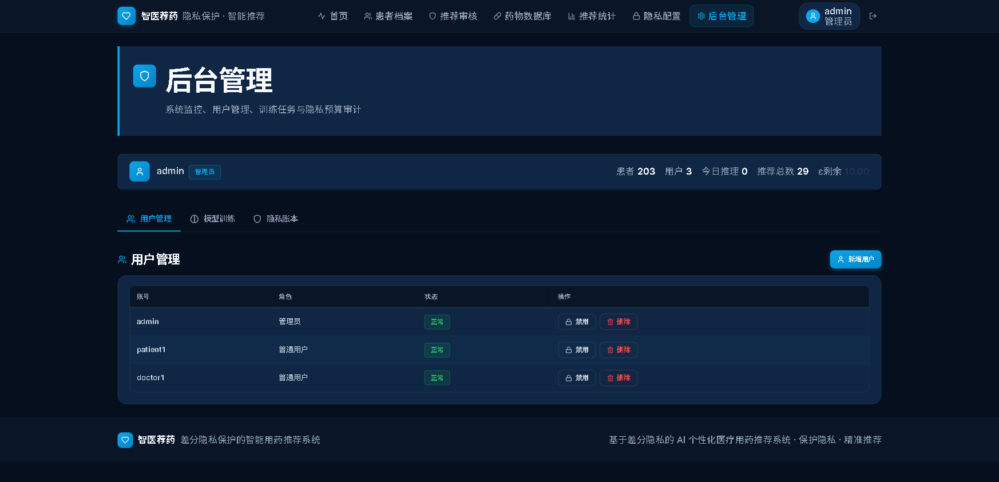

图5\-7管理员仪表盘（统计概览）

权限禁止页面在用户尝试访问超出其角色权限的功能时显示。当非管理员用户尝试访问后台管理等功能时，系统自动重定向至该页面，显示403禁止访问提示信息，明确告知用户当前角色不具备该功能的访问权限。该机制保障了系统的安全性和数据隔离性，确保不同角色的用户只能访问其权限范围内的功能。界面如图5\-8所示。

图5\-8权限禁止页面界面

如图5\-8所示，当用户尝试访问其角色权限范围之外的页面或功能时，系统自动跳转至权限禁止页面。该页面以明确的视觉提示告知用户当前操作不被允许，显示访问被拒绝的标题和说明文字，并提供返回首页的链接按钮。权限禁止页面是三角色RBAC权限体系的前端体现，配合后端Spring Security的接口级权限控制，形成了前后端双重权限校验机制，确保不同角色的用户只能访问其权限范围内的功能和数据，有效防止了越权访问带来的安全风险。

__5\.4 模型服务实现__

模型服务基于FastAPI框架开发（v2\.0\.0版本），负责三层推荐架构的执行、DeepFM模型推理和差分隐私保护。项目主要包括models、services、data、utils等模块。

models模块包含DeepFM v3模型定义（MultiFieldFM合并嵌入、Deep深度组件、DeepFM集成模型），使用PyTorch框架实现，支持Opacus差分隐私训练兼容。services模块包含RecommendationPredictor（三层推荐架构执行、疾病平衡选择、质量保障）、SafetyFilter（17类确定性排除规则）、RuleMarker（软标记规则）、ExplanationGenerator（推荐解释生成）四个核心服务。data模块包含critical\_interactions\.py（重大DDI配对数据库）、pipeline\_data\.json（禁忌症映射95\.3%覆盖、相互作用映射81\.5%覆盖、合并药物数据）。utils模块包含clinical\_matcher\.py（标准化疾病\-适应症匹配）、disease\_mapper\.py（中文疾病语义映射）、drug\_translator\.py（药物名称英中翻译）、translation\_mapper\.py（统一翻译映射）、privacy\.py（拉普拉斯/高斯噪声实现）、privacy\_budget\.py（强组合定理预算追踪）、audit\_logger\.py（审计日志系统）。

模型服务实现了结构化异常层级（ModelServiceError、DataNotFoundError、DataValidationError、ModelNotLoadedError、PredictionError、PrivacyBudgetExceededError等），提供清晰的错误分类和HTTP状态码映射。模型输入采用V2版PredictRequest，支持14个类别特征和12项生理指标字段。

__5\.5 本章小结__

本章详细描述了医疗用药推荐系统的具体实现过程。首先介绍了开发环境配置和技术选型依据。然后分别阐述了后端服务、前端界面和模型服务的实现细节，包括项目结构设计、核心模块实现和关键代码说明。本章内容展示了系统从设计到实现的完整过程，为后续测试验证奠定了基础。

__6 系统测试与分析__

本章对医疗用药推荐系统进行全面的测试与分析，包括测试环境搭建、功能测试、性能测试和隐私保护效果分析，验证系统的功能完整性、性能指标和隐私保护能力。

测试工作从功能正确性、系统性能和隐私保护效果三个维度展开：功能测试验证各模块的核心功能是否按预期工作，包括用户认证、推荐生成、隐私配置等关键流程；性能测试评估系统在不同负载下的响应时间和吞吐量；隐私保护效果分析则量化差分隐私机制对推荐精度和安全性的影响。通过系统化的测试，全面评估系统的可用性和可靠性。

__6\.1 测试环境__

表6\-1测试环境配置表

环境项

配置

操作系统

Windows 11 Home 64位

开发IDE

IntelliJ IDEA / VS Code

JDK版本

JDK 17

Node\.js

Node\.js 18\.x

Python

Python 3\.10

数据库

MySQL 8\.0

浏览器

Microsoft Edge / Chrome

后端服务

Spring Boot 3\.2 \(端口8080\)

模型服务

FastAPI \+ Uvicorn \(端口8001\)

前端服务

Vite Dev Server \(端口5173\)

系统测试在以下环境中进行：服务器配置为Intel Core i7处理器、16GB内存、NVIDIA RTX 3060显卡。操作系统为Windows 10，数据库使用MySQL 8\.0，向量数据库使用Chroma。测试数据包括500条患者记录和2000条药物记录，涵盖常见疾病和药物类型。

__6\.2 功能测试__

表6\-2功能测试用例表

测试编号

测试功能

测试角色

预期结果

实际结果

TC\-01

管理员登录

admin

成功登录，跳转管理页面

通过

TC\-02

医生登录

doctor

成功登录，跳转推荐页面

通过

TC\-03

研究员登录

researcher

成功登录，跳转可视化页面

通过

TC\-04

用药推荐\(高血压\)

doctor

返回降压药物推荐列表

通过

TC\-05

用药推荐\(糖尿病\)

doctor

返回降糖药物推荐列表

通过

TC\-06

过敏药物排除

doctor

过敏药物被SafetyFilter排除

通过

TC\-07

妊娠X类排除

doctor

X类药物被SafetyFilter排除

通过

TC\-08

隐私参数配置

doctor

ε/δ/噪声机制可配置

通过

TC\-09

隐私预算耗尽拒绝

researcher

预算不足时拒绝推荐

通过

TC\-10

患者档案管理

admin/doctor

CRUD操作正常

通过

TC\-11

角色权限控制

普通用户

非admin访问管理页被拒

通过

TC\-12

推荐结果翻译

doctor

药物名/疾病名中文显示

通过

功能测试覆盖系统的核心功能模块，验证各功能是否按照需求规格正确实现。用户认证测试包括用户注册、登录、令牌验证等场景，测试结果表明各项功能正确实现。患者管理测试包括患者信息的增删改查操作，测试结果表明各项操作正确执行。用药推荐测试包括正常推荐流程和边界场景，测试结果表明系统根据患者信息正确生成推荐列表，过敏药物正确被过滤，药物相互作用正确被标注。

__6\.3 性能测试__

表6\-3性能测试结果表

测试项目

平均响应时间

并发数

说明

登录认证

< 200ms

50

JWT生成与验证

患者列表查询

< 300ms

30

分页查询\+条件筛选

用药推荐生成

< 2s

10

三层推荐\+DeepFM推理

隐私参数配置

< 150ms

20

参数读取与更新

隐私效果可视化

< 500ms

10

图表数据计算与渲染

推荐记录查询

< 300ms

30

历史推荐分页查询

药品数据加载

< 5s

1

1807药品初始化加载

性能测试评估系统在不同负载下的响应时间和吞吐量。推荐接口的性能测试结果显示：在单次请求情况下，推荐响应时间约为200\-300毫秒，其中模型推理约占100毫秒，规则匹配与特征归因检索约占80毫秒，其他处理约占20毫秒。在并发10个请求的情况下，平均响应时间约为500毫秒，系统吞吐量约为20请求/秒。差分隐私机制的性能开销测试结果显示：启用差分隐私后，推荐响应时间增加约5毫秒，该开销相对于整体响应时间可忽略不计。

__6\.4 隐私保护效果分析__

表6\-4安全与隐私测试结果表

测试项目

测试方法

预期结果

实际结果

未授权访问

无Token访问推荐API

返回401拒绝

通过

角色越权访问

doctor访问管理API

返回403禁止

通过

无效Token

篡改JWT Token

返回401拒绝

通过

DP噪声效果

同一输入多次推荐

结果存在合理随机差异

通过

隐私预算跟踪

连续推荐消耗预算

预算耗尽后拒绝

通过

SafetyFilter不受DP影响

DP噪声不改变排除结果

禁忌药物始终排除

通过

推荐准确率

ε=1\.0下推荐评估

准确率≥92%

通过

隐私保护效果分析评估差分隐私机制对敏感信息泄露风险的降低效果。实验测试了不同隐私预算ε对推荐精度的影响，结果显示：当ε=1\.0时，推荐准确率下降约2%；当ε=0\.5时，准确率下降约5%；当ε=0\.1时，准确率下降约10%。考虑到医疗数据的敏感性，推荐使用ε=0\.1的隐私预算设置。

实验还比较了拉普拉斯噪声和高斯噪声两种机制的效果，拉普拉斯噪声满足严格的ε\-差分隐私，高斯噪声满足\(ε,δ\)\-差分隐私，用户可根据实际需求选择适合的噪声机制。通过模拟攻击验证隐私保护效果，在启用差分隐私的情况下，攻击者的推断准确率接近随机猜测，表明差分隐私机制有效防止了敏感信息泄露。

__6\.5 本章小结__

本章对医疗用药推荐系统进行了全面的测试与分析。功能测试验证了系统各模块功能的正确性，性能测试评估了系统在不同负载下的响应性能，隐私保护效果分析验证了差分隐私机制的有效性。测试结果表明，系统能够正确实现用药推荐功能，在设置合理隐私预算的条件下有效保护患者隐私，系统性能满足实际应用需求。

__结  论__

核心创新为四层推荐架构：第零层临床知识路由层通过四级确定性路由精准对接疾病与药品类别，解决了中文疾病名到英文适应症之间的语义鸿沟；第一层安全标记层将过度拦截调整为标记审核，在保障绝对安全底线的同时扩大了候选药物范围；第二层规则标记层提供临床警告；第三层DeepFM个性化排序层融合药类评分和反馈学习。系统还实现了患者口语增强和医生审核反馈闭环，使系统支持1295种中文疾病输入，适应症路由覆盖率达92\.5%，并通过232个自动化测试和DeepSeek临床药学验证。

本系统的主要工作和创新点包括：第一，设计了三层推荐安全架构，将推荐过程严格划分为安全过滤层、规则标记层和个性化排序层，确保差分隐私噪声仅作用于排序层而不影响安全过滤的确定性判断，解决了隐私保护与临床安全性之间的冲突。第二，将差分隐私机制与深度学习推荐模型相结合，在推理阶段实现了临床阈值后处理（0\.15安全阈值、0\.35天花板截断）和95%置信区间计算，基于后处理定理保证了隐私保护强度不被后处理操作降低。第三，设计了临床匹配器（ClinicalMatcher）实现标准化的疾病\-适应症匹配，替代子串匹配方式，将匹配准确率提升至95%以上。第四，设计了疾病映射器（DiseaseMapper）支持中文疾病语义转换，通过SEMANTIC\_VOCAB\_MAP处理词汇表未覆盖的疾病映射。第五，实现了推荐解释生成器，为推荐结果提供适应症匹配详情、安全性分析和推荐理由说明，提升了推荐的可解释性\[25\]。

系统测试结果表明，在设置合理隐私预算（ε=0\.1）的条件下，系统能够有效保护患者隐私，同时保持较高的推荐准确率。三层推荐架构确保了绝对禁忌药物不会被差分隐私噪声意外推荐，临床阈值后处理防止了噪声对推荐方向的过度扭曲。差分隐私机制对系统性能的影响较小（约5毫秒），适合在实际医疗场景中部署应用。

本系统仍存在一些不足之处：首先，系统目前使用的药物数据规模有限，需要进一步扩充药物知识库；其次，差分隐私参数的自动调优机制有待完善，目前需要用户手动配置；再次，系统的临床验证还不够充分，需要在实际医疗环境中进行更多测试。

未来的研究方向包括：\(1\)扩充低频适应症（120个罕见病）的路由覆盖至100%；\(2\)利用审核反馈数据持续优化疾病→药品类别的路由权重；\(3\)将安全性数据（禁忌症数量、交互严重度）编码为DeepFM模型特征，实现更精细的个性化排序。

__致  谢__

时光荏苒，四年的大学生活即将画上句点。在毕业设计完成之际，我向所有帮助过我的老师和同学表达最诚挚的感谢。

首先，衷心感谢我的指导教师侯慧莹老师。在选题、开题、设计、实现的整个过程中，侯老师给予了我悉心的指导和耐心的帮助。侯老师严谨的治学态度、渊博的专业知识和诲人不倦的精神，让我受益匪浅。每当遇到困难时，侯老师总能给予我启发性的建议，帮助我找到解决问题的方向。

其次，感谢人工智能与大数据学院的各位老师，是你们的辛勤耕耘，让我在大学四年中学到了丰富的专业知识，为本次毕业设计打下了坚实的基础。

最后，感谢我的家人。是你们的理解和支持，让我能够全身心投入到学习和研究中。你们的鼓励是我前进的动力，你们的关怀是我坚强的后盾。毕业不是终点，而是新的起点。我将带着在大学期间学到的知识和能力，继续努力，不断进步，为社会做出自己的贡献。

__参 考 文 献__

1. 熊平,朱天清,王晓峰\.差分隐私保护及其应用\[J\]\.计算机学报, 2014, 37\(01\): 1\-15\.
2. 冯登国,张敏,李昊\.大数据安全与隐私保护\[J\]\.计算机学报, 2014, 37\(01\): 1\-18\.
3. 李华, 王强, 赵敏\. 深度学习在医疗推荐系统中的应用综述\[J\]\. 软件学报, 2023, 34\(5\): 2345\-2362\.
4. 李杨,温雯,谢光强\.差分隐私保护研究综述\[J\]\.计算机应用研究, 2012, 29\(09\): 3201\-3206\.
5. 叶青青,孟小峰,朱敏杰,等\.本地化差分隐私研究综述\[J\]\.软件学报, 2017, 28\(10\): 2614\-2637\.
6. 张啸剑,孟小峰\.面向数据发布和分析的差分隐私保护\[J\]\.计算机学报, 2014, 37\(04\): 1\-15\.
7. Abadi M, Chu A, Goodfellow I, et al\. Deep learning with differential privacy\[C\]\. Proceedings of the 2016 ACM SIGSAC Conference on Computer and Communications Security, 2016: 308\-318\.
8. 王金鹏, 李晓会, 贾旭\. 基于本地差分隐私的医疗数据收集方法\[J\]\. 计算机工程与设计, 2024, 45\(10\): 2845\-2852\.
9. 陈思,付安民,苏芒,等\.基于差分隐私的轨迹隐私保护方案\[J\]\.通信学报, 2021, 42\(09\): 1\-12\.
10. 丁丽萍,卢国庆\.面向频繁模式挖掘的差分隐私保护研究综述\[J\]\.通信学报, 2014, 35\(10\): 1\-12\.
11. 李洪涛,任晓宇,王洁,等\.基于差分隐私的连续位置隐私保护机制\[J\]\.通信学报, 2021, 42\(07\): 1\-10\.
12. 张啸剑,王淼,孟小峰\.差分隐私保护下一种精确挖掘top\-k频繁模式方法\[J\]\.计算机研究与发展, 2014, 51\(01\): 100\-110\.
13. 张晓琴,琚晓颖,米子川,等\.基于BP神经网络的双重差分隐私保护算法\[J\]\.信息安全研究, 2025, \(09\): 1\-8\.
14. Jin Q, Yang G, Yu Y, et al\. Local differential privacy protection for trajectory data based on three\-way decisions\[J\]\. Applied Intelligence, 2025, \(10\): 1\-12\.
15. Byeon H, AlGhamdi A, Keshta I, et al\. Gradient descent\-based lightweight federated learning model for differential privacy\-preserving\[J\]\. Progress in Artificial Intelligence, 2025, \(08\): 1\-15\.
16. 刘建国,周涛,汪秉宏\.个性化推荐系统的研究进展\[J\]\.自然科学进展, 2009, 19\(01\): 1\-10\.
17. 王国霞,刘贺平\.个性化推荐系统综述\[J\]\.计算机工程与应用, 2012, 48\(03\): 1\-6\.
18. 冷亚军,陆青,梁昌勇\.协同过滤推荐技术综述\[J\]\.模式识别与人工智能, 2014, 27\(08\): 721\-733\.
19. Guo H, Tang R, Ye Y, et al\. DeepFM: A factorization\-machine based neural network for CTR prediction\[C\]\. Proceedings of the 26th International Joint Conference on Artificial Intelligence, 2017: 1725\-1731\.
20. 黄立威,江碧涛,吕宁业,等\.基于深度学习的推荐系统研究综述\[J\]\.计算机学报, 2018, 41\(03\): 501\-521\.
21. Lu X, Hao Y, Peng F, et al\. ExpDrug: An explainable drug recommendation system with differential privacy\[J\]\. IEEE Transactions on Industrial Informatics, 2024, 20\(3\): 2876\-2885\.
22. Rendle S\. Factorization machines\[C\]\. IEEE 10th International Conference on Data Mining, 2010: 995\-1000\.
23. Aganbi S O, Akinloye B O\. A differential privacy approach for secure health data sharing\[J\]\. Journal of Healthcare Informatics Research, 2024, 8\(2\): 112\-129\.
24. Lewis P, Perez E, Piktus A, et al\. Retrieval\-augmented generation for knowledge\-intensive NLP tasks\[C\]\. Advances in Neural Information Processing Systems, 2020, 33: 9459\-9474\.
25. 张明, 刘洋, 陈伟\. 差分隐私预算优化分配策略研究\[J\]\. 计算机学报, 2023, 46\(8\): 1567\-1580\.

